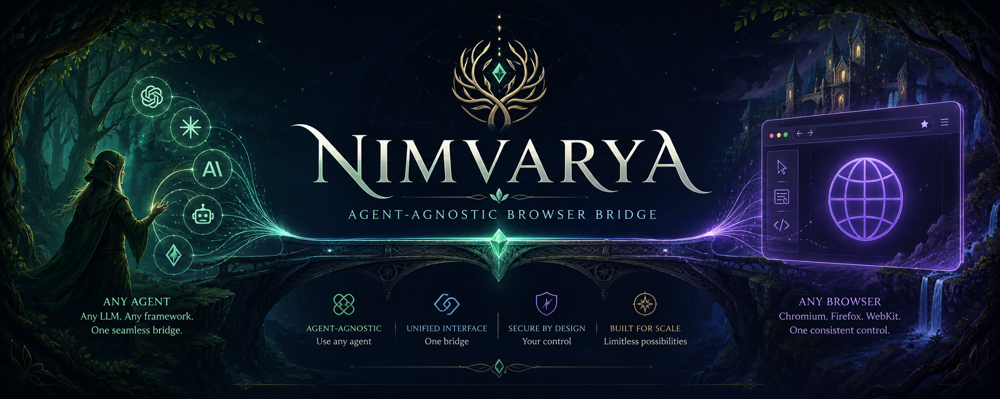

# nimvarya

[](#license)
[](#setup)
[](#setup)

_A standalone, boky-free Chrome-control bridge for your favourite terminal AI._

Drive a real Chrome tab — navigate, read, find, click, type, screenshot,
query console and network — from Claude Code, Codex CLI, Gemini CLI, or
Cursor, over one shared MCP surface.


## Features

`nimvarya` is extracted from boky's devtools bridge but shares no code with
it — boky keeps working unchanged. It ships three parts:

- **Extension:** a standalone MV3 Chrome extension that executes page actions
  and captures page events, all on a deliberately-unfocused sandbox tab.
- **Relay:** a local `ws` server, bound to `127.0.0.1`, that routes frames
  between the extension and any number of controllers.
- **MCP server:** a stdio server exposing twenty page actions as discrete,
  clearly-described tools — no umbrella command, no enum arg.
- **Never-throw contract:** a relay/extension failure, an over-large result,
  or a not-found selector all come back as a structured result, never a
  thrown transport error.
- **Self-healing screenshots:** an oversized `captureTab` result is
  automatically re-captured down a bounded downscale ladder instead of
  failing outright.

See [`docs/TOOLS.md`](docs/TOOLS.md) for the full reference on every tool.

## Installation

`nimvarya` lives as a self-contained package inside this repo — it isn't
published to a registry (yet). Clone the repo, then:

```bash
cd tools/nimvarya
npm install
npm run verify   # typecheck + lint + test
```

Its own `package.json`, `tsconfig.json`, `eslint.config.mjs`, `vitest.config.ts`
and lockfile mean nothing is inherited from the repo root, and it is
deliberately **not** wired into the root `scripts/verify.sh` (same as
`services/nest-host`).

## Usage

Run the relay and build the extension, each in its own terminal:

```bash
npm run relay              # ws://127.0.0.1:8766 (NIMVARYA_PORT overrides)
npm run build:extension    # → dist/extension/
```

Then load `tools/nimvarya/dist/extension` unpacked in `chrome://extensions`,
and start the MCP server:

```bash
npm run mcp   # stdio MCP server — usually launched by your MCP client, not by hand
```

## Configuration

`nimvarya` runs great with zero configuration beyond registering the MCP
server. Register it for Claude Code in the repo-root `.mcp.json`:

```json
{
  "nimvarya": {
    "type": "stdio",
    "command": "node",
    "args": ["tools/nimvarya/bin/mcp.mjs"],
    "env": {}
  }
}
```

- **`NIMVARYA_URL`** — override the relay URL (default `ws://127.0.0.1:8766`).
- **`NIMVARYA_PORT`** — override the relay's listen port.

Only Claude Code has been hand-verified so far; Gemini CLI, Codex CLI, and
Cursor have documented-but-unexercised config paths. See
[`docs/TOOLS.md`](docs/TOOLS.md#per-client-status) for per-client detail and
[`docs/VERIFICATION.md`](docs/VERIFICATION.md) for the dated, live-Chrome
verification traces behind every tool's documented behavior.

## Conventions

- `src/protocol/actions.ts` — `PAGE_ACTIONS` is the **single source of truth**
  for the supported actions. Every consumer types itself
  `Record<PageAction, …>` so drift is a `tsc` error.
- Every non-`types.ts` file under `src/` has a co-located `.unit.test.ts`
  that names its exports.
- Every exported symbol must have an importer, kept by hand in this package.

## Whatcha think?

Found a rough edge, a missing tool, or a client that doesn't behave as
documented? Open a GitHub issue with what you tried and what came back — the
per-client status table above only gets more accurate with more hands on it.

## License

MIT.

---

See [`docs/marketing/00-product-facts.md`](docs/marketing/00-product-facts.md)
for the verified fact list this README is grounded in.
