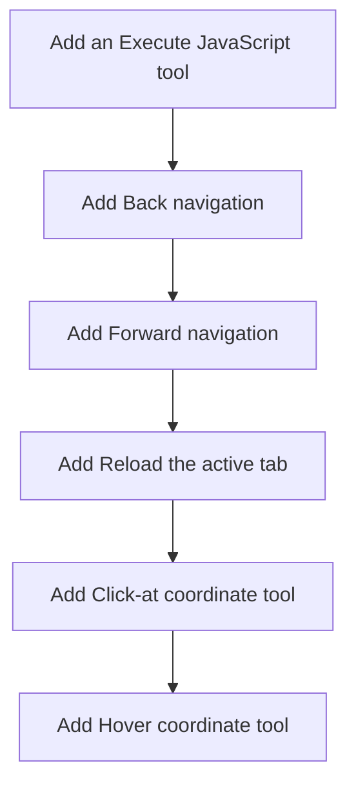

# Horizon 3 — Add browser-driving tools (claude-in-browser parity)

Path taken: **full** · Domain shape: **technical** (developer tooling machinery) · Horizon: **3** · Project: `agent-agnostic-browser-bridge`

---

## 🎯 What are we trying to achieve?

The standalone `@boky/chrome-bridge` MCP tool set currently offers 10 tools (read, find, click, type, screenshot, console/network read). This horizon closes the biggest gap to Anthropic's **claude-in-browser**: the tools that let an agent actually **drive** a page — `executeScript` (run arbitrary JavaScript in the page), back/forward and reload navigation, and click/hover **at a coordinate** (no CSS selector needed).

**Screenshots are already shipped** (`captureTab` returns an MCP image block); this horizon deliberately keeps them and adds the driving tools around them. When done, the bridge advertises **16 tools**, each wired end-to-end and tsc-enforced.

## 🧠 Why does this change need to happen?

An agent-agnostic bridge with only "click a selector / type into a selector" can't reach a canvas, an overlay, or a dynamic list item, can't inspect page state, and can't move through a multi-step wizard or recover from a wrong click. claude-in-browser exposes `javascript_tool`, `navigate`, and the `computer` (mouse/keyboard/scroll) family precisely so an agent can do these. Without them the bridge is a reader, not a driver.

### At a glance

- **Implementation:** 6 phases (single-tool each). Complexity: **Medium**.
- **Main risk:** synthetic pointer events (`elementFromPoint` + `dispatchEvent`) are untrusted (`isTrusted: false`), so a coordinate click can appear to succeed while a React/Vue handler ignores it; success is therefore defined as the events being *dispatched on the element under the coordinate*, never as "a framework handler fired".
- **Target:** tsc `--noEmit`, eslint `--max-warnings 0`, and vitest are green for the package; the existing 10 tools are unchanged and still passing.
- **Testing focus:** the tsc-enforced parity seam, the correct chrome-port call/direction, the no-history/not-found error sentinel, and the MAIN-world vs isolated-world execution.

---

## Order of work

The six phases are independent (each adds one tool over the existing seam), so `dependsOn` is empty for all; they're ordered by the natural shape of the work (raw page execution → navigation → coordinate pointer).

---

## Phase 0 — Add an Execute JavaScript tool

**Technical ID:** `execute-script` · bounded context `page-driving-tools` · layer `cross-cutting` · blast radius `medium`

**Goal:** expose the active tab's page as a scripting target so a caller can run an arbitrary JavaScript expression and read a serializable result back.

**Why:** claude-in-browser's `javascript_tool` is the most flexible primitive the bridge lacks — inspect page state, call a page-window API, read a value no selector reaches. It rides the already-shipped `executeScript` port, **with one correction:** the expression must run in the page's **MAIN world** so it sees page globals/libraries (the current port injects into the isolated world).

**Changes:**
- Add an `executeScript` entry to the `PAGE_ACTIONS` tuple.
- Add `ExecuteScriptParams { code: string }` / `ExecuteScriptResult { value: unknown; error?: string }`.
- Extend `ChromePorts.executeScript` (or a main-world entrypoint) to run in `world: 'MAIN'`.
- Handler injects `(code) => (0, eval)(code)` in MAIN world; JSON-serialise with a replacer and return `{ error }` for a non-serialisable/over-large result.
- Register the MCP tool; update tests + README tool count.

**Files / areas:** `src/protocol/actions.ts`, `src/protocol/types.ts`, `src/extension/ports.ts`, `src/extension/page-actions.ts`, `src/mcp/tool-catalog.ts`, `README.md`, and the actions/tool-catalog/page-actions unit tests.

**How to verify:** every check under the phase's rubric passes (`action-parity-seam`, `main-world-execution`, `serialization-guard`, `protocol-contract`, `co-located-unit-test`).

**Done when:** an `executeScript` page action runs a caller-supplied expression in the active tab's MAIN world and returns a JSON-serializable `{ value }` or an `{ error }`, wired e2e with a co-located unit test asserting the MAIN-world run and the serialization/coerce path.

**Depends on:** nothing — can start immediately.

**Reference (rubric minScores):** action-parity-seam 8 · main-world-execution 8 · serialization-guard 7 · protocol-contract 7 · co-located-unit-test 7.

---

## Phase 1 — Add Back navigation

**Technical ID:** `navigate-back` · bounded context `page-driving-tools` · layer `cross-cutting` · blast radius `medium`

**Goal:** move the active tab back through its browser history — claude-in-browser `navigate` parity beyond a single URL.

**Why:** the bridge can only point a tab at one URL (`navigateTo`); returning to a previous screen is how an agent recovers from a wrong click, and it needs a history move `navigateTo` cannot express.

**Changes:** add `goBack(tabId)` to `ChromePorts` (backed by `chrome.tabs.goBack`), add it to **both** fake-port fixtures; add `navigateBack` action + no-args param/`moved: true` result; handler returns `{ moved: true }` or the no-history `{ error }`; register the MCP tool; update tests + README.

**Files / areas:** `src/extension/ports.ts`, `src/extension/page-actions.ts`, `src/protocol/actions.ts`, `src/protocol/types.ts`, `src/mcp/tool-catalog.ts`, `README.md`, `page-actions.unit.test.ts`, `service-worker.unit.test.ts`.

**How to verify:** `chrome-port-wiring`, `parity-seam-drift`, `no-history-error-path`, `protocol-types-shape`, `mcp-catalog-and-docs`.

**Done when:** a `navigateBack` page action moves the active tab back through history, wired e2e through the `goBack` port (both fake fixtures updated), with a unit test asserting the port call and the no-history error path.

**Depends on:** nothing — can start immediately.

---

## Phase 2 — Add Forward navigation

**Technical ID:** `navigate-forward` · bounded context `page-driving-tools` · layer `cross-cutting` · blast radius `medium`

**Goal:** move the active tab forward through its browser history — re-advancing after a back is how an agent re-does a step it undid.

**Why:** mirrors `navigateBack`; an agent that stepped back needs to move forward again, and `navigateTo` cannot express it.

**Changes:** add `goForward(tabId)` to `ChromePorts` (backed by `chrome.tabs.goForward`), add it to both fake fixtures; add `navigateForward` action + no-args param/`moved: true` result; handler returns `{ moved: true }` or the no-history `{ error }`; register the MCP tool; update tests + README.

**Files / areas:** same set as `navigate-back` (ports, page-actions, actions, types, tool-catalog, README, both unit tests).

**How to verify:** `chrome-port-wiring`, `parity-seam-drift`, `no-history-error-path`, `protocol-types-shape`, `mcp-catalog-and-docs`.

**Done when:** a `navigateForward` page action moves the active tab forward through history, wired e2e through the `goForward` port, with a unit test asserting the port call and the no-history error path.

**Depends on:** nothing — can start immediately.

---

## Phase 3 — Add Reload the active tab

**Technical ID:** `reload-tab` · bounded context `page-driving-tools` · layer `cross-cutting` · blast radius `small`

**Goal:** reload the active tab for a clean page re-serve — a refresh that history navigation cannot express.

**Why:** an agent driving a web UI needs to force a fresh load to pick up a change or clear a stuck state. A single, small `chrome.tabs.reload` call; deliberately its own phase (distinct port method + distinct tool).

**Changes:** add `reload(tabId)` to `ChromePorts` + both fake fixtures; add `reloadTab` action with no-args param/`{ reloaded: true }` result; handler returns the sentinel or `{ error }`; register the MCP tool; update tests + README count.

**Files / areas:** ports, page-actions, actions, types, tool-catalog, README, `page-actions.unit.test.ts`, `service-worker.unit.test.ts`.

**How to verify:** `tsc-parity-seam`, `reload-calls-chrome-port`, `readme-tool-count`, `chrome-port-method-and-fakes`, `catalog-schema-strictness`.

**Done when:** a `reloadTab` page action reloads the active tab, wired e2e through the `reload` port, plus the README tool-count/manual-check text in line.

**Depends on:** nothing — can start immediately.

---

## Phase 4 — Add Click-at coordinate tool

**Technical ID:** `click-at` · bounded context `page-driving-tools` · layer `cross-cutting` · blast radius `medium`

**Goal:** click at a page coordinate — the start of claude-in-browser's `computer`-style pointer control, with no CSS selector.

**Why:** needed when there is no stable selector (canvas, overlay, dynamic list item) or to activate a point selectors cannot reach. **Success is defined as dispatching the pointer/click events on the element under the coordinate, not as "a framework handler fired"** — synthetic events are untrusted.

**Changes:** add `ClickAtParams { x; y }` + result; add `clickAt` action; handler injects a function that calls `document.elementFromPoint(x, y)` and dispatches `pointerdown / pointerup / click`; add an `asJsonValue`-style helper; register the MCP tool (integer x/y, `additionalProperties: false`); update tests + README.

**Files / areas:** `src/extension/page-actions.ts`, `src/protocol/actions.ts`, `src/protocol/types.ts`, `src/mcp/tool-catalog.ts`, `README.md`, `page-actions.unit.test.ts`, `tool-catalog.unit.test.ts`.

**How to verify:** `coordinate-dispatch-path`, `parity-seam-tsc`, `coordinate-param-validation`, `synthetic-event-dispatch-sequence`, `tool-catalog-and-result-contract`.

**Done when:** a `clickAt` page action dispatches synthesized mouse/pointer events on the element at the x/y coordinate, wired e2e, with a unit test asserting the `elementFromPoint`/dispatch path and the not-found sentinel.

**Depends on:** nothing — can start immediately.

---

## Phase 5 — Add Hover coordinate tool

**Technical ID:** `hover` · bounded context `page-driving-tools` · layer `cross-cutting` · blast radius `medium`

**Goal:** hover at a page coordinate — to reveal a tooltip or highlight before reading.

**Why:** mirrors `click-at` for the hover gesture; `elementFromPoint` + `pointerover / mouseover` dispatch. Same honest contract: success = events dispatched on the element under the coordinate.

**Changes:** add `HoverParams { x; y }` + result; add `hover` action; handler injects a function that calls `document.elementFromPoint(x, y)` and dispatches `pointerover / mouseover`; add the JSON-safe helper; register the MCP tool; update tests + README.

**Files / areas:** same set as `click-at`.

**How to verify:** same five rubric dimensions as `click-at` (`coordinate-dispatch-path`, `parity-seam-tsc`, `coordinate-param-validation`, `synthetic-event-dispatch-sequence`, `tool-catalog-and-result-contract`).

**Done when:** a `hover` page action dispatches synthesized pointer/mouse events on the element at the x/y coordinate, wired e2e, with a unit test asserting the `elementFromPoint`/dispatch path and the not-found sentinel.

**Depends on:** nothing — can start immediately.

---

## Discovery findings (drive the decomposition)

| Area | Finding | Implication |
|---|---|---|
| PAGE_ACTIONS | `src/protocol/actions.ts:10` — exactly 10 actions, `Record<PageAction,…>` consumers, tsc-forced parity | extend the tuple; every consumer must change together |
| ChromePorts | `ports.ts:26` — only queryActiveTab/executeScript/updateTab/captureVisibleTab; no goBack/goForward/reload/window/debugger | new navigation needs new port methods (covered by existing `tabs` permission) |
| Action flow | `page-actions.ts:117` + `service-worker.ts:60-84` — raw map → guarded map → dispatcher | a new action is added to both maps; the rest is automatic |
| Seam | 6 touch points: actions tuple, params, results, handler, catalog, tests | a new action is cross-cutting, not additive |
| executeScript | returns page-controlled `unknown`; no JSON-serializable guard | handler must clamp/coerce; `{ error }` on non-serialisable |
| Fake ports | `page-actions.unit.test.ts:45`, `service-worker.unit.test.ts:52` — both must satisfy `ChromePorts` | a new port method must be added to both fakes |
| Conventions | `.testguard.json`, dead-export hook (extension/src only), prefer-as-const | a new module needs a co-located test + importer; `as const` on schemas |
| MCP server | `server.ts:98` — only `captureTab` has an image branch; generic JSON text elsewhere | new tools use the text branch; `additionalProperties: false` in schemas |
| `.mcp.json` | `chrome-bridge` registered with a relative path | no config change needed; README count needs updating |
| Pointer machinery | none exists (grep found no elementFromPoint/pointer/DOM dispatch) | click/hover built from scratch via `executeScript` |
| In-page helper | `page-script.ts` is only a capture wrapper | coordinate/pointer logic is a new in-page func/module |

## Out of scope (deferred)

- Full computer fidelity via `chrome.debugger`/CDP (true mouse/keyboard, page/element screenshots) — a deferred architectural decision.
- Rest of the computer family: key press, scroll, wait-for-condition, double-click.
- Tab management (list/create/switch/close — needs tabId-targeting across every handler).
- Form filling (checkbox/select/radio), file/image upload, window resize.
- Accessibility-tree `read_page` parity and semantic `find` parity.
- Multi-client README/config verification and result-size-cap tuning.
- Claude-app-only tools (`update_plan`, `gif_creator`, `shortcuts_*`, `turn_answer_start`).

*(Full reasons for each are in the roadmap JSON `deferred` array.)*

## Success criteria

1. The MCP server advertises **16 tools** (existing 10 + `executeScript`, `navigateBack`, `navigateForward`, `reloadTab`, `clickAt`, `hover`), each wired end-to-end with the tsc-enforced parity seam; tsc/eslint/vitest green; existing 10 unchanged; pointer handlers exercised by a test.
2-7. One per phase — the single-tool deliverable named in each phase's `expectedResult`.

## Alignment preview

The full-path preview was assembled after Stage 3 and a Preview-Concerns critique surfaced 5 issues (which two bundle two tools; isolated-world `eval` can't see page globals; undefined serialization contract; synthetic events may not fire handlers; README goes stale). They were incorporated into the decomposition, and the bundled-tool issue was resolved by the gate. The user was presented the preview and the roadmap was built to it.

## Quality gate

- Path: **full** · Gate iterations: **3** (critic → heal → critic → heal → critic).
- Iteration 1: `phase-blast-radius` (major) — two phases bundled two tools → split into six single-tool phases.
- Iteration 2: `testable-rubrics` (major) — split not propagated into rubrics; referenced a sibling tool → rewritten single-tool.
- Iteration 3: **pass** — all 10 dimensions green.
- **Accepted debt (2 minors):** a few copy-paste verbatim artifacts in the navigate-back/navigate-forward rubrics (`goBack/goBack`); the click-at/hover rubrics reference a shared `CoordinatePointerParams` name while `changes` add `ClickAtParams`/`HoverParams`. Cosmetic, no rework.

## Full analysis

- **Domain shape:** `technical` — developer tooling machinery, no business entities/rules. Reason stated in the roadmap JSON.
- **Risks:** synthetic-event trust (top risk); `goBack`/`goForward` no-op/throw with no history; three new port methods must be added in lockstep; bundled-action gate risk; non-serialisable `executeScript` return.
- **Assumptions:** stay on `executeScript`/`chrome.tabs` (no CDP); one discrete MCP tool per action; screenshots already shipped; active-tab targeting unchanged; bridge stays boky-free.
- **Ubiquitous language:** page action · MCP tool · active tab · executeScript · coordinate · history navigation · chrome port · tool catalog · page-driving-tools.

Execute with: `/dima-plan-roadmap-ddd-v5-7 execute docs/roadmaps/agent-agnostic-browser-bridge/horizons/horizon-03-browser-driving-tools-roadmap.json`
