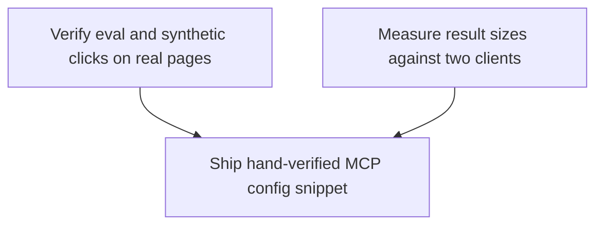

# Horizon 4 — Evidence and Verification (agent-agnostic-browser-bridge)

> **Revision 1 (2026-09-03, REPLAN `revise-phases`).** Phase 3 (`ship-hand-verified-mcp-config-snippet`)
> was replaced: its contract and rubric required a live Gemini CLI tool call, which `decisions.md`
> 2026-09-03 (horizon 4) forbids — hand-verification is Claude Code only for the life of the project.
> Phase 3 now hand-verifies Claude Code alone and documents Gemini CLI as config-documentation-only
> (`gemini mcp add` command form, no live call); Codex CLI / Cursor stay documentation-only. The
> horizon objective, phases 1–2, and all evidence already recorded are unchanged. Previous roadmap at
> `horizon-04-evidence-and-verification-roadmap.rev0.json`.

## 🎯 What are we trying to achieve?

Horizon 4 is a verification-only horizon. It records **empirical evidence** in a real Chrome session
(whether the MAIN-world indirect eval used by the `executeScript` page action survives a page whose
Content-Security-Policy bans eval, and whether the synthetic events dispatched by `clickAt`/`hover`
actually reach live framework handlers on a real SPA), measures **result sizes** against real target
clients to inform the deferred "where does the size cap live" decision, and ships **one hand-verified
MCP config snippet** in the README. It does not add features, does not change the 16 page-action
surface, and does not decide the three deferred decisions — it only gathers evidence for them.

## 🧠 Why does this change need to happen?

Two earlier checkpoints (Horizons 2–3) closed without empirical proof: nobody has recorded whether
MAIN-world eval survives a real strict-CSP page, or whether the synthetic events dispatched by
`clickAt`/`hover` trigger real SPA handlers that many frameworks ignore because the events are
untrusted. Those two facts are the evidence the deferred CDP-vs-DOM decision needs before any
computer-parity feature can be built. Separately, the bridge's MCP layer renders every text result as
pretty-printed JSON with no truncation and `captureTab` is deliberately uncapped, so responses can
reach megabytes; no one knows how real clients handle that, and the README currently *claims* the
snippet "works for any other MCP client" without ever having verified it.

## At a glance

- **Implementation:** 3 phases
- **Complexity:** Low (all small blast-radius, verification/documentation only, no code changes)
- **Main risk:** a record that looks complete but proves nothing — a CSP header asserted but never
  quoted, or a SPA probe read before the framework commits state; every claim must be backed by an
  observable page-side effect.
- **Testing focus:** real, hand-run Chrome evidence plus `npm run verify` (typecheck + lint + unit) in
  `tools/chrome-bridge`; no new `.int.test.ts`, no jsdom.

---

## Order of work

1. **Verify eval and synthetic clicks on real pages** — collect the CDP-vs-DOM evidence.
2. **Measure result sizes against two clients** — collect the size-cap evidence.
3. **Ship hand-verified MCP config snippet** — document exactly what was verified.

(The three are independent — no phase depends on a prior one — but this order runs the riskiest
empirical work first and leaves the doc-only work last.)

---

## Per phase

### Phase 1 — Verify eval and synthetic clicks on real pages

- Technical ID: `real-chrome-event-fidelity-check` · bounded context: page actions — real-Chrome event fidelity · layer: infrastructure · blast radius: small

**Goal:** Run a hand-driven real-Chrome check that answers two claims and records the evidence into
the project memory files: (1) does MAIN-world indirect eval `(0, eval)(code)` survive on a real page
whose CSP forbids eval, or does it return the "page may block eval" sentinel; (2) do `clickAt`/`hover`
synthetic events fire real React/Vue handlers — proven only by a follow-up page-side probe, never by
the tool's own `{found,dispatched}` count.

**Why:** The CDP-vs-DOM decision needs real evidence, and `dispatched` count is not proof a framework
handler reacted (a documented decision).

**Changes:**
- Start the documented ceremony: `npm run relay`, `npm run build:extension`, Load unpacked, connect an MCP client.
- Navigate a strict-CSP site; call `executeScript` with `{code:"document.title"}`; record site URL, exact CSP header, and the `{value}` vs "page may block eval" outcome.
- Navigate a real React/Vue SPA; call `clickAt` and `hover`, then immediately run a follow-up `executeScript`/`getPageText` probe reading a page-side state change (open menu, tooltip visibility, counter).
- Append evidence to `discoveries.md`; annotate the two open h03 blockers with outcomes; keep the CDP-vs-DOM decision OPEN.
- Run `npm run verify` in `tools/chrome-bridge`.

**Files / areas:** `docs/roadmaps/agent-agnostic-browser-bridge/discoveries.md`, `.../blockers.md`

**How to verify** (one per rubric dimension — see collapsed rubric below):
- Real strict-CSP site: names a public URL, gives the exact CSP header (script-src without unsafe-eval), quotes the result verbatim, site is non-trivial, outcome unambiguous.
- Framework-handler proof: real framework-heavy site, target selector + x/y + `{found,dispatched}`, follow-up probe with a page-side state datum, per-gesture fired/not-fired conclusion after a settle delay, no proof claimed from dispatch alone.
- Evidence in memory files: grep finds each site URL in `discoveries.md`; the h03 CSP/clickAt blocker is annotated; no evidence only in chat/PR/scratch.
- Deferred decisions stay OPEN: blockers still OPEN with appended outcomes, `decisions.md` statuses unchanged, diff implements no deferred decision.
- 16-action surface unchanged: docs-only diff, `page-actions.ts` byte-identical, no committed dist change, `npm run verify` exits 0.

**Done when:** one evidence record set in the project memory files (strict-CSP site + SPA site), the two h03 blockers annotated, CDP-vs-DOM still OPEN.

**Depends on:** nothing — can start immediately.

### Phase 2 — Measure result sizes against two clients

- Technical ID: `measure-result-sizes-against-clients` · bounded context: result-size behavior — MCP result rendering and target clients · layer: cross-cutting · blast radius: small

**Goal:** Produce byte-size measurements (records + a recommendation, never code changes) for the
"where does the result-size cap live" decision, exercised through real Claude Code and Gemini CLI
sessions: captureTab image-block bytes, `readConsoleMessages`/`readNetworkRequests` text bytes at
limit 100 vs 500, and the exact `executeScript` `{value}` over-large boundary at
`MAX_EXECUTE_SCRIPT_RESULT_CHARS = 1,000,000`.

**Why:** The MCP layer truncates nothing, so large responses reach megabytes and different clients
handle that differently; real numbers must drive the cap-location decision, not guesses.

**Changes:**
- On a busy tab, call `readConsoleMessages`/`readNetworkRequests` at limit 100 then 500; record each returned text-block byte size (500-entry ≈ 4MB worst case), within the 30s controller timeout.
- Call `captureTab`; record the image content-block byte size (raw PNG base64, uncapped).
- Call `executeScript` with expressions just below and just above 1,000,000 chars; record the exact integer where the "too large" error appears.
- Drive probes through Claude Code (repo-root `.mcp.json`) and Gemini CLI (`gemini mcp add`); record client-side truncation or rejection as evidence.
- Append measurements + one cap-location recommendation to `discoveries.md`; annotate the result-size blocker; keep the decision OPEN.

**Files / areas:** `.../discoveries.md`, `.../blockers.md`

**How to verify** (per rubric dimension):
- Concrete byte sizes for all three probe families, each an integer + unit, probe config named, no approximations.
- Both clients contributed at least one attributed measurement; no unattributed size.
- Boundary pinned to exact integer: succeeding + failing probes a few chars apart, error text matched, measuring the serialized result value not the source string.
- Client behavior recorded: limit-500 reads and captureTab state delivered-whole / truncated / rejected, and which side did the cutting.
- Records-only: diff touches only the two memory files, PAGE_ACTIONS 16 unchanged, decision still OPEN.

**Done when:** one measurement record in `discoveries.md` (captureTab bytes, read* at 100/500, the 1,000,000/1,000,001 boundary) from ≥2 client sessions, plus one cap-location recommendation; decision left OPEN.

**Depends on:** nothing — can start immediately.

### Phase 3 — Ship hand-verified MCP config snippet

- Technical ID: `ship-hand-verified-mcp-config-snippet` · bounded context: MCP client registration — README config documentation · layer: interface · blast radius: small

**Goal:** Replace the README "MCP client config" overclaim ("works for any other MCP client" without
verification) with a single hand-verified snippet (stdio, command `node`, args
`["tools/chrome-bridge/bin/mcp.mjs"]`, env `{}`) plus a distinct per-client status note for each of the
four target clients. **Claude Code is the only hand-verified client** (proven by one live page-action
call through the snippet's exact command/args). Gemini CLI is config-documentation-only — the README
gives the `gemini mcp add chrome-bridge -- node tools/chrome-bridge/bin/mcp.mjs` command form but no
live call is made. Codex CLI and Cursor are documentation-only (binaries not installed).

**Why:** The README claims one snippet works for every MCP client, but that was never tested, and
`decisions.md` 2026-09-03 (horizon 4) scopes hands-on verification to Claude Code only. The README must
report exactly which clients were tested and which are only documented.

**Changes:**
- With `npm run relay` up and `tools/chrome-bridge/dist/extension` loaded unpacked, load the chrome-bridge entry in Claude Code from the repo-root `.mcp.json` and call one of the 16 page actions (e.g. `getPageText`) with a real argument; record tool name, argument, and exact returned result/error.
- In the README "MCP client config" section, replace the "works for any other MCP client" paragraph + snippet block (~lines 118–135) with exactly one chrome-bridge stdio snippet matching the repo-root `.mcp.json` entry field-for-field.
- Add a distinct status note per client: Claude Code hand-verified (name the page-action call); Gemini CLI config-documentation-only (give the `gemini mcp add` command, state no live call); Codex CLI and Cursor documentation-only (binaries not installed). No sentence bundles clients; no blanket "works for any MCP client" phrasing remains.
- Keep the `CHROME_BRIDGE_URL` relay-override and `import.meta.url` launcher notes unchanged; run `npm run verify`; confirm 16 tools.
- Annotate the h02 Gemini pasted-`mcpServers`-block blocker **in place, not resolved**: record observed-state evidence (`~/.gemini/settings.json` has no `mcpServers` key; `gemini mcp add` is the documented subcommand) and state the pasted-block path stays empirically untested (live Gemini verification out of scope).

**Files / areas:** `tools/chrome-bridge/README.md`, `.../blockers.md`

**How to verify** (per rubric dimension):
- Exactly one snippet block, field-for-field match to the repo-root `.mcp.json` chrome-bridge entry (stdio / node / repo-root-relative args / `{}` env); no second competing snippet.
- No "works for any MCP client" (or reworded equivalent) claim; all four client names present, each with its own status; "verified"/"tested" used only for Claude Code.
- Claude Code proof is a named live page-action call (not `ping`, not a tool listing) with argument and returned result quoted, relay + unpacked extension running, going through `node tools/chrome-bridge/bin/mcp.mjs`.
- The h02 Gemini blocker is annotated in place, still open (not "resolved"/"closed"), cites the observed-state evidence, and states the pasted-block path was not and cannot be tested this horizon.
- Diff is only README + blockers.md; no `src/`, no `.mcp.json`, no `bin/mcp.mjs`, no test file; PAGE_ACTIONS still 16; `npm run verify` exits 0; `CHROME_BRIDGE_URL` + `import.meta.url` paragraphs unchanged.

**Done when:** the README ships one snippet matching `.mcp.json`, a distinct status note per client, no unverified blanket claim, and the h02 Gemini blocker is annotated (not resolved) from observed-state evidence.

**Depends on:** nothing — can start immediately.

---

## Discovery Findings (grounded in Stage 1.5)

| Area | Finding | File | Implication |
|---|---|---|---|
| page-action surface | Exactly 16 actions, tsc-pinned via `Record<PageAction,...>` | `tools/chrome-bridge/src/protocol/actions.ts` | 16-action pin is compile-time; a count assertion suffices |
| result-size limits | No constants in `types.ts`; live in page-actions/capture/capture-buffer | `.../types.ts` | Distinguish extension-side caps from absent MCP-layer cap |
| executeScript | MAIN-world indirect eval at page-actions.ts:416, CSP-blocked -> sentinel | `.../page-actions.ts` | Reproducible CSP check; record CSP header honestly |
| executeScript size guard | Boundary is exactly a JSON length of 1,000,001 chars | `.../page-actions.ts` | Confirm via binary search, not re-derive |
| clickAt/hover | No mechanism observes framework-handler effects; dispatched != fired | `.../page-actions.ts` | Must pair with a follow-up page-side probe |
| existing caps | All extension-side; captureTab explicitly uncapped | `.../capture.ts` | 500-entry read ≈ 4MB+ JSON; no MCP-layer truncation |
| MCP rendering | captureTab -> single image block; everything else -> pretty JSON, no guard | `.../server.ts` | No generic MCP cap to find; observe client truncation |
| README | Overclaims "works for any other MCP client"; verified snippet slots at lines 118-135 | `tools/chrome-bridge/README.md` | Replace overclaim with one hand-verified snippet + per-client notes |
| client binaries | Only claude + gemini on PATH; no codex/cursor | — | Only Claude Code and Gemini CLI hand-verifiable |
| real sites | None ever recorded; only local fixture used | `.../blockers.md` | CSP + SPA sites chosen fresh, recorded URL+header+outcome |
| harness | No reusable scripted harness; 3-command ceremony | `.../discoveries.md` | Bootstrap per-check; defer a reusable harness |
| verify gate | verify = typecheck + lint + test, no jsdom, unit tests only | `tools/chrome-bridge/package.json` | Run `npm run verify` in the package; ignore root lint false-positive |

## Out of Scope

All feature families gated on the three deferred decisions, plus tabId plumbing, client-config edits, a
17th page action, and a reusable verification harness — each with its reason in the roadmap `deferred`.

## Required Materials

| Material | Kind | Needed by |
|---|---|---|
| A fresh real strict-CSP site + a real framework-heavy SPA | dataset | Phase 1 |
| The running extension + relay ceremony | tool | Phases 1–2 |
| Live Claude Code and Gemini CLI sessions | tool | Phases 2–3 |

## Success Criteria

- `analysis.successDefinition`
- Phase 1: one evidence record set (strict-CSP + SPA sites), h03 blockers annotated, CDP-vs-DOM still OPEN.
- Phase 2: one measurement record (captureTab bytes, read* at 100/500, the 1,000,000/1,000,001 boundary) from ≥2 client sessions + one cap-location recommendation, decision left OPEN.
- Phase 3: one corrected README artifact — a single chrome-bridge stdio snippet matching the repo-root `.mcp.json` entry, hand-verified in Claude Code via a named live page-action call, distinct per-client status notes for all four target clients (Gemini CLI config-documentation-only, Codex CLI / Cursor documentation-only), no "works for any other MCP client" claim, h02 Gemini blocker annotated (not resolved).

## Quality Gate

- Path: **lite** (code-local, single subsystem, 3 phases).
- 1 critic iteration: 1 `major` (resources-gathered: requiredMaterials empty) healed by populating 3
  external acquisitions; 10 dimensions passed. No blockers, no `minor` debit. Verdict: green.
- **Revision 1 (2026-09-03, REPLAN `revise-phases`):** phase 3 replaced to align with the
  Claude-Code-only hand-verification decision (`decisions.md` 2026-09-03). One critic pass over the
  revised roadmap: 1 `major` (`success-coverage` — `analysis.successDefinition` item (3) still named
  Gemini CLI hand-verification) applied mechanically with the critic's proposed text; no blocker, so
  the verdict stands without escalation. Phase 3's rubric regenerated (6 dimensions).
- Deferred decisions (CDP-vs-DOM, result-size cap location/threshold, tabId model) remain OPEN — this
  horizon produces evidence for them, never decides them.

## Full analysis

- **Domain shape:** technical — developer-tooling machinery (extension behavior under CSP, result-size
  measurement, MCP client registration); no business entities or rules a domain expert would recognize.
- **Ubiquitous language:** page action, real-Chrome manual check, MCP config snippet, target client,
  result-size cap, capture buffer read, captureTab image block, deferred decision.
- **Assumptions:** Claude Code is the only hand-verified client (Gemini CLI descoped by user override
  in phase 2 / `decisions.md` 2026-09-03; Codex CLI + Cursor have no binary); the 3 caps remain shipped
  behavior; client config files are observed state, not edited.
- **Risks:** site-specific eval rejection (Trusted Types / injection paths); dispatched != fired; Gemini
  pasted-block path may fail; scope creep toward implementing a cap; only two clients verifiable; heavy
  probes may truncate/hang a session.

---

## Evidence — Phase 1: `real-chrome-event-fidelity-check` (2026-09-03)

Run against the live extension (full 16-action build, verified) through a throwaway WebSocket
controller on the running relay (`ws://127.0.0.1:8766`) — the ceremony prior horizons used. The
stale `chrome-bridge` MCP server in the executing session (10-tool, pre-Horizon-3) was bypassed;
no source or build artifact was changed. `npm run verify` in `tools/chrome-bridge`: **green**
(19 files, 234 tests). Git diff: docs-only.

### Claim 1 — MAIN-world `executeScript` eval vs a real strict-CSP page

- **Site:** `https://github.com` (real, non-trivial; substantial first/third-party runtime scripts
  under its own deployed CSP).
- **CSP header (verbatim, `curl -s -o /dev/null -D - https://github.com/`, unauthenticated response):**
  `content-security-policy: default-src 'none'; base-uri 'self'; … script-src github.githubassets.com; style-src 'unsafe-inline' github.githubassets.com; …`
  The `script-src` directive is `github.githubassets.com` only — **no `'unsafe-eval'`**. In the
  logged-in browser the served directive was
  `script-src github.githubassets.com 'nonce-01hcQhGMrd84LulIxgKClgLE3QPnDaZz9bVscP+lDbg=' 'unsafe-inline'`
  (still **no `'unsafe-eval'`**), quoted verbatim from the error below.
- **Call:** `executeScript { code: "document.title" }` (also tried `"1+1"` and a self-catching
  `eval("2+2")` wrapper — same result for all).
- **Result (verbatim command `error`, not a `{ value }` result, not the documented
  "page may block eval" sentinel):**
  `Evaluating a string as JavaScript violates the following Content Security Policy directive because 'unsafe-eval' is not an allowed source of script: script-src github.githubassets.com 'nonce-01hcQhGMrd84LulIxgKClgLE3QPnDaZz9bVscP+lDbg=' 'unsafe-inline'".`
- **Outcome:** the **eval-sentinel** branch, but surfaced as a raw command **error** carrying
  Chrome's exact CSP message — the injected function's `try/catch` → `coerceExecuteScriptOutcome`
  graceful-sentinel path (`"executeScript returned no result — the page may block eval…"`) did **not**
  fire here. Every `executeScript` call is defeated on this page (the handler always routes through
  `(0, eval)(code)`).
- **Baseline (non-CSP):** on `https://www.tinkercad.com/…` and `https://react.dev`, `executeScript`
  returned `{ value: "…" }` normally.

### Claim 2 — synthetic `clickAt` / `hover` vs real React framework handlers

Proof is the follow-up page-side probe, never the gesture's own `{ found, dispatched }` echo.

- **`clickAt` — site `https://react.dev` (React SPA, `document.title === "React"`).**
  Target: the top-bar Search button, center ≈ `(300, 32)`.
  - Baseline probe: `[role="dialog"]` = 0; `.DocSearch-Modal, .DocSearch-Container` = 0.
  - Gesture: `clickAt { x: 300, y: 32 }` → `{ found: true, dispatched: 3 }` (pointerdown/pointerup/click).
  - Probe ≈ 2 s later: `.DocSearch-Modal, .DocSearch-Container` = **2**;
    `document.activeElement` = **`INPUT.DocSearch-Input`** (the modal mounted *and* programmatically
    focused its input).
  - **Conclusion: the React onClick handler fired.** A lazily-mounted, autofocused search modal is
    not something a synthetic click produces unless the component's handler ran.
- **`hover` — site `https://mui.com/material-ui/react-tooltip/` (React SPA).**
  Target: the first demo's `<Tooltip title="Delete">` IconButton (`aria-label="Delete"`),
  scrolled to center ≈ `(785, 369)`.
  - Baseline probe: `[role="tooltip"]` = 0; `.MuiTooltip-popper` = 0.
  - Gesture: `hover { x: 785, y: 369 }` → `{ found: true, dispatched: 2 }` (pointerover/mouseover).
  - Probe ≈ 2 s later: `[role="tooltip"]` = **1**; `.MuiTooltip-popper` = **1**;
    tooltip `textContent` = **`"Delete"`**.
  - **Conclusion: the MUI React pointer-enter handler fired** and rendered the tooltip with the
    correct title.

### What this is evidence *for* (recommendations only — decisions stay OPEN)

- The **CDP-vs-DOM** decision (OPEN): DOM `executeScript` is **fully defeated** by a strict page CSP
  and fails **loudly** (raw CSP error), so any "run arbitrary JS on any page" capability would need a
  non-eval path (CDP `Runtime.evaluate`, which is not CSP-bound). This is a *recommendation input*,
  not a decision.
- The **CDP-vs-DOM** decision (OPEN): synthetic `clickAt`/`hover` **do** reach real React handlers on
  at least two mainstream React sites — the "frameworks ignore untrusted events" risk did **not**
  materialise here. Weakens (does not remove) the case for CDP-level trusted input. Recommendation
  input only.
- `decisions.md` CDP-vs-DOM / result-size / tabId entries: **unchanged, still OPEN.** No source
  changed; `PAGE_ACTIONS` still 16.

## Evidence — Phase 2: `measure-result-sizes-against-clients` (2026-09-03, PARTIAL — Claude Code half only)

Run against the live extension on `https://react.dev` (and `https://www.reddit.com` for the network
buffer) through **the executing session's own `chrome-bridge` MCP server** — i.e. a real **Claude Code
target-client session** — for `readConsoleMessages` / `readNetworkRequests` / `captureTab` (all three
present in that session's 10-tool build), plus a throwaway WS controller on `ws://127.0.0.1:8766` for
the `executeScript` boundary probes and for byte-sizing the `captureTab` image payload. No source or
build artifact changed; `PAGE_ACTIONS` still 16.

### Measured sizes — Claude Code client

Every "block bytes" figure is the MCP text block the client received = `JSON.stringify(result, null, 2)`
(pretty-printed — roughly 1.3–1.5× the compact buffer payload).

| Probe | Page | Block bytes (client-visible) | entries | `dropped` | `truncated` | Claude Code delivery |
|---|---|---|---|---|---|---|
| `readConsoleMessages` limit 100 | react.dev + 600 synthetic ~210-char `console.log` lines | **33,212 B** | 100 | true | true | inline |
| `readConsoleMessages` limit 500 | same | **165,793 B** | 500 | true | false | **redirected to a file** (exceeded the session's ~25k-token inline cap) |
| `readNetworkRequests` limit 100 | reddit.com | **124,068 B** | 100 | false | true | **redirected to a file** |
| `readNetworkRequests` limit 500 | react.dev | **187,969 B** | 147 (whole buffer) | false | false | **redirected to a file** |
| `captureTab` | react.dev (1893×1508 viewport) | **275,536 B** base64 (`data:` URL 275,558; decoded PNG 206,651 B) | — | — | — | inline, rendered natively, **no truncation** |

- Bridge-side flags: `truncated: true` = more entries matched than `limit`; `dropped: true` = the
  500-entry ring buffer (`DEFAULT_MAX_ENTRIES`) had already evicted older entries.
- **Realistic vs worst case (console):** 500 entries of ~210 chars → 166 KB. Theoretical worst case is
  500 × `MAX_CONSOLE_TEXT_BYTES` (8192) ≈ **4 MB** JSON; not reproduced here.
- `captureTab` is **uncapped extension-side** (confirmed) and there is **no MCP-layer cap anywhere**.

### `executeScript` `{ value }` over-large boundary — exact (react.dev, via controller)

| Probe | Serialized-result JSON length | Outcome |
|---|---|---|
| `'a'.repeat(999990)` | 999,992 | `{ value }` OK |
| `'a'.repeat(999998)` | **1,000,000** | `{ value }` **OK** |
| `'a'.repeat(999999)` | **1,000,001** | **ERROR:** `executeScript result is too large (1000001 chars; limit 1000000)` |
| `'a'.repeat(1000000)` | 1,000,002 | ERROR: `executeScript result is too large (1000002 chars; limit 1000000)` |

Boundary: **serialized result ≤ 1,000,000 chars passes; ≥ 1,000,001 fails**, error text verbatim the
shipped `MAX_EXECUTE_SCRIPT_RESULT_CHARS` message. This **confirms** the shipped constant with live
probes that actually cross it — it is not extrapolated.

### Client-side handling — Claude Code

Claude Code **never truncates a tool result silently**: a text block over ~25k tokens (~124 KB+ here)
is written to a file on disk and replaced inline with a notice naming the path; smaller blocks arrive
inline; image content blocks always arrive inline and render. The bridge did no cutting in any case
(`dropped`/`truncated` are buffer-cursor flags, not delivery truncation).

### Bonus — a second strict-CSP site for Phase 1

`https://www.reddit.com` sends `script-src 'self' 'strict-dynamic' 'report-sample' 'nonce-…'`
(**no `'unsafe-eval'`**). `executeScript { code: "console.log(...)" }` there failed with the verbatim
Chrome error `Evaluating a string as JavaScript violates the following Content Security Policy
directive because 'unsafe-eval' is not an allowed source of script: script-src 'self' 'strict-dynamic'
'report-sample' 'nonce-5utiEs2TVoZyUo5NtbSYSIDZ'`. Independent confirmation of Phase 1's github.com
finding on an unrelated deployment.

### Gemini CLI half — descoped by the user (override)

`gemini` is on PATH but every invocation in this environment fails with `you must specify the
GEMINI_API_KEY environment variable` — no API key, no interactive OAuth. The user instructed:
*"lets skip gemini and other cli from testing"*. Recorded as a binding project scope decision
(`decisions.md` 2026-09-03): **hand-verification and result-size measurement are Claude-Code-only for
the life of this project; Gemini CLI / Codex CLI / Cursor are documentation-only.**

Phase graded 8 / 4 / 9 / 7 / 8 by a subagent (no self-grade). Only `two-client-coverage` (4 < 7)
failed; the user **overrode** that dimension. Phase closes **done with an override** — the grade sheet
is kept verbatim in the ledger `override.gradeResultBefore`.

### What this is evidence *for* (recommendations only — decision stays OPEN)

- **Result-size-cap location (OPEN):** there is **no MCP-layer cap**; only extension-side per-action
  caps exist, and `captureTab` has none. Claude Code self-defends (file redirect). *Recommendation
  input, not a decision:* a single generic character cap on text results at the MCP layer (e.g. reuse
  `DEFAULT_MAX_CHARS` = 200,000) with an explicit `truncated` marker would bound the ~4 MB console
  worst case for clients that do **not** self-defend; `captureTab` (~270 KB base64) is fine left
  uncapped. Confirm against a Gemini CLI session before this hardens into a recommendation.
- `decisions.md` result-size / CDP-vs-DOM / tabId entries: **unchanged, still OPEN.**
