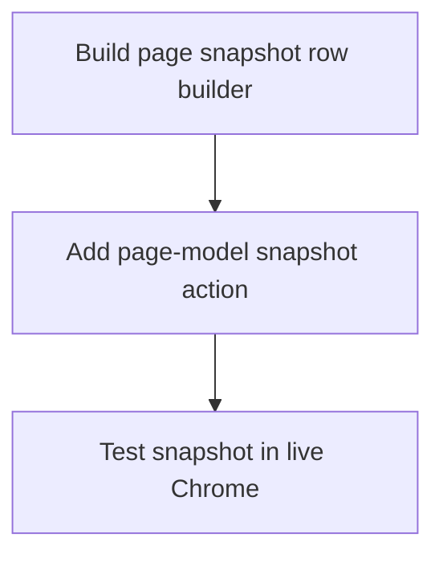

# Horizon 05 — Page-Model Snapshot

## 🎯 What are we trying to achieve?

Give the chrome-bridge tool a **ref-addressable page model**: a new `pageModel` action that reads the active Chrome tab and returns a compact, clickable-element list — each element carrying a **stable ref**, an accessibility **role**, a **name/label**, and a **viewport bounding box** `{x, y, width, height}`. An agent can then take one row's box center and feed it straight into the existing `clickAt(x,y)` / `hover(x,y)` — **no `executeScript` needed** to find an element's coordinates.

Today the single biggest ergonomic gap is that `findElement` only returns a match *count*, and getting an element's position means running `executeScript` — which fails on strict-CSP sites like github.com. This horizon closes that gap.

## 🧠 Why does this change need to happen?

The bridge can navigate, read text/HTML, find-by-count, click/type by selector or coordinate, and run arbitrary JS. But the moment an agent wants to click something it found, it must know *where* that thing is. The only way today is `executeScript` — and horizon 4 proved that breaks on pages whose Content-Security-Policy forbids `eval` (github.com, reddit.com). Bridging "I see a button" → "click it" therefore required a CSP-fragile script. A page model that returns coordinates directly removes that dependency entirely.

## At a glance

- **Phases:** 3
- **Complexity:** Medium (one algorithm-heavy phase + one atomic surface-wiring phase + one manual verification phase)
- **Main risk:** ref re-resolvability — a ref that can't be re-queried after a page changes defeats the whole objective (must be proven live, not just on a fixture)
- **Testing focus:** dependency-free/serializable `buildPageModel`, interactive-element predicate, re-resolvable refs, viewport-coordinate boxes, in-page row-cap truncation, page-result coercion, `{world:'MAIN'}` injection, 16→17 count tests

---

## Order of work

```
Build page snapshot row builder  →  Add page-model snapshot action  →  Test snapshot in live Chrome
        (the DOM-walker)                (wire it as the 17th MCP tool)      (manual real-browser proof)
```

1. **Build page snapshot row builder** — the algorithm must exist and be unit-tested before anything is wired. It is also the highest-risk piece (predicate, ref mechanism, coordinate model, cap).
2. **Add page-model snapshot action** — the whole typed surface (PAGE_ACTIONS, params/results, handler maps, tool catalog) is one atomic, compile-forced unit; the typed `Record<PageAction,…>` means a forgotten key is a `tsc` error, so it all lands together.
3. **Test snapshot in live Chrome** — a binding project rule requires a real-Chrome end-to-end check to close any horizon that changes the extension; a static fixture cannot prove ref re-resolvability or bbox freshness.



---

### Phase 0 — Build page snapshot row builder

Technical ID: `build-snapshot-row-builder` · bounded context: page-actions subsystem · layer: infrastructure · blast radius: small

- **Goal:** a self-contained MAIN-world function `buildPageModel(maxRows)` that walks the active tab's top-frame DOM and returns a compact, row-capped list of actionable/interactive elements (ref, role, name, box).
- **Why:** the DOM-walk is the hard, risky core. It must pick a defensible predicate, a re-resolvable ref, the bbox convention, and a hard cap — best built and unit-tested first, in isolation, so the risk is reviewable on its own. The function must be **fully self-contained** (no imported helpers/closures/module constants) because `chrome.scripting.executeScript` serializes it into the page.
- **Changes:**
  - Add `SnapshotBox {x,y,width,height}`, `SnapshotRow {ref, role, name, box}`, `SnapshotSummary {rows, totalRows, truncated}` types (`readonly`, `| null` for absent values).
  - Define `MAX_SNAPSHOT_ROWS` (defensible round number, e.g. 500) — passed in as `maxRows`, never referenced inside the function.
  - Implement `buildPageModel(maxRows)` reading the global `document`, walking the top frame.
  - Predicate: explicit/aria role OR interactive ARIA role OR semantic interactive tag (button, a[href], input, textarea, select, option) OR `tabindex>=0` OR contenteditable.
  - Derive `role` from DOM attributes/tags; `name` from text/aria-label/aria-labelledby/alt/placeholder/`<label>`; `box` from `getBoundingClientRect`.
  - Attach a re-resolvable ref (generated CSS/nth-child path, **not** a bare index); dedupe parent/child both matching the predicate.
  - Apply the cap in-page (stop at `maxRows`, keep `totalRows` as true match count, set `truncated`).
- **Files / areas:** `tools/chrome-bridge/src/extension/page-actions.ts`, `src/protocol/types.ts`, `page-actions.unit.test.ts`
- **How to verify** (from the rubric):
  - `serializable-single-function` — one top-level `export function buildPageModel`, body references only `maxRows` + DOM globals, unit test stubs `document`.
  - `interactive-predicate-selection` — the test fixtures above produce a row, those below don't; `tabindex="-1"` and disabled controls produce none; parent/child deduped.
  - `ref-resolvability` — every ref round-trips via `document.querySelector`, unique across the snapshot, siblings get distinct refs.
  - `role-name-derivation` — button/text/aria-label/label-for/aria-labelledby cases, `null` not `""` for absent name/role, fields `readonly`.
  - `bbox-viewport-coordinates` — box is `{x:left, y:top, width, height}` from `getBoundingClientRect`, never `offsetLeft`/page-absolute.
  - `row-cap-truncation` — N>maxRows → rows=maxRows/totalRows=N/truncated=true; equal-to-cap → truncated=false; totalRows is true match count; cap applied in-page.
- **Depends on:** nothing — can start immediately.

### Phase 1 — Add page-model snapshot action

Technical ID: `add-page-model-action` · bounded context: page-actions subsystem · layer: application · blast radius: medium

- **Goal:** wire `pageModel` through the whole typed surface as the **17th MCP tool**, with a handler that runs `buildPageModel` via `{world:'MAIN'}` and coerces the page-controlled result.
- **Why:** the surface is one atomic compile- and test-forced unit — a forgotten key anywhere is a `tsc` error, and the two hardcoded-16 count tests must move to 17 or the suite fails. The handler must inject with `{ world: 'MAIN' }` explicitly (only `executeScript` does today; `findElement`/`clickAt` run in ISOLATED). Result coercion is required because the MAIN-world function returns page-controlled data (possibly a DOM node/function/circular/over-large value) that must never cross the wire unchastened.
- **Changes:**
  - Add `'pageModel'` to `PAGE_ACTIONS`; add `PageModelParams { _?: never }` and `PageModelResult`; add the `pageModel` field to both `PageActionParams` and `PageActionResults`.
  - Add `coerceSnapshotOutcome(raw)` — rebuild row primitives from `unknown`, reject non-record/non-array with `{ error }`.
  - Implement the `pageModel` handler: validate params, `ports.queryActiveTab()`, `ports.executeScript(tab.id, buildPageModel, [MAX_SNAPSHOT_ROWS], { world: 'MAIN' })`, return `coerceSnapshotOutcome(raw)`.
  - Add the key to both the raw handler map and the guarded return object.
  - Add the `TOOL_CATALOG` entry (strict no-args schema); update stale header counts to 17 across `tool-catalog.ts`/`types.ts`/`page-actions.ts`/`server.ts`.
  - Bump both count tests to 17; add `pageModel` to the error loop; add a handler test asserting `{ world: 'MAIN' }`.
- **Files / areas:** `src/protocol/actions.ts`, `src/protocol/types.ts`, `src/extension/page-actions.ts`, `src/mcp/tool-catalog.ts`, `actions.unit.test.ts`, `tool-catalog.unit.test.ts`, `page-actions.unit.test.ts`
- **How to verify** (from the rubric):
  - `page-model-action-wired` — `npm run typecheck` green; PAGE_ACTIONS.length = 17; params/results keys present; catalog schema strict.
  - `main-world-injection` — handler calls `executeScript(..., { world: 'MAIN' })`; a unit test asserts that exact call shape.
  - `page-result-coerced` — coercion tests feed non-record/rows-not-array/non-primitive, assert `{ error }` or sanitized result.
  - `count-tests-bumped` — both `PAGE_ACTIONS.length` and `listTools().toHaveLength` are 17; stale comment counts updated.
  - `verify-gate-green` — `npm run verify` (tsc + eslint --max-warnings 0 + vitest) green; no reliance on a non-existent `devtools:check-parity`.
- **Depends on:** build snapshot row builder

### Phase 2 — Test snapshot in live Chrome

Technical ID: `verify-snapshot-real-chrome` · bounded context: page-actions subsystem · layer: cross-cutting · blast radius: small

- **Goal:** per the binding rule that an extension-changing change closes only via a real-Chrome end-to-end check. This is a **manual, human-run** real-browser verification; the pipeline cannot drive a live Chrome session.
- **Why:** a static fixture cannot prove predicate breadth, ref re-resolvability under real SPA class churn, or bbox-to-clickAt freshness. The phase ends `MANUAL_CHROME_CHECK_PENDING` so the status is explicit — never silently "done".
- **Changes:**
  - Build + load the unpacked extension; boot the nest-host relay so the MCP ext_command is reachable.
  - Snapshot strict-CSP (github.com, reddit.com) and a live web-chat SPA; confirm compact rows and never `{ error }`.
  - Feed one row's bbox center into `clickAt`/`hover`; confirm a real element sits under the coordinate; reuse the ref as a selector in `typeText`.
  - Record max interactive-element count + serialized byte size; tune `MAX_SNAPSHOT_ROWS` if needed; record evidence in the roadmap `.md` twin + memory and leave the ledger `MANUAL_CHROME_CHECK_PENDING`.
- **Files / areas:** `tools/chrome-bridge/dist/`, `extension/`, a live Chrome session via the bridge MCP, target pages
- **How to verify** (from the rubric):
  - `bbox-center-drives-click` — names URL + row, records bbox + center, proves the element under the center is the intended row (elementFromPoint/screenshot), shows a real effect.
  - `ref-re-resolves-as-selector` — ref is a generated selector (not an index), re-resolves after interaction/re-render to the same logical node.
  - `compact-rows-no-error-on-targets` — non-error payload on github/reddit AND a live SPA; row count + byte size recorded; every row carries ref/role/name/box; row-capped.
  - `cap-tuned-against-measured-dom` — measured counts per target; tuned cap with re-run OR explicit justification for the default.
  - `manual-pending-status-recorded` — ledger reads `MANUAL_CHROME_CHECK_PENDING`; evidence committed to `.md` twin + memory; distinguishes scripted from manual.
- **Depends on:** Add page-model snapshot action

---

## Discovery Findings

| Area | Finding | File | Implication |
|---|---|---|---|
| action surface shape | PAGE_ACTIONS is a 16-entry `as const` tuple; per-action params/results interfaces, no shared envelope; `Command` is a mapped type | `protocol/types.ts` | 4 protocol edits; `readonly` + `\| null` house style |
| handler maps | raw map + guarded return object both `Record<PageAction, Handler>` | `page-actions.ts` | raw key + guarded key both required |
| **world selection** | only `executeScript` passes `{world:'MAIN'}`; findElement/readPage/clickAt run ISOLATED | `page-actions.ts` | snapshot must pass `{world:'MAIN'}` (mirror executeScript, NOT findElement) |
| result coercion & cap | page results coerced via `coerce*Outcome`; size cap applied handler-side | `page-actions.ts` | new `coerceSnapshotOutcome`; row cap applied in-page (bound at source) |
| executeScript substrate | `ports.executeScript(tabId, func, args, options?)`, optional `world` | `ports.ts` | no ports change; func literal + `{world:'MAIN'}` |
| page-script | existing MAIN-world content script builds no DOM model | `page-script.ts` | don't reuse; per-call func literal, not a content script |
| tool catalog + rendering | `TOOL_CATALOG` Record typed; listTools derives from PAGE_ACTIONS; no MCP size cap; stale headers | `tool-catalog.ts`/`server.ts` | one catalog entry needed; stale headers updated to 17 |
| caps & truncation pattern | `MAX_READ_LIMIT=500`, `{entries,totalChars,truncated}` patterns | `capture.ts`/`capture-buffer.ts` | mirror `{rows,totalRows,truncated}`; name cap like `MAX_READ_LIMIT` |
| command routing | dispatcher keys off action name, no per-action case | `command-dispatch.ts` | zero dispatch change |
| manifest | no debugger perm; content_scripts top-frame only | `manifest.json` | no manifest change |
| wire guards | no per-action params guard; validated by hand in handlers | `guards.ts` | no new guard |
| test wiring | `fakePorts`/`fakeStore`; extract injected fn via `vi.mocked(...).mock.calls[0][1]`; stubGlobal DOM | `page-actions.unit.test.ts` | follow this pattern |
| build passes | service-worker + page-script + capture-forwarder, no new entry needed | `vite.extension.config.ts` | no new build entry |
| **parity count tests** | two tests hardcode `16`; **no `devtools:check-parity`** in this package | `actions.unit.test.ts`/`tool-catalog.unit.test.ts` | real gate = compile-time Record typing + count tests via `npm run verify` |
| bbox field name | `{x,y,w,h}` vs `{x,y,width,height}` drift | `protocol/types.ts` | pin to `{x,y,width,height}` |

## Out of Scope (deferred)

Each entry from the roadmap's `deferred` list carries its reason. Highlights: CDP/AXTree, keyboard, scroll, tab management, file upload, full-page screenshots, drag/rich-mouse, `clickByRef`/`typeByRef` consumers, wait primitives, iframe modeling, resolving the CDP-vs-DOM decision, the generic result-size-cap, and any change to boky itself. Also deferred: ref-consuming actions, an optional maxRows param, CDP role derivation, cross-frame modeling, tabId targeting, a generic MCP-layer cap, and the authenticated web-chat session (YAGNI'd — no phase/success criterion consumes it).

## Required Materials

| Name | Kind | Why |
|---|---|---|
| Running Chromium + chrome-bridge extension + relay | tool | mandatory real-Chrome end-to-end check |
| Concrete target page set (live SPAs + strict-CSP) | dataset | predicate breadth + ref-stability proof on live DOM |
| Live DOM size + interactive-element-count measurements | dataset | choose/justify the row cap under the ~1M-char / ~124KB windows |

## Success Criteria

1. The horizon-level success definition (analysis.successDefinition) — 6 numbered clauses.
2. **Build page snapshot row builder:** unit-tested `buildPageModel(maxRows)` returning `{rows,totalRows,truncated}` with ref/role/name/box rows and an in-page row cap.
3. **Add page-model snapshot action:** the 17th MCP tool, type-driven by `Record<PageAction,…>`, handler returning a coerced snapshot via MAIN-world injection, count tests + handler test green.
4. **Test snapshot in live Chrome:** a recorded real-Chrome end-to-end proof (bbox center drives clickAt/hover; ref re-resolves for typeText), `MAX_SNAPSHOT_ROWS` tuned — `MANUAL_CHROME_CHECK_PENDING`.

## Alignment Preview

The user was shown the 3-phase preview at Stage 3.4. Advisory concerns raised and resolved:
- **Self-contained vs. exported** (folded): phase 0's contract tightened to a single dependency-free top-level function — enforced by the `serializable-single-function` rubric.
- **Phase-3 clarity** (folded): reworded to make explicit it is a manual, human-run real-browser check; horizon not closed until it runs — enforced by `manual-pending-status-recorded`.
- bbox field name and the "6-place / check-parity" claim: already handled in the phases/rubric.

The user chose **"Build the full roadmap"** (no redirect).

## Quality Gate

- **Path:** full (3–5 phases, real external material, manual real-Chrome verification)
- **Iterations:** 2
- **Critic (iter 1):** 1 `major` (`resources-gathered` — unconsumed "Authenticated session" material), plus 2 minor polish notes; no blockers; `domain-shape-fit` passed (technical correct)
- **Verified (blockers):** none to verify
- **Healed:** 1 major (dropped the unconsumed material → moved to `deferred` with YAGNI reason) + 2 minor (corrected `devtools:check-parity` → `npm run verify` + Record typing; tightened "mirrors findElement" → "mirrors executeScript + {world:'MAIN'}")
- **Accepted debt:** 0 minor issues deliberately left
- **Verdict:** ✅ passed, no surviving blocker/major

## Full analysis

- **Domain shape:** `technical` — developer-tooling machinery (extending a Chrome-control extension's typed page-action surface), no business entities/rules. The pages are pure DOM-walk + protocol/MCP wiring; `domain-shape-fit` confirmed by reading the actual phases.
- **Ubiquitous language:** page-model snapshot, ref, role, name/label, bounding box, actionable/interactive element, MAIN-world injection, clickAt/hover.
- **Assumptions:** 11 (baseline 16 actions; ~6→~12 place edit; MAIN-world injection; active-tab-only; no manifest change; viewport bbox; defensible predicate; re-resolvable ref; compact-capable with `row cap`; h2 binding decision applies; CDP decision stays OPEN).
- **Risks:** 9 (ref re-resolvability; predicate over/under-selection; bbox staleness; page-result coercion; result-size interaction; compile-surface tedium; clickByRef/typeByRef scope creep; unstated CDP decision conflict; not silently adopting AXTree).
