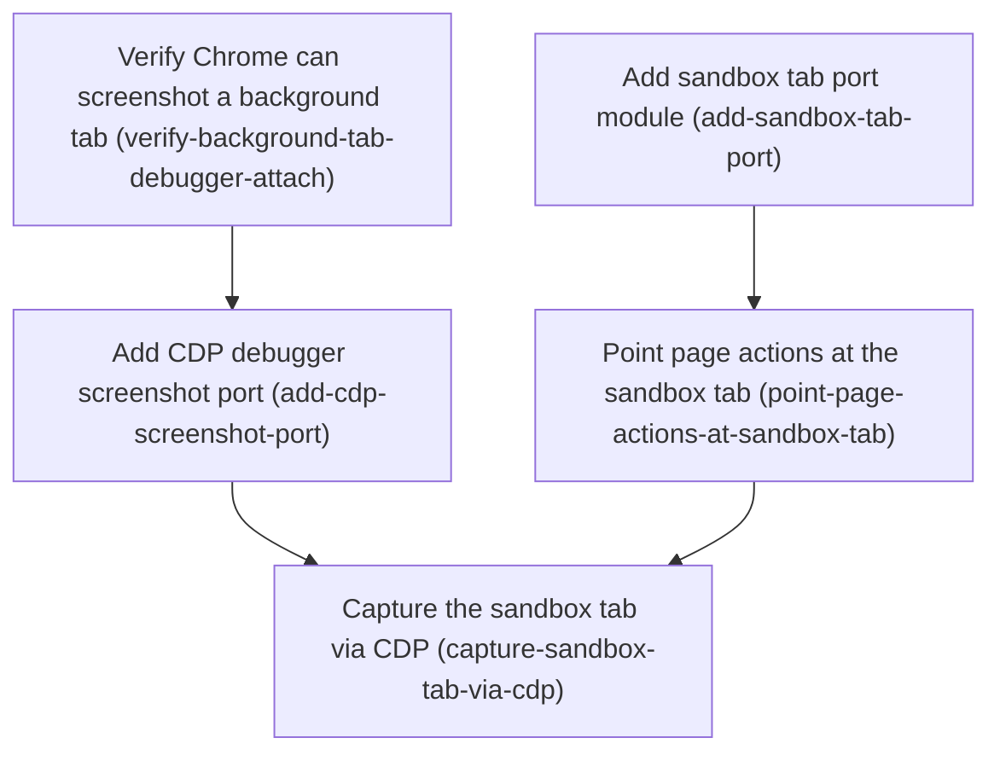

# Horizon 06 — Dedicated sandbox tab for the chrome-bridge MCP

## 🎯 What are we trying to achieve?

Give the bridge one dedicated browser tab (a "sandbox tab") that the MCP creates and reuses, so every page action operates on *that* tab by its id — even while it sits unfocused in the background — and screenshots of that background tab work. Today the bridge targets the single *active* tab, so to drive a page you have to click it into focus first. This horizon removes that dependency: a human never has to pick or switch to the tab an agent is driving.

Because Chrome's built-in screenshot (`chrome.tabs.captureVisibleTab`) can only capture the *focused* tab, background-tab screenshots need the **Chrome DevTools Protocol (CDP)** via `chrome.debugger` — the project's first deliberate step onto its long-open CDP-vs-DOM fork. CDP is used **only** for the screenshot gap; every other action stays DOM-based.

## 🧠 Why does this change need to happen?

As a product, the bridge is meant to let an agent drive a real website (claude.ai, ChatGPT, github.com, …) hands-free. But every action resolves its target from `ports.queryActiveTab()` — the tab the human happens to be looking at. If the human clicks a different tab mid-command, the agent's target silently changes, and the agent can only ever act on what's in front of the user. Compounding this, the human has to be looking at the working tab, which is exactly the coupling the tool exists to avoid. A dedicated, background-capable target tab is the fix; and once a tab is deliberately backgrounded, its screenshot has to come from CDP rather than the focus-only `captureVisibleTab`.

### At a glance

- **Phases:** 5 (feasibility gate → sandbox-tab port → CDP screenshot port → repoint actions → capture via CDP)
- **Complexity:** Medium — introduces a new privileged subsystem (`chrome.debugger`/CDP) with a session-lifecycle and a manifest permission, plus a real-Chrome gate and a live-Chrome closure check.
- **Main risk:** `chrome.debugger` may not be able to attach to a **background** tab from the MV3 service worker — if so, the whole "screenshot a background tab" design is falsified. This is de-risked up front by an explicit phase-0 real-Chrome probe.
- **Security footprint:** adds the high-privilege **`debugger`** permission (a permanent, manifest-declared grant that lets the extension read/modify any page). Deliberate and necessary for background capture; flagged for reviewers.
- **Testing focus:** sandbox-tab lifecycle (create/reuse/validate/recreate + no double-spawn), CDP attach→capture→detach ordering + `onDetach` cleanup + no lingering attachment, the "no `queryActiveTab` remains in the resolve path" proof, and the `data:image/png;base64,...` result contract.

---

## Order of work

1. **Verify Chrome can screenshot a background tab** — *first, because the whole CDP design depends on it.*
2. **Add sandbox tab port module** — independent; the resolver the handlers need.
3. **Add CDP debugger screenshot port** — after the probe proves attach works.
4. **Point page actions at the sandbox tab** — after the sandbox port exists.
5. **Capture the sandbox tab via CDP** — after both ports and the repointing exist.

---

## Phase 0 — Verify Chrome can screenshot a background tab

*Technical ID: `verify-background-tab-debugger-attach` · bounded context: chrome-bridge extension — CDP feasibility · layer: infrastructure · blast radius: small*

- **Goal** — Prove, in a real Chrome session, that `chrome.debugger` can attach to a **non-focused** tab from the extension service worker and that `Page.captureScreenshot` returns that background tab's PNG — *before* any CDP port code is built on that assumption.
- **Why** — The whole feature screenshots a deliberately backgrounded tab. Chrome's own `captureVisibleTab` can't; CDP `Page.captureScreenshot` can target a tab by id regardless of focus — but it is *not established* that an MV3 service worker can attach to a non-active tab (suspension, tab discard, or Chrome rejecting the target). If attach fails, the feature is not buildable as scoped, so this is validated first as a hard gate.
- **Changes**
  - Add `debugger` to `manifest.json` permissions (the `<all_urls>` host permission is already present).
  - Real-Chrome check: open one foreground tab and a second background tab; from the service worker call `chrome.debugger.attach({tabId: <backgroundTab>}, '1.3')` and `sendCommand → Page.captureScreenshot`.
  - Confirm the returned image is a PNG of the **background** tab, not the focused tab; record the verdict.
  - If attach fails or returns the focused tab — stop and raise it; the CDP approach is falsified. Do not patch around it.
  - On pass, remove the throwaway probe; the `debugger` permission stays (it lands here).
- **Files / areas** — `tools/chrome-bridge/extension/manifest.json`; the throwaway real-Chrome probe.
- **How to verify** — `manifest-debugger-permission` (only the `debugger` permission added, nothing else changed); `attach-targets-background-by-id` (attach succeeds on the recorded non-focused tabId, ids recorded as distinct); `capture-returns-background-tab-png` (PNG decodes and contains a unique marker only on the background tab); `service-worker-context-and-repeatability` (ran from the SW, detaches cleanly, runs twice); `honest-negative-verdict` (a genuine failure is recorded as BLOCKED, not worked around).
- **Done when** — a recorded real-Chrome verdict that attach works on a background tab and the screenshot shows that tab, with the `debugger` permission in the manifest. A negative verdict ends the phase `blocked` with the proof.
- **Depends on** — nothing; can start immediately.

## Phase 1 — Add sandbox tab port module

*Technical ID: `add-sandbox-tab-port` · bounded context: chrome-bridge extension — sandbox-tab lifecycle · layer: infrastructure · blast radius: small*

- **Goal** — A new port that guarantees exactly one dedicated sandbox tab exists and returns its numeric `tabId`, creating/recreating it as needed.
- **Why** — Today every action uses the active tab. To own a single dedicated background tab we need create-it-once, remember-its-id, reuse-it. The Chrome APIs it needs (`tabs.create`, `tabs.get`, `storage.local`) don't exist anywhere in the codebase yet, so this is a brand-new port.
- **Changes**
  - `SandboxTabPorts` interface with one method `resolveTabId(): Promise<number>`.
  - `chromeSandboxTabPorts()`: read the persisted id from `chrome.storage.local`, validate via `chrome.tabs.get`; if missing/stale, `chrome.tabs.create({ active: false })` and persist the new id.
  - Make create re-entrant (validate before create, persist promptly) so two near-simultaneous commands don't both spawn a tab.
  - Co-located `sandbox-ports.unit.test.ts` (stub `chrome` via `vi.stubGlobal`), one test per lifecycle path.
- **Files / areas** — `tools/chrome-bridge/src/extension/sandbox-ports.ts` (new) + `sandbox-ports.unit.test.ts` (new).
- **How to verify** — `single-tab-reuse` (same id returned, zero creates); `fresh-tab-create-persist` (created `active:false`, persisted before resolve); `stale-id-recreate` (dead id → replacement + persist); `concurrent-no-double-spawn` (overlapping calls → exactly one `tabs.create`); `lifecycle-path-test-coverage` (one test per path, asserts chrome side-effects).
- **Done when** — `sandbox-ports.ts` + its test export the full `resolveTabId` lifecycle. No other file touched.
- **Depends on** — nothing; can start immediately.

## Phase 2 — Add CDP debugger screenshot port

*Technical ID: `add-cdp-screenshot-port` · bounded context: chrome-bridge extension — CDP screenshot · layer: infrastructure · blast radius: medium*

- **Goal** — A port that screenshots an arbitrary background tab via CDP `Page.captureScreenshot`, so a non-focused tab can still be captured.
- **Why** — `captureVisibleTab` is window-scoped and only captures the focused tab. The sandbox tab is deliberately unfocused, so its capture must come from CDP, which targets a tab by id; this needs the `debugger` permission (added in phase 0).
- **Changes**
  - `CaptureDebuggerPorts.captureScreenshot(tabId): Promise<string>` returning `data:image/png;base64,<b64>`.
  - `chromeCaptureDebuggerPorts()`: `attach` → `sendCommand('Page.captureScreenshot')` → read `{data}` → wrap as the `data:` URL → `detach` in a `finally`.
  - `chrome.debugger.onDetach` listener so a mid-session detach clears up and rejects an in-flight capture; surface attach failures as throws.
  - Co-located `debugger-ports.unit.test.ts` (stub `chrome.debugger`): attach→capture→detach ordering, prefix handling, onDetach cleanup, attach failure.
  - Record the CDP-vs-DOM decision: CDP only for the screenshot gap; the broad pivot is deferred.
- **Files / areas** — `tools/chrome-bridge/src/extension/debugger-ports.ts` (new) + `debugger-ports.unit.test.ts` (new). (`manifest.json`'s `debugger` permission already applied in phase 0.)
- **How to verify** — `screenshot-data-url` (validly-prefixed single data URL, base64 passed through unmodified); `cleanup-on-all-paths` (`detach` in a `finally`, doesn't mask the outcome); `repeatable-no-lingering-attachment` (second capture re-attaches cleanly after success *and* failure); `ondetach-listener-cleanup` (listener added once, rejects in-flight capture, no leak); `cdp-vs-dom-scope-record` (decision note limits CDP to `Page.captureScreenshot`).
- **Done when** — `debugger-ports.ts` + test, and the CDP-vs-DOM decision recorded as limited to `Page.captureScreenshot`.
- **Depends on** — `verify-background-tab-debugger-attach`.
- **Rollback** — delete `debugger-ports.ts` + test and remove the `debugger` permission; no other code calls this port.

## Phase 3 — Point page actions at the sandbox tab

*Technical ID: `point-page-actions-at-sandbox-tab` · bounded context: chrome-bridge extension — target resolution · layer: application · blast radius: medium*

- **Goal** — Every page-action handler that currently resolves the active tab now resolves the one sandbox tab id, so all actions act on the same unfocused tab.
- **Why** — The sandbox port now exists; the handlers must use it. This is one mechanical substitution (each handler does `queryActiveTab()` → aborts for `NO_ACTIVE_TAB`), not bespoke per-action logic.
- **Changes**
  - Add a `SandboxTabPorts` parameter to `pageActionHandlers`.
  - Replace the `queryActiveTab()`/`NO_ACTIVE_TAB` block in all 13 non-captureTab sites (incl. the readConsole/readNetwork closure) with `await sandboxTab.resolveTabId()`, caught by the existing `guard()`.
  - Replace the `NO_ACTIVE_TAB` sentinel with a sandbox-specific sentinel + message; update the two "no history" strings to "the sandbox tab". Leave captureTab's active-tab path alone (re-pointed next phase).
  - Wire `chromeSandboxTabPorts()` into `startServiceWorker`.
  - Rewrite the unit tests to prove the resolver forwards id `7` into each concrete Chrome call and that no `queryActiveTab` remains in the resolve path; keep `queryActiveTab` in `fakePorts` for captureTab.
- **Files / areas** — `page-actions.ts`, `service-worker.ts`, `page-actions.unit.test.ts`, `service-worker.unit.test.ts`.
- **How to verify** — `exhaustive-repointing` (grep `queryActiveTab` shows only captureTab's windowId block); `capturetab-handoff-preserved` (captureTab unchanged this phase); `sentinel-error-and-messages` (old sentinel gone, caught throw, both messages updated); `test-forwards-resolved-id` (resolver called AND id forwarded to each API); `service-worker-wiring` (ports actually wired into `startServiceWorker`, its test passes).
- **Done when** — every non-captureTab action resolves to the sandbox tab id, with tests proving no `queryActiveTab` remains.
- **Depends on** — `add-sandbox-tab-port`.
- **Rollback** — restore the `queryActiveTab` blocks + old sentinel, revert the signature and the test fake.

## Phase 4 — Capture the sandbox tab via CDP

*Technical ID: `capture-sandbox-tab-via-cdp` · bounded context: chrome-bridge extension — CDP screenshot · layer: application · blast radius: medium*

- **Goal** — Switch `captureTab` from the window-scoped `captureVisibleTab` to the CDP debugger screenshot port, so it returns a real PNG of the unfocused sandbox tab.
- **Why** — `captureTab` is the one action whose call is window-scoped and grabs whatever tab is focused — the wrong result when the target is the backgrounded sandbox tab. The CDP port screenshots a specific tab regardless of focus.
- **Changes**
  - Add a `CaptureDebuggerPorts` parameter to `pageActionHandlers` (after `SandboxTabPorts`).
  - Rewrite `captureTab` to resolve the sandbox tab id and call `debugger.captureScreenshot(tabId)`, returning `{ result: { dataUrl } }` — `dataUrl` is the already-prefixed `data:image/png;base64,...` URL the CDP port returns (the `data:` prefix is added once at the port layer, not re-added here).
  - Wire `chromeCaptureDebuggerPorts()` into `startServiceWorker`.
  - Rewrite the captureTab unit tests (assert `captureScreenshot(7)` + `dataUrl`; port-rejection → `{ error }`).
- **Files / areas** — `page-actions.ts`, `service-worker.ts`, `page-actions.unit.test.ts`.
- **How to verify** — `data-url-contract` (valid `data:image/png;base64,<b64>`, base64 passed straight through); `sandbox-tab-routing` (called with the sandbox tabId, no `captureVisibleTab` fallback in the sandbox path); `error-contract` (resolver-failure and port-rejection both → `{ error }`); `wiring-is-live` (debugger ports genuinely constructed + passed, `tsc` clean).
- **Done when** — captureTab returns the sandbox tab's PNG via CDP, proved by tests, with the result contract and MCP image block unchanged. A live-Chrome check must then confirm the PNG shows the sandbox tab while a different tab is focused — the horizon closes `blocked / MANUAL_CHROME_CHECK_PENDING`.
- **Depends on** — `add-cdp-screenshot-port`, `point-page-actions-at-sandbox-tab`.
- **Rollback** — restore the old captureTab body; note this restores the focused-tab-only limitation.

---

## Discovery Findings

| Area | Finding | Path | Implication |
|---|---|---|---|
| ChromePorts contract | 6 of 7 methods already take `tabId`; only `captureVisibleTab(windowId)` is window-scoped | `ports.ts` | Re-pointing the six DOM/nav actions is a pure resolution change; captureTab *must* go CDP |
| Target resolution | All 14 handlers do `queryActiveTab()` → `NO_ACTIVE_TAB` | `page-actions.ts` | One mechanical substitution, not 14 rewrites |
| captureTab + MCP result | CDP returns bare base64 (`{data}`), no `data:` prefix; MCP maps `{dataUrl}` → image block | `page-actions.ts` / `server.ts` | Prefix added once at the port layer; keep `{dataUrl}` contract |
| Protocol contract | No new action and no per-call param needed (sandbox tab is the default target) | `protocol/actions.ts` | `protocol/types.ts`, tool catalog, parity tests untouched |
| Service-worker wiring | No `tabs.create`/`storage`/`chrome.debugger` anywhere; `tabs.onRemoved→evict` exists | `service-worker.ts` | New injected `SandboxTabPorts`/`DebuggerPorts`, not widening ChromePorts |
| Capture rings | Rings keyed by tabId; content scripts `<all_urls>` top-frame auto-inject | `capture-store.ts` | Sandbox tab self-populates on navigation; only resolution changes |
| Manifest | `[tabs, activeTab, scripting, storage, alarms]`, no `debugger`; `storage` present | `manifest.json` | One line to add `debugger`; high-privilege grant |
| CDP usage | Zero existing `chrome.debugger`/CDP code | (grep) | Greenfield port, write from scratch |
| Tests | `fakePorts()` implements all 7 methods; queryActiveTab asserted ~10× | `page-actions.unit.test.ts` | Rewrite these exactly per success criterion; new port needs `stubGlobal` test |
| Testguard | `/ports\.ts$` exemption does NOT cover new `*-ports.ts` | `.testguard.json` | Every new port module ships a co-located test |

## Out of Scope (deferred)

- Broad CDP pivot (Runtime.evaluate, Input.dispatch*, scroll, full-page capture, file upload) — option (b), explicitly not chosen.
- General tab management (listTabs, create/close/switch, multi-tab, cross-window).
- Keyboard (gap #3) and Scroll (gap #4) actions.
- Full-page / element-clipped screenshots + format options.
- The result-size-cap location/threshold decision.
- iframe / all_frames capture.
- Preserving the active-tab path as a selectable per-call option.
- Removing the now-dead `queryActiveTab` / `captureVisibleTab` / `ActiveTab.windowId` surface (later cleanup horizon).
- Auto-navigating the sandbox tab to a fixed bootstrap URL.
- Boky's extension / relay / MCP (unchanged everywhere).

## Required Materials

None — every input is an in-repo code artifact or a documented Chrome extension API. The one soft external prerequisite (a real Chrome session) is the runtime the live-Chrome check covers.

## Success Criteria

The full list is in the roadmap JSON. Summarized: lazy-create/reuse/persist/revalidate one sandbox tab; every non-captureTab action resolves to it (proved no `queryActiveTab` remains); captureTab returns the background tab's PNG via CDP (proved against the `{ dataUrl }` contract); the CDP-vs-DOM decision recorded (option a, broad pivot deferred); `tsc`/`eslint`/`vitest` green and the manifest gains `debugger`; and the horizon closes only after a live-Chrome check (per the project rule, it ends `blocked / MANUAL_CHROME_CHECK_PENDING`).

## Alignment Preview

The decomposition was approved at Stage 3.4. One endorsed concern changed it: the real-Chrome **CDP-attach probe became its own phase-0 gate** (it was previously the first task inside the CDP port phase). Two advisory concerns were folded in without restructuring: the phase titles now name files and the CDP-screenshot-only + active-tab-gone boundary is explicit; and the high-privilege `debugger` permission is flagged for reviewers (a deliberate consequence of the user's "must capture background tabs now" decision).

## Quality Gate

Path: **full**. Gate passed on **iteration 0**: critically scored 10/10 dimensions, all `pass: true`, all scores 8–9 (`minor`), 0 `blocker`, 0 `major` → **no healing required**. One non-blocking prose inconsistency (which layer owns the `data:` prefix) was corrected before output so phase 4 does not double-prefix the URL. Accepted debt: none.

## Full analysis

- **Domain shape:** technical — MV3 target-resolution + a CDP/screenshot adapter, no business rules; matches the project's recorded vision.
- **Ubiquitous language:** sandboxTab, tabId, backgroundTab, targetResolution, captureVisibleTab, CDP, debuggerSession.
- **Assumptions:** sandbox tab is the default target (no active-tab per-call option this horizon); the six DOM/nav ports already take tabId; content scripts auto-populate the sandbox tab's rings; `debugger` + `<all_urls>` suffices for attach; `Page.captureScreenshot` works on a held-rendered background tab; the tabId-targeting blocker is resolved; a fresh/about:blank sandbox tab returns empty-but-valid reads.
- **Risks (top):** `chrome.debugger` may not attach to a background tab from an MV3 SW → the screenshot feature is falsified (de-risked by the phase-0 probe); the minimal CDP island may sprawl into trusted input (guarded by tracking every CDP surface the decision note covers); mis-target on a stale tabId after browser restart (mitigated by validate-and-recreate); MV3 suspension / double-spawn race (mitigated by re-entrant create); CDP session-lifecycle leaks (mitigated by `onDetach` + `finally` detach); and the security note: the `debugger` permission is a powerful grant, accepted deliberately, surfaced to reviewers. A semantic landmine: adding CDP does NOT make `executeScript` work on strict-CSP sites — that stays a known hard failure and is stated in the decision record.
