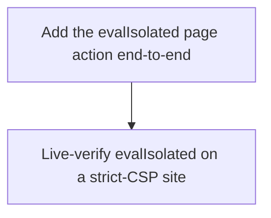

# Horizon 08 — eval-isolated-tool

## Executive Summary

**🎯 What are we trying to achieve?**
Add one new tool, `evalIsolated`, to the chrome-bridge MCP. It runs a caller-written JavaScript expression in the browser's **isolated** content-script world, which is *exempt from a site's Content-Security-Policy*. That means it can read page text, element content, and the page URL on strict-CSP sites (LinkedIn, github.com, reddit.com) where the existing `executeScript` tool — which deliberately runs in the page's **MAIN** world and therefore hits the page CSP — is blocked. The existing `executeScript` tool is left completely unchanged.

**🧠 Why does this change need to happen?**
While driving LinkedIn through chrome-bridge, every `executeScript` call failed with Chrome's "Evaluating a string as JavaScript violates the following Content Security Policy directive" error. That one blocker took down the whole page-reading path (headline, skills, experience, dates, section visibility). The root cause is that `executeScript` runs in the page's MAIN world, which inherits the page's CSP, and LinkedIn/github/reddit all disallow `eval`. Chrome extension content scripts in the **isolated** world are not subject to the page's CSP, so running the same expression there sidesteps the block entirely. This horizon adds that one escape hatch — deliberately narrow, per the "address the enabler first, then continue" request.

**At a glance**

| | |
|---|---|
| **Phases** | 2 |
| **Complexity** | Low — one new page action across a type-locked surface, plus a live-Chrome check |
| **Main risk** | The core premise (isolated-world `eval` is CSP-exempt) is asserted, not yet measured; the live-Chrome check is what actually proves it. |
| **Target** | `tsc --noEmit`, `eslint --max-warnings 0`, package vitest green; live-Chrome proof on a strict-CSP site (until that passes, the horizon stays `MANUAL_CHROME_CHECK_PENDING`). |
| **Testing focus** | Isolated-world selection, the type-locked parity surface completeness, `executeScript` left untouched, the result/error contract, and updated count-hardcoded tests + README counts. |

---

## Implementation plan

**Order of work**

1. **Add the evalIsolated page action end-to-end** — because `PAGE_ACTIONS` is the protocol's single source of truth and every consumer is typed `Record<PageAction, …>`, this is one atomic change: it must land together across the catalog, the protocol types, the handler, and the count tests, or `tsc` breaks.
2. **Live-verify evalIsolated on a strict-CSP site** — after the action exists, prove in a real Chrome session that it returns a value on github/reddit where `executeScript` errors with the CSP message. (This edits a loaded extension, so the real-Chrome check is mandatory.)

### Phase 0 — Add the evalIsolated page action end-to-end

Technical ID: `add-eval-isolated-action` · bounded context: chrome-bridge protocol/action surface · layer: infrastructure · blast radius: medium

**Goal** — Add a new `evalIsolated` page action (and its MCP tool) that runs a caller-supplied JS expression in the isolated content-script world, so DOM/text/location reads work on strict-CSP sites, leaving `executeScript` byte-for-byte unchanged.

**Why** — Strict-CSP sites block the MAIN-world `executeScript` string eval with Chrome's CSP error. Running the same expression in the isolated world (chrome.scripting's default, CSP-exempt) sidesteps it. Adding one member to `PAGE_ACTIONS` breaks `tsc` unless every typed consumer and the count-hardcoded tests update together, so the whole surface must change in one atomic phase.

**Changes**
- Insert `evalIsolated` into the `PAGE_ACTIONS` tuple after `executeScript` (17 → 18).
- Add `EvalIsolatedParams {code}` / `EvalIsolatedResult {value; error?}` to protocol/types.ts, plus the `evalIsolated` keys in `PageActionParams`/`PageActionResults`.
- Add a raw `evalIsolated` handler: validate `code` non-empty, resolve `sandboxTab.resolveTabId()`, call `ports.executeScript(tabId, func, [code])` with **no** MAIN world (ISOLATED), reusing the shared `InPageScriptOutcome` / `coerceExecuteScriptOutcome` / 1MB cap, returning `{result:{value}}` or `{error}`.
- Register `evalIsolated: guard(raw.evalIsolated)` in the guarded map; leave `executeScript` byte-for-byte unchanged.
- Add an `evalIsolated` `TOOL_CATALOG` entry with `{code: {type:'string'}}`, `required:['code']`.
- Update the count tests to 18; add a `page-actions.unit.test.ts` handler block asserting no `{world:'MAIN'}` is passed.
- Update README action counts (17→18) and add a manual e2e step.

**Files / areas** — `src/protocol/actions.ts`, `src/protocol/types.ts`, `src/extension/page-actions.ts`, `src/mcp/tool-catalog.ts`, `src/protocol/actions.unit.test.ts`, `src/mcp/tool-catalog.unit.test.ts`, `src/extension/page-actions.unit.test.ts`, `README.md`

**How to verify**
- *Isolated-world selection is correct* — the `evalIsolated` handler passes no `{world:'MAIN'}`; its test asserts `[7, expect.any(Function), [code]]` with no MAIN option; the guarded map exposes it.
- *Type-locked parity surface complete* — `evalIsolated` is in `PAGE_ACTIONS`, the param/result interfaces, both handler maps, and `TOOL_CATALOG`; `npm run verify:fast` green with no `@ts-ignore`/`as any`.
- *executeScript left byte-for-byte unchanged* — its handler still passes `{world:'MAIN'}`, its tests and catalog description are untouched.
- *Result/error contract matches* — reuses `coerceExecuteScriptOutcome`; empty/over-large/over-1MB → `{error}`; tests cover the value, error, no-envelope, and cap paths.
- *Count-hardcoded tests + README updated* — both test files assert 18; `required.get('evalIsolated') === ['code']`; README says eighteen and includes `evalIsolated`.

**Done when** — `npm run verify:fast` green with `evalIsolated` present in `PAGE_ACTIONS`, the protocol types, both handler maps, and `TOOL_CATALOG`, and every count-hardcoded test asserts 18.

**Depends on** — nothing — can start immediately.

### Phase 1 — Live-verify evalIsolated on a strict-CSP site

Technical ID: `live-verify-eval-isolated` · bounded context: chrome-bridge live verification · layer: cross-cutting · blast radius: small

**Goal** — In a real Chrome session, verify `evalIsolated` returns a structured value on a strict-CSP site (github.com / reddit.com, plus LinkedIn if signed in) where the same expression via `executeScript` returns Chrome's verbatim CSP eval error, proving the blocker is actually resolved rather than merely typed.

**Why** — This change edits the loaded extension, and the core premise — that a string `eval` inside an isolated-world func is exempt from the page CSP — is asserted but not yet measured. The live check distinguishes a real fix from a merely-typed one, and must account for a stale service worker (which makes the new action time out rather than error). If the check can't run, the horizon is marked `blocked`/`MANUAL_CHROME_CHECK_PENDING` with the reason.

**Changes**
- Remove and re-add the freshly built unpacked extension (or restart Chrome) so the new service worker is loaded; a stale SW times out the new action instead of erroring.
- On github.com (and reddit.com, plus LinkedIn if signed in), call `evalIsolated` with e.g. `document.querySelector('h1')?.innerText`, `location.href`, or a JSON string of link hrefs, and confirm it returns the value.
- Run the same expression through `executeScript` on the **same** site and confirm it returns Chrome's verbatim CSP eval error.
- Record the outcome in the README manual e2e checklist (or the horizon verify record); if it couldn't be performed, mark the horizon `blocked`/`MANUAL_CHROME_CHECK_PENDING` and state the reason.

**Files / areas** — `extension/manifest.json`, `README.md` (runtime inspection/verification; no source change expected)

**How to verify**
- *Real live-chrome MCP provenance* — the verdict names the chrome-bridge actions and the strict-CSP host, anchored to a real sandbox tab, from captured tool return values — never a unit test or the Playwright standalone REPL.
- *Same-site isolated-world exemption demonstrated* — `evalIsolated` returns a real structured value and `executeScript` returns the verbatim CSP error, on the **same** site and **same** expression.
- *Fresh extension load, stale-SW excluded* — the record documents a remove+re-add (or Chrome restart) before the check, and treats a 30s timeout as distinct from the CSP error.
- *Truthful verdict and horizon state* — the horizon is verified only with the complete live record, else it stays `MANUAL_CHROME_CHECK_PENDING` with the reason.

**Done when** — a recorded live-Chrome verification shows `evalIsolated` returns a structured DOM/text/location value on a strict-CSP site where `executeScript` returns the CSP error; if it wasn't run, the horizon is marked `blocked`/`MANUAL_CHROME_CHECK_PENDING` with the reason.

**Depends on** — Add the evalIsolated page action end-to-end.

---

## Discovery Findings
*(from the actual chrome-bridge source — grounded, not assumed)*

| Area | Finding | File | Implication |
|---|---|---|---|
| PAGE_ACTIONS tuple | 17-member `as const` tuple; `getTabState` already added | `src/protocol/actions.ts` | `evalIsolated` → 18; every `Record<PageAction,…>` consumer must update (tsc-enforced) |
| Params/results keying | keyed interfaces; `ExecuteScriptParams{code}` / `ExecuteScriptResult{value;error?}` | `src/protocol/types.ts` | add `EvalIsolatedParams{}`/`EvalIsolatedResult{}` + 2 key entries; `Command` self-derives |
| executeScript handler | `(0, eval)(code)` func with `{world:'MAIN'}`; `InPageScriptOutcome`/`coerceExecuteScriptOutcome`/1MB cap | `src/extension/page-actions.ts` | `evalIsolated` = near-verbatim copy, only world differs; add to both raw + guarded maps |
| Ports world handling | `executeScript(..., options?.world)` — omitting world = ISOLATED default | `src/extension/ports.ts` | **no port change**; `evalIsolated` just omits the MAIN option |
| TOOL_CATALOG | `Record<PageAction, ToolCatalogEntry>`; `listTools()` from `PAGE_ACTIONS` | `src/mcp/tool-catalog.ts` | add an `evalIsolated` entry with `required:['code']`; dispatch auto-advertises |
| Count tests | tuples/length assert 17 | `actions.unit.test.ts`, `tool-catalog.unit.test.ts` | bump to 18; add `required.get('evalIsolated')===['code']` |
| Manifest | `scripting` + `<all_urls>` present; isolated world already used | `src/extension/manifest.json` | **no manifest change** / no new permission |
| Stale docs | README says 'sixteen'/16, server.ts 'eight', types.ts 'ten' | `README.md` etc. | update README to 18 + enumerate; internal comments deferred as debt |

## Out of Scope

- **scroll** (gap #4) — no scrolling mechanism this horizon.
- **wait/settle** (gap #3) — no read-tool settling.
- **response bodies** (gap #5) — network capture unchanged.
- **click-by-text / fuller event sequence** (gap #6) — `clickElement` stays CSS-only.
- **findElement-returns-refs + DOM page-model snapshot** (gap #2) — `findElement` still returns a count.
- **full-page / element-clipped screenshots** (gap #7) — `captureTab` stays viewport-only.
- **CDP Runtime.evaluate pivot** — the CSP fix is via the isolated world, not CDP; `evalIsolated` can't reach page-script globals (a known ceiling, not a bug).
- **modifying `executeScript`** — explicitly kept unchanged.
- **dead active-tab surface cleanup** — a separate deferred concern.
- **new permission / port / capability** — not needed.
- **stale internal doc-count comments** (server.ts / types.ts / tool-catalog.ts) — already wrong today, not tsc-enforced; deferred to a docs-cleanup pass (YAGNI).

## Required Materials
None (lite path — Stage 2 skipped; every input is already established in Discovery).

## Success Criteria
- The chrome-bridge MCP advertises `evalIsolated` in `listTools` (18 tools) and one call on a strict-CSP site returns a structured DOM/text/location value where the same expression via `executeScript` returns Chrome's verbatim CSP eval error. It runs in the isolated world (CSP-exempt), reuses `executeScript`'s result/error contract and 1MB cap, and leaves `executeScript` byte-for-byte unchanged. `tsc --noEmit`, `eslint --max-warnings 0`, package vitest pass; parity surface + count tests + README at 18. Verified in real Chrome; until then the horizon is `blocked`/`MANUAL_CHROME_CHECK_PENDING`.
- *Add the evalIsolated page action end-to-end* — `npm run verify:fast` green with `evalIsolated` in `PAGE_ACTIONS`, types, handler maps, and `TOOL_CATALOG`; every count test at 18; `listTools()` advertises it.
- *Live-verify evalIsolated on a strict-CSP site* — a recorded live-Chrome verification showing `evalIsolated` returns a structured value where `executeScript` returns the CSP error; else `blocked`/`MANUAL_CHROME_CHECK_PENDING`.

## Alignment Preview
Prepared on the lite path (non-blocking). Scope locked by the user to the "enabler alone (CSP eval)" slice via a new `evalIsolated` tool. No concerns raised; no redirect needed.

## Quality Gate
- **Path:** lite · **iterations run:** 0 · **verdict:** passed on iteration 0.
- **Issues raised → verified (blockers only) → healed:** 0 blockers, 0 majors, 10 minor (all `pass`, scores 8–9). No verify or heal required. `domain-shape-fit` passed (score 9) — the technical classification is accurate.

## Full analysis
- **domainShape:** technical — developer tooling machinery (a page action evaluating JS in a specific execution world to work around a CSP limitation), no business entities/rules.
- **Ubiquitous language:** page action · execution world (`world`) · Content-Security-Policy (CSP) / strict-CSP site · `func`-injection · sandbox tab · `TOOL_CATALOG` · in-page outcome (`InPageScriptOutcome` / `coerceExecuteScriptOutcome`).
- **Assumptions:** isolated-world func-injection is CSP-exempt; it shares DOM/location but not page globals; `ports.executeScript` already defaults to ISOLATED; no port/relay/dispatch/manifest change; result must be JSON-serialisable; a stale SW makes the new action time out, so live verify must re-add the extension.
- **Primary risk:** the CSP-exemption premise is asserted but unmeasured — the live-Chrome check is the proof, and the horizon is held `MANUAL_CHROME_CHECK_PENDING` until it passes. Secondary: the isolated world can't read page-script globals (a documented ceiling, not a regression).
