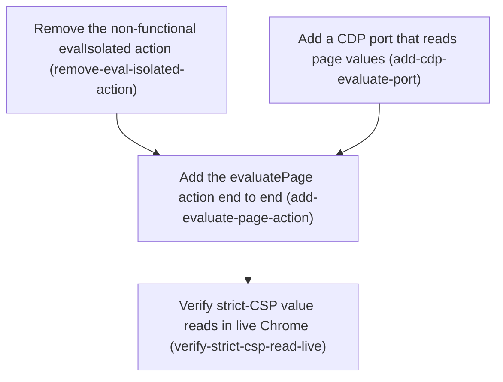

# Horizon 09 — Read strict-CSP page values through CDP

## 🎯 What are we trying to achieve?

Some websites (LinkedIn, github.com, reddit) run a strict security policy that
blocks the chrome-bridge's current way of reading a value off the page
(`executeScript`). Horizon 08 tried to get around this with a different trick
(`evalIsolated`) and live testing proved the trick can never work in a modern
Chrome extension. This horizon takes the one route that does work — Chrome's
DevTools Protocol (CDP), the same low-level channel the browser's own DevTools
uses — adds a new `evaluatePage` tool built on it, removes the dead
`evalIsolated` tool, and proves the new tool reads real values from those
sites in a live browser.

## 🧠 Why does this change need to happen?

The whole point of this project is to let any AI coding tool drive and read a
real Chrome tab. "Read a value from the page" is a core capability, and it is
currently broken on exactly the high-value sites an agent most wants to read
(a logged-in LinkedIn profile, a GitHub PR, a Reddit thread). Horizon 08 spent
a whole horizon on an approach that turned out to be architecturally
impossible: Chrome's Manifest V3 forbids evaluating a string as code in *every*
execution context an extension has, so no amount of cleverness inside the
extension can do it. CDP sits outside that restriction. The `debugger`
permission CDP needs is already granted (horizon 06 uses it for background-tab
screenshots), so this is additive, not a new ask of the user.

## At a glance

- **Phases:** 4
- **Complexity:** Medium — one small infrastructure addition, one well-worn
  "add an action" change, one deletion, one live check; no new permissions, no
  protocol redesign.
- **Main risk:** CDP `Runtime.evaluate` could itself hit a site-specific
  restriction on some target — phase 4 tests two sites head-to-head to catch that.
- **Quality target:** `npm run verify` green for `tools/chrome-bridge`;
  `executeScript` byte-for-byte unchanged; a recorded live transcript.
- **Testing focus:** unit coverage of the CDP result mapping (value / exception
  / over-large / no-leak), type-locked parity across the six action-wiring
  sites, and a real-Chrome head-to-head against `executeScript`.

## User decisions taken at planning (Step 0)

1. **Lift the CDP `Runtime.evaluate` ban** for read-only page evaluation. The
   horizon-06 / horizon-08 decisions that barred it are superseded for reads.
2. **Open the broader CDP pivot too.** `Input.dispatch*` (trusted synthetic
   input), CDP scroll, and persistent CDP sessions are greenlit for later
   horizons without re-asking — but are **not built** here.
3. **Remove `evalIsolated` this horizon** (not left frozen-dead like the
   active-tab surface).

---

## Order of work

1. **Remove the non-functional evalIsolated action** — clears the dead surface
   first so the action-count tests only move once toward the new total.
2. **Add a CDP port that reads page values** — independent of phase 1; builds
   the `Runtime.evaluate` capability the new action will call.
   → depends on nothing
3. **Add the evaluatePage action end to end** — needs the port (phase 2) to
   delegate to and the clean 17-action baseline (phase 1) for its count tests.
   → depends on phases 1 and 2
4. **Verify strict-CSP value reads in live Chrome** — needs the shipped action.
   → depends on phase 3

---

## Phase 1 — Remove the non-functional evalIsolated action

Technical ID: `remove-eval-isolated-action` · context: chrome-bridge page-action protocol · layer: cross-cutting · blast radius: small

**Goal** — `evalIsolated` and its entire protocol / handler / catalog / test /
doc surface are gone; `PAGE_ACTIONS` is back to 17 entries; `npm run verify` green.

**Why** — Horizon 08's `evalIsolated` tried to read strict-CSP values by running
a caller string through `eval` in the extension's isolated content-script world.
Live testing showed Chrome's Manifest V3 forbids string evaluation in every
world, including that one — the extension's own security policy blocks it and
MV3 does not let that policy be relaxed. Every call returns a policy error. A
permanently dead tool in the MCP catalog misleads any connected agent into
thinking the capability exists.

**Changes**
- Remove `"evalIsolated"` from the `PAGE_ACTIONS` tuple in `actions.ts`.
- Delete `EvalIsolatedParams` / `EvalIsolatedResult` and their entries in the
  `PageActionParams` / `PageActionResults` mapped types in `types.ts`.
- Delete the `evalIsolated` raw handler and its guarded-map entry in `page-actions.ts`.
- Delete the `evalIsolated` entry from `TOOL_CATALOG`.
- Delete the `evalIsolated` describe block from `page-actions.unit.test.ts`;
  drop the count from 18 to 17 in `actions.unit.test.ts` and `tool-catalog.unit.test.ts`.
- README: remove `evalIsolated` from the two enumerations and its manual e2e
  step; change the "eighteen page actions" / "18 tools" counts to seventeen / 17.

**Files / areas** — `src/protocol/actions.ts` (+ test), `src/protocol/types.ts`,
`src/extension/page-actions.ts` (+ test), `src/mcp/tool-catalog.ts` (+ test), `README.md`

**How to verify**
- *Every trace of evalIsolated is gone* — `grep -riE 'evalIsolated|EvalIsolated'`
  over `tools/chrome-bridge` returns nothing; `PAGE_ACTIONS.length === 17`; both
  count tests assert 17.
- *npm run verify passes without suppressions* — no new `@ts-expect-error`,
  `eslint-disable`, `it.skip`, or loosened assertion in the diff.
- *Removal-only scope* — no file outside the eight listed is touched;
  `executeScript` and every other handler byte-for-byte unchanged.

**Done when** — the deliverable above exists and every check under *How to
verify* passes its bar.

**Depends on** — nothing — can start immediately.

**Rollback** — restore the deleted surface from git history if a later horizon
revives an isolated-world approach (none is currently believed possible under MV3).

Reference — full rubric

- `complete-removal` (minScore 8) — grep-clean, count 17, README updated. Fails
  if types are left as orphan exports or a test still references the gone handler.
- `green-gate-no-shortcuts` (minScore 8) — verify exits 0 with no new
  suppression or skipped test.
- `removal-only-scope` (minScore 7) — deletes and nothing else; no CDP code, no
  neighbouring-handler tidy-ups.

Healer hint: re-scope to a pure deletion plus the forced count/enumeration
edits; a failing dimension is almost always an orphan type or stale test — grep again.

---

## Phase 2 — Add a CDP port that reads page values

Technical ID: `add-cdp-evaluate-port` · context: chrome-bridge CDP debugger adapter · layer: infrastructure · blast radius: small

**Goal** — a new `evaluate(tabId, expression)` method on the
`chrome.debugger`-backed port module runs an expression against a tab through
CDP `Runtime.evaluate` and returns a JSON value or an error, reusing the
module's existing attach / detach / leak-cleanup lifecycle.

**Why** — `debugger-ports.ts` (from horizon 06) already attaches a debugger,
runs one CDP command, and detaches, with cleanup so a crash never leaks the
attachment. It currently exposes only screenshot capture. CDP's
`Runtime.evaluate` evaluates a JavaScript expression in the page's real context
and is **not** subject to a page's Content-Security-Policy — the one mechanism
that reads values from strict-CSP sites where `executeScript` is blocked. This
phase adds that one CDP call; wiring it to a tool is the next phase.

**Changes**
- Rename `CaptureDebuggerPorts` → `DebuggerPorts` (no longer capture-only);
  update its one importer in `page-actions.ts`. Keep `captureScreenshot`, add
  `evaluate(tabId, expression): Promise<InPageScriptOutcome>`.
- Factor the shared attach / `inFlight` / `onDetach` / detach-in-`finally`
  machinery out of `captureScreenshot` into a private helper both methods call,
  so screenshot behaviour is unchanged.
- Implement `evaluate`: attach; `sendCommand({ tabId }, "Runtime.evaluate",
  { expression, returnByValue: true, awaitPromise: true })`; detach in `finally`.
- Map the reply: `exceptionDetails` → `{ ok: false, error }`; otherwise
  `JSON.stringify(result.value)` with the same `MAX_EXECUTE_SCRIPT_RESULT_CHARS`
  cap the `executeScript` handler applies (export/move the constant, don't
  re-hardcode); `undefined` / non-serialisable → the same error strings
  `executeScript` returns.
- Co-located unit tests with a stubbed `chrome.debugger`: value read,
  `exceptionDetails` → error, over-large → cap error, detach on error path, no leak.

**Files / areas** — `src/extension/debugger-ports.ts` (+ `debugger-ports.unit.test.ts`)

**How to verify**
- *CSP-exempt read path* — issues `Runtime.evaluate` with `returnByValue` +
  `awaitPromise`; no `chrome.scripting`, no `eval`; a test asserts the exact
  command name and params.
- *Outcome and cap parity* — returns `InPageScriptOutcome`; the next phase can
  call `coerceExecuteScriptOutcome` on it with no adaptation; the size cap is
  the same shared constant.
- *Screenshot behaviour preserved* — existing `captureScreenshot` tests pass
  unchanged; `onDetach` registered once, not per call.
- *Port test coverage* — success / exception / over-large / detach-on-error all
  asserted with a stubbed `chrome.debugger`.

**Done when** — `DebuggerPorts.evaluate` exists with per-behaviour unit
coverage, `npm run verify` is green, and `captureScreenshot` is unchanged.

**Depends on** — nothing — can start immediately.

**Rollback** — none needed (additive infrastructure); revert the commit.

Reference — full rubric

- `csp-exempt-read-path` (8) — CDP `Runtime.evaluate`, `returnByValue` +
  `awaitPromise`. Fails if `awaitPromise` omitted (promises serialise as `{}`)
  or `returnByValue` omitted (empty reads).
- `outcome-and-cap-parity` (8) — same `InPageScriptOutcome` shape and shared
  size cap as `executeScript`. Fails if `exceptionDetails` ignored or the cap dropped.
- `screenshot-behaviour-preserved` (8) — refactor doesn't regress capture; one
  `onDetach` listener, both methods detach on every path.
- `port-test-coverage` (7) — four paths asserted against a stubbed `chrome.debugger`.

Healer hint: check `awaitPromise` + `returnByValue` are both set and
`exceptionDetails` is mapped; a screenshot regression is nearly always a
per-call `onDetach` listener — register it once in the shared helper.

---

## Phase 3 — Add the evaluatePage action end to end

Technical ID: `add-evaluate-page-action` · context: chrome-bridge page-action protocol · layer: interface · blast radius: medium

**Goal** — a new `evaluatePage` page action wired through the tuple, the
param/result types, the raw + guarded handler (calling `DebuggerPorts.evaluate`
on the sandbox tab), the `TOOL_CATALOG`, and the count-hardcoded tests;
`PAGE_ACTIONS` reaches 18.

**Why** — with the CDP port in place (phase 2) and the dead action removed
(phase 1), the bridge needs the user-facing MCP tool an agent calls to read a
strict-CSP page value. This is the exact "add one page action" shape the
project has done seven times: one tuple entry, a named params interface
(`{ code: string }`) and result interface (`{ value?: unknown; error?: string }`),
a handler in both maps, one `TOOL_CATALOG` description with `required: ["code"]`,
and count-hardcoded tests. The handler resolves the dedicated sandbox tab (like
every action since horizon 06) and delegates to the CDP port.

**Changes**
- Add `"evaluatePage"` to `PAGE_ACTIONS`, right after `"executeScript"`.
- Add `EvaluatePageParams` / `EvaluatePageResult` interfaces + their entries in
  the two mapped types.
- Raw handler: reject non-string / empty `code` with `{ error }`; resolve the
  sandbox tab; `await captureDebugger.evaluate(tabId, params.code)`; return
  `coerceExecuteScriptOutcome(outcome)`. Add `evaluatePage: guard(raw.evaluatePage)`
  to the guarded map.
- `TOOL_CATALOG.evaluatePage`: description names CDP and the strict-CSP use
  case, does not over-claim mutation/trusted input; `inputSchema { code: string }`,
  `required: ["code"]`.
- Bump counts/tuple assertions to 18 in the two count tests; add handler tests
  (value read, empty/missing code, port-error passthrough) with a fake
  `captureDebugger.evaluate`.
- README: `evaluatePage` in the enumeration (two spots), counts to eighteen /
  18, a manual e2e step for a strict-CSP read.

**Files / areas** — `src/protocol/actions.ts` (+ test), `src/protocol/types.ts`,
`src/extension/page-actions.ts` (+ test), `src/mcp/tool-catalog.ts` (+ test), `README.md`

**How to verify**
- *Type-locked parity surface* — wired in all six coordinated places; parity by
  types alone, no cast / `@ts-ignore` / `as any`; count tests assert 18.
- *Handler delegates correctly* — validates `code`, resolves the sandbox tab,
  calls `captureDebugger.evaluate`, returns `coerceExecuteScriptOutcome`; no
  `executeScript`/MAIN fallback.
- *executeScript untouched* — its handler, unit block, catalog description, and
  the shared coercer/constant are unchanged in the diff.
- *Catalog description honest* — tells an agent it's for CDP page reads on
  strict-CSP sites; doesn't claim reliable mutation.

**Done when** — `npm run verify` green; `evaluatePage` present everywhere it
must be (`PAGE_ACTIONS` length 18); MCP `listTools` derives 18 tools;
`executeScript` untouched.

**Depends on** — *Remove the non-functional evalIsolated action* and *Add a CDP
port that reads page values*.

**Rollback** — revert this phase's commit to remove the `evaluatePage` surface.

Reference — full rubric

- `type-locked-parity-surface` (8) — all six places, no type escapes, counts at 18.
- `handler-delegates-correctly` (8) — validate → resolve sandbox tab → CDP port
  → shared coercer; no MAIN fallback.
- `executeScript-untouched` (8) — additive diff; MAIN assertion and catalog
  description unchanged.
- `catalog-description-honest` (7) — names CDP + strict-CSP; no over-claim.

Healer hint: a parity failure is a missed one of six places — add the key,
don't cast; a handler failure is usually a leftover `executeScript`/MAIN
fallback — delete it and delegate purely to `captureDebugger.evaluate`.

---

## Phase 4 — Verify strict-CSP value reads in live Chrome

Technical ID: `verify-strict-csp-read-live` · context: chrome-bridge live verification · layer: cross-cutting · blast radius: small

**Goal** — a recorded live transcript showing `evaluatePage` returning a real
value from ≥2 strict-CSP sites while `executeScript` still returns the page's
CSP error on the same expression.

**Why** — every horizon that changes the extension closes with a real-Chrome
end-to-end check rather than shipping done-but-unverified (a binding decision
from horizon 02). Horizon 08's premise died because this check was left last
and then failed; running it here is what keeps horizon 09 honest and confirms
CDP `Runtime.evaluate` is CSP-exempt in practice, not just in theory.

**Changes**
- Rebuild `dist/extension`; restart the chrome-bridge MCP server so it
  advertises `evaluatePage`; remove + re-add the unpacked extension (a stale
  service worker makes a new action time out silently — the documented signature).
- Via the chrome-bridge MCP: `navigateTo https://github.com`; `getTabState` to
  confirm the sandbox tab anchored; `evaluatePage { code:
  "document.querySelector('h1')?.innerText" }` → expect a string; `executeScript`
  with the same code → expect github's page-CSP error.
- Repeat the `evaluatePage` read on one of reddit.com or LinkedIn (signed in).
- Record the transcript in README's manual-verification list and as a one-line
  `discoveries.md` entry; mark the two horizon-08 `evalIsolated` blockers
  resolved in `blockers.md`.
- If the check can't be run in-session: end **blocked** with
  `MANUAL_CHROME_CHECK_PENDING` and exact rebuild + reload + retry steps.

**Files / areas** — `README.md` (manual-verification section),
`docs/roadmaps/agent-agnostic-browser-bridge/discoveries.md` + `blockers.md`

**How to verify**
- *Head-to-head evidence* — both calls, identical expression, on ≥2 strict-CSP
  sites; `evaluatePage` returns an actual value, not `{}`/null-from-error.
- *Fresh build confirmed* — rebuild + MCP restart + extension reload noted; a
  timeout was diagnosed as stale build, not recorded as an action failure.
- *Outcome recorded* — dated `discoveries.md` line, README updated, h08 blockers
  marked resolved.

**Done when** — the transcript exists and is recorded, or a `blocked` row with
`MANUAL_CHROME_CHECK_PENDING` and precise retry steps — never done-but-unverified.

**Depends on** — *Add the evaluatePage action end to end*.

**Rollback** — none — verification only.

Reference — full rubric

- `head-to-head-evidence` (8) — `evaluatePage` succeeds where `executeScript`
  fails, same expression, ≥2 sites.
- `fresh-build-confirmed` (8) — ran against the new build; timeouts diagnosed
  as stale SW, not results.
- `outcome-recorded` (7) — written to `discoveries.md` + README; h08 blockers resolved.

Healer hint: if evidence is thin, re-run both actions on both sites and paste
the raw transcript; if the action genuinely doesn't work, end blocked with
`REPLAN_REQUIRED` naming which CDP assumption failed — not a healer retry.

---

## Discovery Findings

| Area | Finding | File | Implication |
|---|---|---|---|
| CDP adapter | `debugger-ports.ts` already does attach → 1 CDP command → detach with leak-safe cleanup; exposes only `captureScreenshot`. | `src/extension/debugger-ports.ts` | Add `evaluate` as a second method sharing the attach/cleanup helper. |
| Handler wiring | `createPageActionHandlers(ports, sandboxTab, captureDebugger)`; every handler resolves `sandboxTab.resolveTabId()`; `captureTab` already delegates to `captureDebugger`. | `src/extension/page-actions.ts` | `evaluatePage`'s handler is ~4 lines; no new constructor param. |
| Eval outcome shape | `executeScript` / `evalIsolated` return `InPageScriptOutcome`; `coerceExecuteScriptOutcome` maps it; `MAX_EXECUTE_SCRIPT_RESULT_CHARS` = 1,000,000 applied handler-side. | `src/extension/page-actions.ts` | CDP `evaluate` returns the same shape → handler reuses the coercer; cap stays put. |
| Add-an-action surface | Adding an action = six coordinated edits, all in `Record<PageAction, …>` maps (missed one = tsc error). | `src/protocol/actions.ts` | Phases 1 and 3 each touch the same six places. |
| evalIsolated footprint | Enumerable across 8 files (tuple, 2 interfaces + 2 map entries, raw + guarded handler, catalog, 2 test files, README ×4). | `src/protocol/actions.ts` | Removal is small and fully greppable — zero hits when done. |
| Live-verify enablement | A new action is callable only after MCP server restart + `dist/extension` rebuild + remove/re-add; a stale SW makes it **time out**, not error. | `src/protocol/guards.ts` | Phase 4 must rebuild + restart + reload; failure signature = "timeout, never unknown-action". |
| Strict-CSP evidence | `executeScript` returns Chrome's CSP-eval error on github.com and reddit.com; `evalIsolated` returned the extension's *own* CSP error. | `discoveries.md` | Phase 4 head-to-head is well-grounded: `executeScript` = known-failing control, `evaluatePage` = treatment. |

## Out of Scope (deferred)

- **Trusted synthetic input via CDP `Input.dispatch*`** — greenlit by the h09
  decision, not built here; no phase needs it.
- **CDP-driven scroll / virtualized-list materialization** — later horizon.
- **Persistent multi-command CDP sessions** — deferred until a phase needs session continuity.
- **Removing or deprecating `executeScript`** — stays unchanged this horizon.
- **DOM page-model snapshot / findElement-refs** (horizon 05, never executed) — still deferred.
- **A wait/settle primitive** — still deferred.
- **Deleting the deliberately-dead active-tab surface** — still deferred.
- **Relocating the result-size cap to a generic MCP-layer truncation** —
  `evaluatePage` reuses the per-action cap; revisit only if forced.
- Anything past phase 4 — held for the next Planning Horizon; project memory
  carries the context forward.

## Required Materials

None — all inputs are repo-internal or the already-running chrome-bridge MCP.

## Success Criteria

1. Reading page-script values on strict-CSP sites (github.com, reddit.com,
   LinkedIn) works through the chrome-bridge MCP via a CDP-backed `evaluatePage`
   action, verified in live Chrome.
2. `evalIsolated` is absent from every file under `tools/chrome-bridge` and
   `npm run verify` is green.
3. `DebuggerPorts.evaluate` exists with unit coverage and `captureScreenshot` is unchanged.
4. `PAGE_ACTIONS` length 18, `TOOL_CATALOG` advertises `evaluatePage`,
   `executeScript` untouched.
5. A recorded transcript shows `evaluatePage` returning a value on ≥2
   strict-CSP sites while `executeScript` still fails on the same expression.

## Alignment Preview

Shown to the user in-session after the three Step 0 decisions. The plan is a
direct, minimal execution of those decisions; no redirect was requested.

## Quality Gate

- **Path:** full (4 phases, technical shape).
- **Stage 5:** critic pass applied against `rubric.md` inline by the
  orchestrator (single-horizon, heavily-precedented technical change; no
  subagent fan-out requested). All 10 dimensions pass at or above `minScore`
  (`domain-shape-fit` 10, `grounded-in-discovery` 9, `phase-blast-radius` 8,
  `yagni-scope` 8, `testable-rubrics` 8, `success-coverage` 9, others ≥7). Zero
  blockers, zero majors.
- **Accepted debt (minor):** phase 3's `executeScript-untouched` contract
  forbids even a helpful cross-reference in `executeScript`'s catalog
  description; a future horizon may want to add "prefer `evaluatePage` on
  strict-CSP sites" there.
- **Verdict:** passed, iteration 0.

## Full analysis

- **Domain shape:** technical — a Chrome extension, a `chrome.debugger`/CDP
  adapter, and an MCP tool catalog; no business entities or rules.

| Term | Meaning |
|---|---|
| CDP (Chrome DevTools Protocol) | Low-level Chrome control reached via `chrome.debugger`; not subject to a page's CSP. |
| `Runtime.evaluate` | The CDP command that evaluates a JS expression in a tab's page context and returns its value. |
| page action | One capability in `PAGE_ACTIONS`, exposed as exactly one MCP tool. |
| sandbox tab | The single auto-created background tab every page action targets since horizon 06. |
| strict-CSP site | A site whose CSP blocks `chrome.scripting` eval — github.com, reddit.com, LinkedIn. |
| `evalIsolated` | The horizon-08 action being removed; isolated-world string eval, impossible under MV3. |
| `DebuggerPorts` | The `chrome.debugger`-backed port module (was `CaptureDebuggerPorts`) owning attach/command/detach. |

**Assumptions**
- `chrome.debugger.sendCommand` supports `Runtime.evaluate` with
  `returnByValue` + `awaitPromise` from an MV3 service worker (permission
  already granted and used for `Page.captureScreenshot`).
- CDP `Runtime.evaluate` is exempt from page CSP (documented DevTools mechanism;
  `executeScript`'s failure is specific to `chrome.scripting`).
- The sandbox tab remains the sole action target (horizon-06 decision).
- A live check is runnable this horizon; if not, phase 4 ends blocked with
  `MANUAL_CHROME_CHECK_PENDING`.

**Risks**
- CDP `Runtime.evaluate` could hit a Trusted-Types or site-specific restriction
  on some target — mitigated by testing ≥2 sites head-to-head.
- Sharing the attach/detach lifecycle between `captureScreenshot` and `evaluate`
  could regress screenshot capture — mitigated by an explicit rubric dimension.
- `chrome.debugger` attach raises Chrome's "started debugging this browser"
  banner on the sandbox tab — acceptable since the tab is unfocused.
