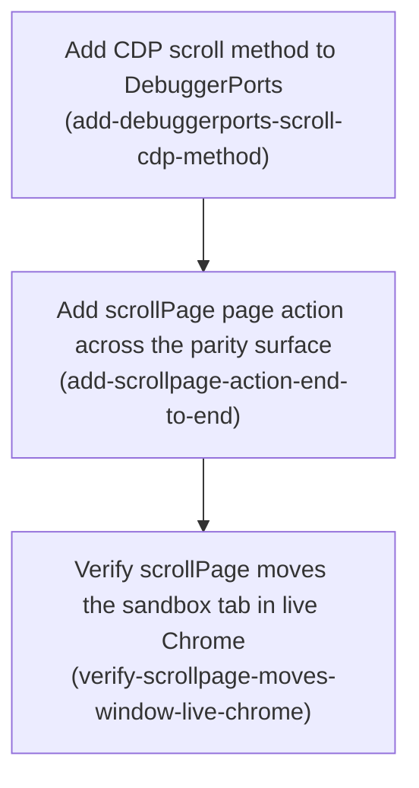

# Horizon 10 — Add a CDP scroll action (scrollPage)

Project: **agent-agnostic-browser-bridge** · Horizon 10 · Path: full · Domain shape: technical · Gate: passed iteration 0 (0 blockers, 0 majors, 10 minor issues accepted as debt)

> **Revision 1 (2026-09-03, REPLAN `revise-phases`).** Phase 3 (`verify-scrollpage-live-chrome-head-to-head`) was **dropped** and replaced by **`verify-scrollpage-moves-window-live-chrome`**. Its original premise — proving `scrollPage` materializes virtualized rows a prior `readPage` missed **in the deliberately-unfocused sandbox tab** — was verified infeasible: that tab runs no rendering pass, so scroll events / IntersectionObserver / `content-visibility` never fire there (user-verified live). The live check is now narrowed to *"`scrollPage` increases the sandbox tab's window `scrollY`"*; virtualized-row materialization is a **known limitation held for a future horizon** whose job is to make the sandbox tab render. Phases 1–2 (done, graded) are unchanged. One `major` (phase-3 blast radius — the closure phase bundles the transcript with the decision/limitation write-ups, as every prior horizon's closure phase has) is accepted as debt. The `.json` file is the source of truth; the Phase 3 section below reflects revision 1.

---

## 🎯 What are we trying to achieve?

Add one new browser-control command, **`scrollPage`**, to the standalone `tools/chrome-bridge` tool. It scrolls the controlled Chrome tab using the Chrome DevTools Protocol (CDP — the low-level `chrome.debugger` channel), so that list rows a web app only draws when you scroll near them ("virtualized" rows, common on infinite-scroll feeds) become visible to the existing `readPage` command, which today misses them entirely. Done means `scrollPage` is wired through the whole tool, the test/build pipeline stays green, and a **real recorded before/after in live Chrome** shows `readPage` returning rows after a scroll that it did not return before.

## 🧠 Why does this change need to happen?

The tool can read a page's text and DOM, but only what is currently in the DOM. Modern list UIs (React virtual scrollers, social feeds) keep off-screen rows out of the DOM until you scroll toward them. There is no scroll capability in the tool at all today, and the read path runs in a mode that cannot reliably move an unfocused tab. Horizon 9 established that CDP (`chrome.debugger`) can drive the tab's dedicated background "sandbox tab" for reads; this horizon uses the same channel to *move* it. A synthetic mouse-wheel event does not always work on a background tab, so `scrollPage` tries the wheel first and falls back to a script scroll, reporting which one actually moved the page.

## At a glance

- **Phases:** 3
- **Complexity:** Low–Medium (one new transport method, one atomic protocol wiring, one live check; reuses horizon 9's CDP attach helper unchanged)
- **Main risk:** the CDP mouse-wheel may not fire a background tab's scroll listeners (the same "event dispatched but the page's handler never ran" ceiling that synthetic clicks hit on github/reddit in horizon 4). Mitigated by the script fallback — but if *neither* mechanism materializes rows, phase 2 blocks and the fix is a REPLAN, not a retry.
- **Quality/verification target:** `npm run verify` (typecheck + lint + tests) green in `tools/chrome-bridge` with no skips or suppressions; horizon closes only on a real dated live-Chrome transcript.
- **Testing focus:** byte-for-byte assertion of the CDP command shapes; attach/detach cleanup on every code path; the wheel-then-script fallback branch logic and honest `method` reporting; the two hardcoded action-count tests (18→19); "pending marker is a blocked state, never a pass".

---

## Order of work

1. **Add CDP scroll method to DebuggerPorts** — can start immediately; builds the transport in isolation.
   ↓ *phase 2 needs the `scroll` method's signature and outcome shape to exist*
2. **Add scrollPage page action across the parity surface** — wires the action end to end and calls the phase-1 method.
   ↓ *phase 3 needs a built bridge that actually advertises the `scrollPage` tool*
3. **Verify scrollPage moves the sandbox tab in live Chrome** — the empirical closure gate (revision 1: window-`scrollY` movement, not row materialization).

---

## Phase 1 — Add CDP scroll method to DebuggerPorts

Technical ID: `add-debuggerports-scroll-cdp-method` · subsystem: DebuggerPorts / withDebuggerSession (CDP transport) · layer: infrastructure · blast radius: medium

**Goal** — a new `scroll(tabId, intent)` method on the `DebuggerPorts` interface and its Chrome factory, moving the sandbox tab's scroll position over CDP, trying a synthetic mouse-wheel first and falling back to a script scroll only when the wheel did not move the page, with full co-located unit tests. No caller yet.

**Why** — there is zero scroll capability in the tool; the DOM-read path cannot reliably move an unfocused tab, so virtualized rows stay invisible. A CDP-issued scroll is the focus-independent, CSP-exempt motion that can reveal them, but a background-tab wheel event is not always honored — hence the fallback and the `method` field that says which mechanism worked.

**Changes**
- Add `scroll(tabId: number, intent: ScrollIntent): Promise<ScrollOutcome>` to `interface DebuggerPorts`. `ScrollIntent` has exactly two optional fields: `amountPx?` (pixels down; default 2000 when neither field is set) and `toBottom?` (one large downward jump to `document.documentElement.scrollHeight`, **not** a loop chasing an infinite list). No `direction`, no repeat count. `ScrollOutcome` = `{ readonly method: 'wheel' | 'script' | 'none'; readonly scrollYBefore: number; readonly scrollYAfter: number; readonly reachedEnd: boolean }`; `reachedEnd` is best-effort (`scrollYAfter + innerHeight >= scrollHeight - SLACK`), may stay `false` forever on a growing list.
- Implement via `withDebuggerSession(tabId, 'scrolling', run)`; widen the private label union `'capturing' | 'evaluating'` → add `'scrolling'`. Per-command attach/detach, **no persistent CDP session**.
- In `run`: read `scrollY`/`scrollHeight`/`innerHeight`/`innerWidth` (→ `scrollYBefore`); dispatch `Input.dispatchMouseEvent` `{ type: 'mouseWheel', x, y, deltaX: 0, deltaY }` with `x`/`y` pinned to the **viewport centre** from the read-back; after a ~150ms settle (a `Runtime.evaluate` of a `setTimeout` promise), re-read `scrollY`; if unchanged, fall back to `Runtime.evaluate` of `window.scrollBy(0, amountPx)` / `window.scrollTo(0, …scrollHeight)` and re-read; return `method` = whichever mechanism produced the final observed movement. Parse all replies through the module-private `isRecord` helper.
- Add a `describe('scroll')` unit-test block: exact `Input.dispatchMouseEvent`/`mouseWheel` params, `x`/`y` derived from the read-back, exact `Runtime.evaluate` params, attach/detach on success and failure, re-attach after failure, once-only `onDetach` listener, mid-command detach rejecting with the `'scrolling'` label, **and** both branches — wheel-only-success (fallback never sent, `method === 'wheel'`) and wheel-then-script-fallback (`method === 'script'`). Name `ScrollIntent`, `ScrollOutcome`, and any helper in the test.
- **Pre-declared ripple** (this is the trap horizon 9's equivalent phase was amended for): add a default `scroll` stub to `fakeDebugger(...)` in `page-actions.unit.test.ts` and to `fakeDebuggerPorts()` in `service-worker.unit.test.ts` so `tsc --noEmit` stays green. No `service-worker.ts` source change.

**Files / areas** — `tools/chrome-bridge/src/extension/debugger-ports.ts`, `debugger-ports.unit.test.ts`, `page-actions.unit.test.ts`, `service-worker.unit.test.ts`

**How to verify**
- **scroll() signature and ScrollOutcome shape** — interface gains exactly one method; `ScrollIntent` has only `amountPx`/`toBottom`; `ScrollOutcome` has exactly the four readonly fields with `method` literally `'wheel' | 'script' | 'none'`; the 2000 default is applied in the factory, not left `undefined` at the wire call.
- **Exact CDP command shape asserted** — a test pins `Input.dispatchMouseEvent` with `type: 'mouseWheel'`, `deltaY` = resolved `amountPx`, and `x`/`y` derived from the stubbed read-back (not hardcoded fixture numbers); read-back and fallback `Runtime.evaluate` params pinned.
- **Attach/detach lifecycle on every path** — all CDP work inside `withDebuggerSession`; label union widened; detach runs on success and on a rejecting `sendCommand`; re-attach after failure; once-only `onDetach`; mid-detach message contains `'scrolling'`; no new persistent attach state anywhere.
- **Wheel-then-script fallback branch logic** — three tests (wheel-only, fallback, neither) with honest `method`; float comparison tolerant of sub-pixel movement; `reachedEnd` covered true and false.
- **Pre-declared test-fake ripples landed** — both fakes updated with `as const`-typed stubs that structurally satisfy `ScrollOutcome`; `npm run verify` exits 0 with no `it.skip`, `@ts-expect-error`, loosened assertions, or bumped timeouts.
- **Reply parsing robustness** — reply fields extracted via `isRecord` + numeric guards, no `any`/`!`/`as T` on a `sendCommand` reply; a degenerate-reply test asserts `method: 'none'` rather than a throw.

**Done when** — `DebuggerPorts.scroll` exists and is implemented as a wheel-then-script fallback via `withDebuggerSession(..., 'scrolling', ...)` with no persistent session, has the `describe('scroll')` block covering both mechanism paths, the two fakes are updated, and `npm run verify` in `tools/chrome-bridge` exits 0. Every check above passes its bar.

**Depends on** — nothing; can start immediately.
**Rollback** — revert the four files; `scroll` has no callers yet.

Reference — full rubric

| Dimension | minScore | Lead pass criteria |
|---|---|---|
| scroll-signature-and-outcome-shape | 6 | Exact signature, two-field `ScrollIntent`, four-field readonly `ScrollOutcome`, 2000 default in the factory |
| cdp-command-shape-asserted-byte-for-byte | 7 | `Input.dispatchMouseEvent`/`mouseWheel` params pinned; `x`/`y` proven derived from read-back; `deltaY` = `amountPx`; fallback expression pinned |
| attach-detach-lifecycle-every-path | 7 | All CDP work inside `withDebuggerSession`; detach on success + failure; label union widened; mid-detach asserts `'scrolling'`; no persistent state |
| wheel-then-script-fallback-branch-logic | 7 | wheel-only / fallback / neither tests; tolerant float compare; honest `method`; `reachedEnd` both cases |
| predeclared-test-fake-ripples-landed | 8 | Both fakes updated, `as const` typed, verify green with zero suppressions |
| reply-parsing-robustness | 6 | `isRecord` + numeric guards, no banned syntax, degenerate-reply test asserts `method: 'none'` |

Healer hint: the likely miss is the fallback branch — sending both mechanisms unconditionally or gating the fallback on strict float equality; gate it on an observed no-movement re-read with small pixel tolerance and only then set `method: 'script'`.

---

## Phase 2 — Add scrollPage page action across the parity surface

Technical ID: `add-scrollpage-action-end-to-end` · subsystem: PAGE_ACTIONS parity surface · layer: application · blast radius: medium

**Goal** — wire a new `scrollPage` page action end to end through the fixed set of coordinated places every bridge action must appear, bump both hardcoded action-count unit tests 18→19, and update the README count/enumeration/prose/manual-e2e surface, so the MCP server advertises `scrollPage` as a discrete tool with a two-field input schema and the handler drives the sandbox tab through `DebuggerPorts.scroll`.

**Why** — the tool keeps its action set drift-free by forcing each action into a fixed set of `Record<PageAction, …>`-typed locations (a missing one is a compile error) plus two hardcoded count tests and the README. `scrollPage` (named to mirror the existing `evaluatePage`) must land in all of them in one reviewable change — partial wiring does not compile.

**Changes**
- `actions.ts`: append `'scrollPage'` to the `PAGE_ACTIONS` `as const` tuple (after `getTabState`), length 18→19.
- `types.ts`: add `ScrollPageParams` (only `amountPx?`, `toBottom?`) and `ScrollPageResult` (`method`, `scrollYBefore`, `scrollYAfter`, `reachedEnd`), built without ever assigning `undefined` explicitly; add one key each to the `PageActionParams` and `PageActionResults` mapped types.
- `page-actions.ts`: add `scrollPage` to **both** the raw `Record<PageAction, Handler>` map and the `guard()`-wrapped return map. Handler: type-check params and return a plain `{ error: … }` sentinel **before** any port call (an existing test asserts the port is not called on bad params); then `resolveTabId()`; then build the `ScrollIntent` (omit unsupplied fields — the port applies the 2000 default); then `captureDebugger.scroll(tabId, intent)`; then a **new dedicated coercer** in the `coercePointerOutcome` style (do **not** reuse `coerceExecuteScriptOutcome` / `InPageScriptOutcome` — the outcome is a status object, not a JSON value).
- `tool-catalog.ts`: add a `scrollPage` `TOOL_CATALOG` entry with an honest description (names the CDP wheel attempt and the `Runtime.evaluate` fallback, the sandbox-tab target, the virtualized-row purpose, and the `method` result field) and an `inputSchema` exposing **exactly** `amountPx` (`{ type: 'number', minimum: 0 }`) and `toBottom` (`{ type: 'boolean' }`), `required: []`, `additionalProperties: false`. Add a reusable `SCROLL_PROPERTIES` `as const` block.
- `actions.unit.test.ts`: add `'scrollPage'` to the ordered-tuple assertion; `.toBe(18)` → `.toBe(19)`.
- `tool-catalog.unit.test.ts`: `.toHaveLength(18)` → `19`; the `it('advertises exactly eighteen tools', …)` label → `'nineteen'`; add `scrollPage` to the required-map assertion; add a schema-shape test asserting the input schema exposes **only** `amountPx` and `toBottom` with no required fields.
- `README.md`: `'eighteen'` → `'nineteen'` (~L48); `'18 tools'` → `'19'` (~L177); add `scrollPage` to **both** enumerations (the inline list ~L48–53 and the built `service-worker.js` bullet ~L205–211); add a `scrollPage` prose paragraph (two-field params, wheel-then-script fallback, `method` field); add a numbered manual-e2e step 14 with a dated `Verified …` stub for phase 3.
- Fix any stale action-count comment (`types.ts` "ten generic page actions", `tool-catalog.ts` "Two of the ten tools") **in a file this phase already opens** — do not hunt in `server.ts`.

**Files / areas** — `tools/chrome-bridge/src/protocol/actions.ts`, `protocol/types.ts`, `extension/page-actions.ts`, `mcp/tool-catalog.ts`, `protocol/actions.unit.test.ts`, `README.md`

**How to verify**
- **Parity-surface completeness proven by a green verify** — `scrollPage` in all seven `Record`-typed locations + both count tests; `npm run verify` completes green with no new `skip`/`only`/`eslint-disable`/timeout bump.
- **Handler validates params before any side effect** — type checks precede `resolveTabId()` and `.scroll(...)` textually and in control flow; a bad-param test asserts neither the `scroll` spy nor `resolveTabId` was called; `{}` is accepted.
- **Input schema exposes exactly amountPx + toBottom, nothing required** — a test asserts the property key set is exactly `['amountPx','toBottom']` and `required` is empty; `SCROLL_PROPERTIES` `as const` block reused.
- **Dedicated scroll-outcome coercer** — a new named function explicitly selects the four fields and returns `{ result: { … } }`; `coerceExecuteScriptOutcome`/`InPageScriptOutcome` not referenced by the handler; unit-tested across all three `method` values.
- **Both count tests bumped, including the it() label text** — every numeric moved to 19 and the `it(...)` description word changed; no stale `18` in an action-count context in either file.
- **README surface fully updated** — count word, both enumerations, `'18 tools'`, a `scrollPage` prose paragraph, a manual-e2e step 14 stub; no README text still says 18 or omits `scrollPage` from a list it enumerates.

**Done when** — `scrollPage` is present across `PAGE_ACTIONS` (19), both mapped types, both handler maps, `TOOL_CATALOG`, both count tests (19), and the README; `npm run verify` exits 0 with no skips or suppressions. Every check above passes its bar.

**Depends on** — Phase 1 (needs the `DebuggerPorts.scroll` signature and the `ScrollIntent`/`ScrollOutcome` shapes).
**Rollback** — remove the `scrollPage` entries from all six files and revert the two count tests and README to 18; the compiler's `Record<PageAction, …>` completeness check confirms nothing dangles.

Reference — full rubric

| Dimension | minScore | Lead pass criteria |
|---|---|---|
| parity-surface-no-drift-completeness | 7 | All seven `Record`-typed locations + both count tests; `npm run verify` green with no suppressions |
| validate-params-before-resolving-sandbox-tab | 7 | Validation precedes `resolveTabId`/`.scroll`; bad-param test asserts port + resolver not called; `{}` accepted |
| input-schema-exactly-two-optional-fields | 7 | Key set exactly `['amountPx','toBottom']`, `required: []`, `additionalProperties: false`, `SCROLL_PROPERTIES` reused |
| dedicated-scroll-result-coercer | 7 | New named coercer selecting the four fields; `coerceExecuteScriptOutcome` not referenced; tested across `method` values |
| count-test-bump-both-files-and-labels | 8 | Every numeric 18→19 and the `it()` label word; no stale 18 in an action-count context |
| readme-surface-fully-updated | 7 | Count word, both enumerations, `'18 tools'`, prose paragraph, manual-e2e step 14 stub |

Healer hint: make the smallest change that puts `scrollPage` on the missing part of the parity surface (the omitted mapped-type key, the un-bumped count or its label word, the second README enumeration, validation ordering, or a dedicated `coerceScrollOutcome`), then re-run `npm run verify` to green.

---

## Phase 3 — Verify scrollPage moves the sandbox tab in live Chrome

Technical ID: `verify-scrollpage-moves-window-live-chrome` · subsystem: live-Chrome scroll-movement verification · layer: cross-cutting · blast radius: small · **revision 1** (replaces `verify-scrollpage-live-chrome-head-to-head`)

**Goal** — in a fresh `chrome-bridge` MCP session started **after** a full `dist/extension` rebuild and extension remove/re-add, prove on a real public page that a `scrollPage` call increases the sandbox tab's window `scrollY` (`scrollY` after > before) and record the observed `method` (`'wheel' | 'script' | 'none'`); then record the narrowed horizon-10 success criterion as a binding `decisions.md` line, and record the finding that the unfocused sandbox tab cannot materialize virtualized/lazy rows on any scroll as a known limitation and a future-horizon blocker.

**Why** — the scroll action is only proven once a live transcript shows it actually moved the page, not merely that the command returned — synthetic input dispatch has repeatedly returned success in this project without the page reacting. The user checked live that the deliberately-unfocused sandbox tab runs no rendering pass, so no scroll there can reveal framework-virtualized rows; that ability is explicitly out of scope this horizon and is written down as a known limitation for a later horizon whose job is to make the sandbox tab render. The sandbox tab's focus model is deliberately **not** changed here (binding h6 decision).

**Changes**
- Rebuild `dist/extension` in `tools/chrome-bridge`, restart the MCP server, then **remove and re-add** the unpacked extension in `chrome://extensions` (a stale service worker manifests as a silent command timeout). Start a **new** MCP session after the rebuild so it advertises `scrollPage`.
- On a public, no-auth page **tall enough to scroll in the main document** (any long article or long list page — it does **not** need to be a virtualized list): `navigateTo` the URL, read `window.scrollY` (via `getTabState` or a `readPage`/`evaluatePage`-adjacent read), call `scrollPage` with a large `amountPx` (or `toBottom: true`), read `window.scrollY` again and confirm it increased. Repeat once with a second `scrollPage` call to show cumulative movement. Paste the **literal** tool output — the two `scrollY` reads and the `scrollPage` result JSON including its `method` field — with a real calendar date into a README manual-e2e step, replacing the phase-1 `Verified` stub.
- Record the observed `method` value and note that in the unfocused sandbox tab the CDP `Input.dispatchMouseEvent` wheel path is expected to hang and fall through to the `Runtime.evaluate` `window.scrollBy`/`scrollTo` script path (the mechanism fix bounds the wheel attempt at 750 ms), so `'script'` is the expected steady-state `method`.
- Add the horizon-10 `decisions.md` line: action name `scrollPage`; two-field param model (`amountPx` optional default 2000, `toBottom` optional boolean, no `direction`, no repeat count); success-fidelity = the result reports `method: 'wheel' | 'script' | 'none'` plus before/after `scrollY` and `reachedEnd`; **the h10 live-verification criterion is deliberately narrowed to "`scrollPage` changes window `scrollY` in the sandbox tab"** — the "reveal virtualized rows a prior `readPage` missed" gate is dropped for this horizon; persistent CDP session stays out of scope; focus model unchanged.
- Add a dated `discoveries.md` line: the deliberately-unfocused sandbox tab runs no rendering pass, so `scrollPage` moves window `scrollY` but scroll events / IntersectionObserver / `content-visibility: auto` never fire and no virtualized/lazy page can materialize rows there on any scroll (user-verified live on a trivial local page — it is the tab, not the site).
- Record the virtualized-list materialization gap in `docs/roadmaps/.../blockers.md` **and** `tools/chrome-bridge/blockers.md` as a **known limitation + explicit future-horizon item**: `scrollPage` exists and moves the window, but materialization needs the sandbox tab to actually render; the follow-up is a horizon that makes it run a render pass. Mark `tools/chrome-bridge/blockers.md` item 2 ("No scroll primitive") **resolved for window movement**, with the materialization dependency called out as still open.
- Update `state.md` to close horizon 10 on the narrowed criterion once the movement transcript is present and the memory files are consistent. **If the fresh MCP session cannot be established** or the build is stale and unfixable in-session, this phase ends **BLOCKED** with a `MANUAL_CHROME_CHECK_PENDING` marker carrying the exact rebuild / remove-and-re-add / fresh-session / target-URL steps, and the horizon stays **OPEN**. A pending marker is never a completed phase.

**Files / areas** — `tools/chrome-bridge/README.md`, `tools/chrome-bridge/blockers.md`, `docs/roadmaps/agent-agnostic-browser-bridge/{discoveries,state,blockers,decisions}.md`

**How to verify**
- **Live-Chrome transcript is genuine and dated** — verbatim tool output (not paraphrase): the actual URL, two raw `window.scrollY` reads (after > before) plus a repeat that increases further, and the full `scrollPage` result JSON including `method`. Numbers internally consistent with the requested `amountPx`/`toBottom`.
- **Success claim narrowed to window `scrollY` movement** — every memory file states the h10 pass condition as "`scrollPage` increased the sandbox tab's window `scrollY`"; no file re-introduces row materialization as an h10 gate; no stale pre-replan goal text copied forward.
- **Materialization gap recorded as a known limitation + future-horizon item** — dated `discoveries.md` line naming the cause (no render pass in the unfocused tab, not just the symptom); both `blockers.md` files carry it as an open future-horizon item with a consistent disposition; `tools/chrome-bridge/blockers.md` item 2 resolved *for movement* with the materialization dependency still called out.
- **Observed mechanism recorded honestly** — the `method` value is echoed and interpreted in prose; the wheel-path-hangs-in-an-unfocused-tab caveat is stated; a `'wheel'` or `'none'` result is called out as a surprise; `decisions.md` mechanism-fidelity matches the README transcript.
- **BLOCKED fallback is actionable** — on a pass, no `MANUAL_CHROME_CHECK_PENDING` marker remains and `state.md` closes h10; on a block, the marker exists with concrete ordered repro steps and `state.md` shows h10 OPEN; the block text names what specifically failed.
- **All memory files tell one consistent story** — README, `decisions.md`, `discoveries.md`, `state.md`, and both `blockers.md` agree on the verdict, the narrowed criterion, the observed `method`, and the gap disposition; dates match across README and `discoveries.md`.

**Done when** — README carries a real dated transcript showing a `scrollPage` call increased the sandbox tab's window `scrollY` in a fresh post-rebuild MCP session (with the observed `method`); `decisions.md` has the h10 binding line including the narrowed criterion; `discoveries.md`/`state.md`/both `blockers.md` consistently record the verdict plus the sandbox-tab-cannot-materialize-rows limitation as a future-horizon item — **or** the phase is BLOCKED with a `MANUAL_CHROME_CHECK_PENDING` marker and exact repro steps and the horizon stays OPEN. Every check above passes its bar.

**Depends on** — Phase 2 (needs a built bridge that advertises the `scrollPage` tool).
**Rollback** — none; the phase only reads live Chrome and writes documentation.

Reference — full rubric

| Dimension | minScore | Lead pass criteria |
|---|---|---|
| live-transcript-is-real-not-templated | 8 | Dated README step; real URL; two raw `scrollY` reads (after > before) + a further-increased repeat; verbatim `scrollPage` result JSON incl. `method` |
| movement-claim-scoped-to-window-scroll-only | 8 | `decisions.md` states the narrowed criterion explicitly; `state.md` closes/blocks against it; no file re-introduces row materialization as the h10 gate |
| materialization-gap-recorded-as-known-limitation | 7 | Dated `discoveries.md` line with the cause; both `blockers.md` carry it as a future-horizon item; item 2 resolved *for movement* with the dependency called out |
| result-mechanism-recorded-honestly | 7 | `method` echoed + interpreted; wheel-hangs caveat stated; `decisions.md` mechanism matches the transcript |
| blocked-exit-is-actionable | 8 | Pass → no stale marker, h10 closed; block → marker + concrete ordered repro + h10 OPEN + named failure |
| memory-files-mutually-consistent | 8 | README / `decisions.md` / `discoveries.md` / `state.md` / both `blockers.md` agree on verdict, criterion, `method`, gap disposition; dates match |

Healer hint: the likely miss is honest-but-paraphrased evidence — re-run the fresh post-rebuild MCP session and paste the verbatim tool output (both raw `scrollY` reads + the full `scrollPage` result JSON with `method`) and a real date into the README step, then reconcile the `method` value across `decisions.md` and both `blockers.md`.

---

## Discovery Findings

| Area | Finding | File | Implication |
|---|---|---|---|
| PAGE_ACTIONS tuple | 18-entry `as const` array; `PageAction` derived from it; ends at `getTabState` | `src/protocol/actions.ts` | Append `'scrollPage'` → 19; no `as const` re-shaping |
| protocol/types.ts | Per-action `XxxParams`/`XxxResult` interfaces + two mapped types; `evaluatePage` is the h9 template; stale "ten generic page actions" header comment | `src/protocol/types.ts` | Add `ScrollPageParams`/`ScrollPageResult` + one mapped-type key each; stale comment is optional in-passing cleanup |
| debugger-ports.ts | `DebuggerPorts` has `captureScreenshot` + `evaluate`; `withDebuggerSession(tabId, label, run)` does per-command attach/`Promise.race`/detach; `onDetach` listener once at construction; label union `'capturing' \| 'evaluating'`; no `Input.*` sent anywhere; `isRecord` is module-private | `src/extension/debugger-ports.ts` | Add `scroll` via `withDebuggerSession(…, 'scrolling', …)`; widen label union; reuse `isRecord`; no persistent session |
| debugger-ports.unit.test.ts | `installStubDebugger()` spies + `fireDetach`; `describe('evaluate')` has 8 tests pinning exact command/params, attach/detach every path, re-attach, once-only listener, mid-detach label | `src/extension/debugger-ports.unit.test.ts` | New `describe('scroll')` mirrors this + both mechanism paths; name every new exported symbol |
| page-actions.ts handler maps | `pageActionHandlers(ports, sandboxTab, captureDebugger, captureStore)` → raw `Record` then `guard()`-wrapped `Record`; h9 handler validates **before** `resolveTabId`; helpers `coercePointerOutcome`, `coerceExecuteScriptOutcome`, `isRecord`, `nonEmptyString` | `src/extension/page-actions.ts` | `scrollPage` in both maps; validate first; new dedicated coercer (not the JSON-value one) |
| page-actions.unit.test.ts fakes | `fakeDebugger(overrides)` builds a base `{ captureScreenshot, evaluate }`; `describe('pageActionHandlers — evaluatePage')` 5-test matrix | `src/extension/page-actions.unit.test.ts` | `fakeDebugger` base must gain a `scroll` default; add a `scrollPage` describe block |
| service-worker | `ServiceWorkerDeps.debuggerPorts: DebuggerPorts`; `pageActionHandlers(deps.ports, deps.sandboxTabPorts, deps.debuggerPorts, captureStore)` — no new constructor param; `fakeDebuggerPorts()` literal at ~L87 | `src/extension/service-worker.unit.test.ts` | `fakeDebuggerPorts()` must gain a `scroll` entry; no `service-worker.ts` source change |
| mcp/tool-catalog.ts | `TOOL_CATALOG: Record<PageAction, ToolCatalogEntry>`; shared property blocks are `as const` consts; `listTools()` maps `PAGE_ACTIONS`; stale "Two of the ten tools" header comment | `src/mcp/tool-catalog.ts` | Add `scrollPage` entry + `SCROLL_PROPERTIES` `as const`; stale comment is optional cleanup |
| hardcoded action-count tests | `actions.unit.test.ts`: ordered-tuple `toEqual` + `.toBe(18)`; `tool-catalog.unit.test.ts`: `toHaveLength(18)` + `it('advertises exactly eighteen tools')` + required-map + per-action schema tests | `src/protocol/actions.unit.test.ts` | Bump both files including the `it()` label word; add a scroll schema-shape test |
| README surface | count/enumeration/prose/e2e at ~L48 (word + inline list), ~L177 ("18 tools"), the numbered manual-e2e steps (step 12 = h9 head-to-head), and a second enumeration in the `service-worker.js` bullet ~L205–211 | `README.md` | Edit word, both enumerations, add a prose paragraph and a manual-e2e step 14 with a dated stub |
| sandbox-ports.ts | `resolveTabId()` creates/recreates the tab when missing; `peekStoredSandboxTabId()` never creates; every acting handler uses `resolveTabId()` | `src/extension/sandbox-ports.ts` | Scroll handler uses `resolveTabId()`; no sandbox-ports change |
| existing scroll code | grep for `scroll`/`mouseWheel`/`dispatchMouseEvent`/`scrollBy`/`Input.` finds **zero** implementation; `clickAt`/`hover` dispatch untrusted events in-page via `executeScript` — the anti-pattern this rejects | `src/extension/page-actions.ts` | Greenfield; the scroll motion deliberately goes through CDP instead |
| config gates | `verify` = typecheck + lint + test; strict TS (`noUncheckedIndexedAccess`, `exactOptionalPropertyTypes`, `verbatimModuleSyntax`); eslint `strictTypeChecked` + `no-explicit-any`, `prefer-as-const`, bans `as T` on JSON values; testguard needs a co-located test per new exported symbol | `package.json` | Build result interfaces without explicit `undefined`; guard CDP reply access; `import type`; verify must exit 0 with no skips |
| blockers.md (package-local) | item 2 ("No scroll primitive … a `scroll({dy})` / `scrollToBottom()` tool driven from the extension") + item 7 describe this gap; h9 found an action grep must include package-local `*.md` | `tools/chrome-bridge/blockers.md` | Phase 3 marks item 2 resolved on a pass and notes item 7 |
| h9 phase structure | h9 = 4 phases (remove dead action / add CDP method / wire action / live verify); its "add CDP method" phase was amended for the interface-method ripple to `service-worker.ts` + 2 fakes; its live-verify phase-4 attempt 1 blocked on a pre-h9 MCP session, attempt 2 passed in a fresh session | horizon-09 roadmap `.md` | H10 has no dead action → 3 phases; pre-declare the ripple; plan explicit rebuild + fresh-session for phase 3 |
| decisions.md | line 28 (h9): the broader CDP pivot incl. CDP scroll is "greenlit for later horizons without re-asking"; line 21 (h6): CDP was originally screenshot-only | `docs/roadmaps/.../decisions.md` | No user decision gate needed to build CDP scroll; add a new h10 line for the settled choices |
| InPageScriptOutcome | `{ ok:true; json:string } \| { ok:false; error:string }`, used by `executeScript` and h9's CDP `evaluate` via `coerceExecuteScriptOutcome` | `src/extension/page-actions.ts` | The scroll port returns a status object → a small dedicated coercer, not `coerceExecuteScriptOutcome` |

## Out of Scope

| Deferred | Reason |
|---|---|
| Trusted keyboard input via CDP `Input.dispatchKeyEvent` | Separate deferred slice; bundling both would make the horizon a family the brief forbids |
| Trusted click-by-coordinate via CDP `Input.dispatchMouseEvent` press/release | Different slice; held for a later horizon |
| A wait/settle action | Not the chosen slice; scroll verification uses manual delays this horizon (strong horizon-11 candidate) |
| A persistent multi-command CDP session | Scoping keeps per-command attach/detach; deferred until a slice needs ordered `Input.dispatch*` sequencing |
| Deleting the dead active-tab surface (`queryActiveTab` / `captureVisibleTab` / `activeTab` permission / `NO_ACTIVE_TAB`) | The user chose to leave it untouched this horizon |
| Resurrecting horizon 5's DOM page-model snapshot | Separate never-executed roadmap; scroll does not require it |
| Switching `readPage`/`getPageText`/`findElement` to a CDP path | They stay on the ISOLATED-world `chrome.scripting` path; only the scroll motion uses CDP |
| A selector-targeted scroll-element-into-view action | The horizon ships ONE atomic scroll action |
| Stale action-count comments outside phase-2 files (`server.ts`) | Only touched-in-passing fixes are in scope; a dedicated cleanup is deferred (5th time) |
| Verifying the MCP config against Gemini CLI / Codex CLI / Cursor | h4 decision binds hand-verification to Claude Code only |
| Wiring `tools/chrome-bridge` into the repo-root `verify.sh` | h1 decision keeps the package self-contained |
| A `direction` param and a `repeat`/`count` field on `scrollPage` | Cut by the user redirect; scroll is always downward and a caller needing more calls the tool again |

## Required Materials

| Material | Kind | Why needed | How to acquire |
|---|---|---|---|
| CDP `Input.dispatchMouseEvent` (`type: 'mouseWheel'`) param reference | knowledge | The unit test asserts the wheel command shape byte-for-byte; guessing risks locking in a non-functional command | Read the official CDP `Input` domain docs + the `Runtime.evaluate` `scrollBy` fallback semantics; cross-check puppeteer/playwright wheel construction |
| A public, no-auth page tall enough to scroll in the **main document** (a long article or long list page) | knowledge | Phase 3 (revision 1) needs a real reachable page whose main document scrolls, so a `scrollPage` call can be shown to increase window `scrollY`. It does **not** need to be a virtualized list — row materialization is no longer the gate. | Pick any stable public no-auth page with a tall main document (e.g. a long Wikipedia article or docs page); confirm the content is top-level, not in an iframe. Record the chosen URL in the transcript. |
| Expectation that the CDP `Input.dispatchMouseEvent` wheel path hangs in an unfocused tab and falls through to the `Runtime.evaluate` `scrollBy`/`scrollTo` script path | knowledge | Phase 3 records the observed `scrollPage` `method` value and must interpret it: in the unfocused sandbox tab the wheel path hangs (bounded 750 ms) and `'script'` is the expected steady-state mechanism. | Already established by the user's live probes (recorded in `discoveries.md`): wheel hangs in the sandbox tab, `window.scrollBy` works. Phase 3 echoes the `method` from the pasted result JSON and notes the caveat. |
| Confirmation that a CDP mouse-wheel on a background tab actually fires the list's scroll/IntersectionObserver listeners | knowledge | If the wheel hits the same "dispatched ≠ fired" ceiling as synthetic clicks, the design leans on the script fallback and the `method` field records which worked | Determined empirically in phase 3; the observed `method` value goes into the transcript and `decisions.md` |

## Success Criteria

1. `scrollPage` lands across exactly the coordinated surface with no drift (`PAGE_ACTIONS` 18→19, Params+Result interfaces + both mapped types, raw + guarded handler entries, `TOOL_CATALOG` entry, both hardcoded action-count tests bumped to 19, README count/enumerations/prose/manual-e2e step), driven by a new `DebuggerPorts.scroll` method reusing `withDebuggerSession` per-command attach/detach with **no** persistent CDP session; `npm run verify` in `tools/chrome-bridge` exits 0 with no skips/suppressions; and the horizon closes only after a live-Chrome transcript shows a `scrollPage` call increased the sandbox tab's window `scrollY` in a fresh post-rebuild MCP session (with the observed `method` value), with the virtualized-row materialization gap recorded as a known limitation held for a future horizon. *(Revision 1: the original close required `scrollPage` to make `readPage` return rows it previously missed — verified infeasible in the unfocused sandbox tab.)*
2. **Phase 1** — `DebuggerPorts.scroll(tabId, intent)` exists with a two-field `ScrollIntent` and a `method`-bearing `ScrollOutcome`, implemented via `withDebuggerSession(…, 'scrolling', …)` as a wheel-then-script fallback with no persistent session, with a `describe('scroll')` block covering both mechanism paths and the two test fakes updated; `npm run verify` green.
3. **Phase 2** — `scrollPage` present in `PAGE_ACTIONS` (19), both mapped types, both handler maps, `TOOL_CATALOG` (schema exposes only `amountPx` + `toBottom`), both count tests (19), and the README; `npm run verify` green with no skips.
4. **Phase 3 (revision 1)** — README carries a real dated transcript showing a `scrollPage` call increased the sandbox tab's window `scrollY` in a fresh post-rebuild MCP session, including the observed `method` value; `decisions.md` has the h10 binding line with the narrowed live-verification criterion; `discoveries.md`/`state.md`/`blockers.md` and `tools/chrome-bridge/blockers.md` record the verdict **and** the finding that the unfocused sandbox tab cannot materialize virtualized rows on any scroll (a known limitation held for a future horizon) — **OR** the phase ends BLOCKED with a `MANUAL_CHROME_CHECK_PENDING` marker and exact reproduction steps and the horizon stays OPEN.

## Alignment Preview

The user was shown a plain-language preview at Stage 3.4 and **redirected once** (of a 2-round budget):

- **Round 1 redirect (endorsed):** narrow the scroll input to `amountPx` + `toBottom` only (drop `direction` and repeat count); make the method try the wheel then fall back to a script scroll, reporting which worked; name the primary + backup test URL; state that phase 3 ends BLOCKED (never "done") if it cannot run.
- **Round 2 review (4 concerns, all folded in as phase refinements, no re-decomposition):** pin the wheel event to the viewport centre and assert it in the test; add a ~150ms settle before the position re-read; frame `toBottom`/`reachedEnd` as best-effort with the live proof using **repeated** `scrollPage` calls; add a main-document-not-iframe pre-check to phase 3.
- The user then chose **"Build the full roadmap from this"**.

## Quality Gate

- **Path:** full · **Critic iterations:** 1 · **Verify calls:** 0 (no blocker-severity issues) · **Healer calls:** 0
- **Result:** critic `pass: true`; all 10 rubric dimensions scored at or above their `minScore` (lowest margins: `ddd-boundaries` 7 vs 5, `resources-gathered` 7 vs 6, `phase-blast-radius` 8 vs 7).
- **Accepted debt (10 minor issues, not healed per the pipeline's minor-issue policy):**
  - `phases[1].expectedResult` enumerates a wide surface — defensible: it is the codebase's own single "parity surface" unit (a `Record<PageAction,…>` omission is a compile error), and h9 shipped an identical single-action change the same way.
  - `phases[1].layer` labeled `application` sits slightly oddly over a handler that directly consumes the infrastructure `DebuggerPorts` — judged loosely for a technical task; not a rework risk.
  - `requiredMaterials[2]` is really phase-3 empirical work rather than a pre-gatherable material — it is already reflected as a phase-3 step and rubric line.
  - The remaining seven were positive scores with "None needed".
- **Final verdict:** PASSED, iteration 0.

## Full analysis

**Domain shape:** technical — the task is developer-tooling machinery (a Chrome-control MCP tool's page-action protocol, an MV3 service-worker handler map, and a CDP `chrome.debugger` transport), with no business entities, rules, or workflows a domain expert would recognize. The critic re-scored `domain-shape-fit` independently at 10/10.

**Ubiquitous / subsystem language:**

| Term | Meaning |
|---|---|
| page action | One generic capability the bridge exposes (a `PAGE_ACTIONS` entry) that the MCP server advertises as a discrete tool and the extension implements as one handler; this horizon adds the scroll one |
| PAGE_ACTIONS parity surface | The coordinated places an action must appear (tuple, Params + Result interfaces, both mapped types, raw + guarded handler entries, `TOOL_CATALOG` entry) plus the two hardcoded action-count tests, kept drift-free by `Record<PageAction,…>` types making an omission a `tsc` error |
| DebuggerPorts / withDebuggerSession | The `chrome.debugger` (CDP) port and its per-command attach / send / detach helper in `debugger-ports.ts`, with a construction-time `onDetach` listener; horizon 10 adds a `scroll` method and keeps per-command attach/detach (no persistent session) |
| CDP scroll primitive | `Input.dispatchMouseEvent` `type: 'mouseWheel'` with a `Runtime.evaluate` `scrollBy` fallback, issued over CDP against the sandbox tab — the CSP-exempt, focus-independent motion the ISOLATED-world `executeScript` path cannot reliably produce |
| sandbox tab | The single auto-created, deliberately-unfocused tab (`sandboxTab.resolveTabId()`) that every page action targets by id |
| virtualized-list materialization | Causing rows a framework only renders into the DOM when scrolled near the viewport to become present, so a follow-up `readPage` returns content it previously missed |
| live-Chrome head-to-head | The mandatory horizon-closure check in a fresh post-rebuild `chrome-bridge` MCP session: a recorded transcript. *Revision 1 narrowed this to comparing window `scrollY` before vs. after a `scrollPage` call (movement proof); the original "compare `readPage` rows before vs. after on a virtualized list" is infeasible in the unfocused sandbox tab.* |

**Assumptions:** horizon 9 closed green so horizon 10 is a new capability (not a replan); `PAGE_ACTIONS` is currently 18 and the count tests + README say "eighteen"/18; `scrollPage` is one discrete MCP tool mirroring `evaluatePage`; it targets the sandbox tab like every other action; the new `DebuggerPorts` method ripples to exactly two test fakes; a concrete real virtualized-list target is pinned at plan time; live verification needs a rebuilt `dist/extension` + extension reload + a post-rebuild MCP session; the read path stays on `chrome.scripting`; verification is Claude Code only (h4).

**Risks:** the CDP mouse-wheel may not fire a background tab's scroll listeners (same ceiling synthetic clicks hit on github/reddit) → the script fallback covers it, but if neither materializes rows phase 3 blocks and it is a REPLAN; lazy rows need render time and there is no wait/settle action → the proof is timing-sensitive; per-command attach/detach means the scroll and the confirming `readPage` are separate sessions; the named targets may host their list in an iframe → phase 3 pre-checks and swaps; stale build/session has blocked this gate in h2/h7/h8/h9-attempt-1 → phase 3 spells out rebuild + fresh session; `prefer-as-const` and testguard co-located-test rules are easy gate failures for new symbols.
