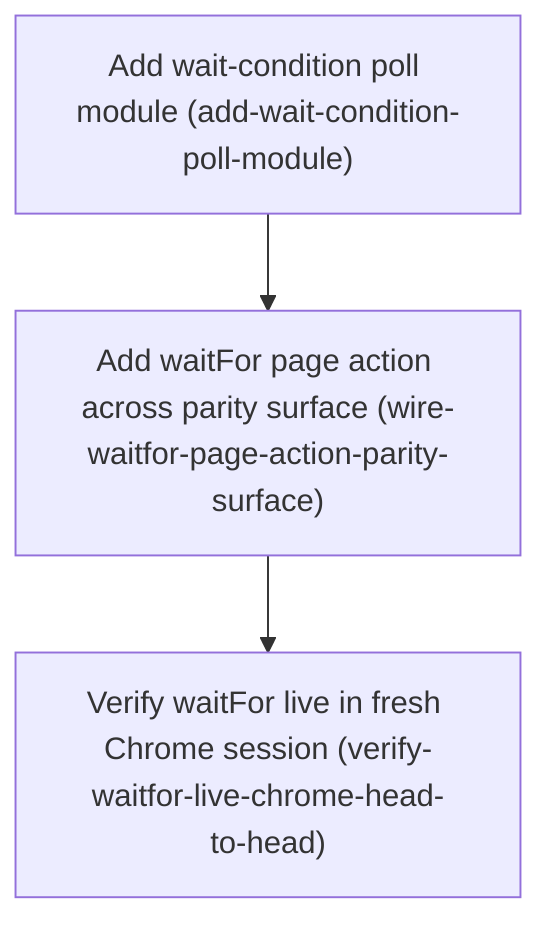

# Horizon 11 — Add a `waitFor` page action (wait/settle primitive)

_Project: agent-agnostic-browser-bridge · Lite path · domain shape: technical (browser-automation machinery — phases follow the parity-surface structure, not DDD bounded contexts) · Gate: passed on iteration 0, 9/9 dimensions pass, 0 blocker/major, 9 minor accepted as debt._

## 🎯 What are we trying to achieve?

An MCP agent driving `tools/chrome-bridge/` today has no way to say "wait until the page is ready, then continue" — every action is a point-in-time snapshot. Horizon 10's live verification had to hand-insert `sleep`s between `scrollPage` and `readPage`. This horizon adds one new generic page action, **`waitFor`**, that blocks until one of three conditions holds and then returns:

- **selector present** — a CSS selector matches at least one node in the sandbox tab's DOM
- **network idle** — no new fetch/XHR entries have landed in the tab's captured network buffer for a quiet window
- **fixed delay** — a plain timed wait

Each mode is bounded by a caller-set `timeoutMs`. Hitting the timeout is a **normal result** (`met: false`), not an error. It targets the same dedicated unfocused sandbox tab as every other action, is CSP-safe (no string eval), and adds no new manifest permission. This resolves package blocker #3 ("No wait/settle primitive").

## 🧠 Why does this change need to happen?

The bridge drives real single-page apps. Those hydrate asynchronously: a `readPage` fired too early returns a skeleton. Without a wait primitive the only lever is "reload and hope", and every multi-step verification the project has done needed manual delays. A single `waitFor` action de-flakes every existing action and every future one, at low cost, using mechanisms the package already has.

## At a glance

- **Phases:** 3
- **Complexity:** Low–Medium — one new small module, one lockstep parity-surface diff (the pattern used for the last four actions), one live-Chrome check.
- **Main risk:** the deliberately-unfocused sandbox tab suspends the browser render pass (horizon 10 discovery), so selector mode only sees **JS-driven DOM mutation** — not IntersectionObserver / `content-visibility` / lazy-rendered nodes. The tool doc must state this plainly or it will mislead.
- **Quality/performance target:** `timeoutMs` hard cap well below the 30s end-to-end command ceiling (default ~10–15s, cap ~25s); the poll loop must always resolve and never throw or hang.
- **Testing focus:** every mode's happy path AND its timeout-elapsed not-met path; `vi.useFakeTimers()` for deterministic timing; parity-surface completeness (both count tests, all ~5 README spots, both handler maps); CSP-safety and no-new-permission invariants; a mandatory live-Chrome head-to-head in a fresh post-rebuild MCP session.

## Order of work

1. **Add wait-condition poll module** — the only genuinely new logic (a time-bounded poll loop) built and fake-timer-unit-tested in isolation, taking injected check callbacks, no parity-surface change yet.
   ↓ _phase 2 needs this module to delegate to_
2. **Add waitFor page action across parity surface** — register `waitFor` as the 20th action everywhere the codebase keeps in lockstep; the handler validates params and calls the phase-1 module.
   ↓ _phase 3 needs a green build to rebuild and verify_
3. **Verify waitFor live in fresh Chrome session** — rebuild, fresh MCP session, head-to-head across all three modes + timeout paths on a real page; confirm the manifest is unchanged; fold in a stale comment fix.

---

## Phase 1 — Add wait-condition poll module

Technical ID: `add-wait-condition-poll-module` · chrome-bridge page-action pipeline · infrastructure · small blast radius

**Goal** — A standalone module `tools/chrome-bridge/src/extension/wait-condition.ts` exporting one async function that polls one of three conditions (selector present / network idle / fixed delay) and resolves `{ mode, met, elapsedMs }` once the condition holds or the timeout budget is spent.

**Why** — The package has no handler that polls over time; every existing action is single-shot. A time-bounded poll loop with a hard cap is the only new logic in this feature, so it is built and tested in isolation with simulated timers before it is wired to anything user-facing.

**Changes**
- Export one async function taking a mode descriptor (`selector-present | network-idle | fixed-delay`), a `timeoutMs`, and injected check callbacks; return `{ mode, met, elapsedMs }`.
- Poll loop: fixed interval, hard timeout cap well below the 30s command ceiling (default ~10–15s, cap ~25s); on timeout resolve `{ met: false }` — never throw.
- selector mode calls a passed-in existence check (count > 0); network-idle calls a passed-in "latest network seq / timestamp" probe and treats "no new entries for a quiet window" as met, **re-arming** the window when a new entry arrives; fixed-delay waits then resolves met.
- `wait-condition.unit.test.ts` with `vi.useFakeTimers()` / `vi.advanceTimersByTimeAsync` covering: selector appears mid-poll, selector never appears (timeout), network goes quiet, network never quiets (timeout), fixed delay elapses, invalid `timeoutMs`.

**Files / areas** — `tools/chrome-bridge/src/extension/wait-condition.ts`, `tools/chrome-bridge/src/extension/wait-condition.unit.test.ts`

**How to verify**
- **Timeout budget always resolves to a not-met outcome** — every mode's timeout path resolves `{ met: false, elapsedMs }` within the hard cap; a throwing check callback is swallowed, not propagated; the loop has an absolute deadline. (minScore 7)
- **Poll interval fixed and timeout budget clamped** — named constants for interval / default / floor / hard cap (`HARD_CAP_MS ≤ 25000`); `timeoutMs` of 0 / negative / NaN / undefined / 999999 each provably clamped; interval never a busy-loop. (minScore 7)
- **All three wait modes behaviorally correct** — happy-path test per mode; network-idle compares two samples over time and re-arms when a new entry arrives; fixed-delay calls neither probe. (minScore 7)
- **Module is standalone with injected checks and controllable clock** — no `chrome.*` / DOM / sibling-module imports; time via injected `now()` or vi-patchable timers; test uses fake timers with no real sleep and no bumped `testTimeout`. (minScore 7)
- **Returned outcome shape is exact and `elapsedMs` truthful** — every `resolve` produces exactly `{ mode, met, elapsedMs }`; `elapsedMs` is measured, non-negative, bounded by the effective budget, `>= delayMs` for a completed fixed-delay. (minScore 7)

**Done when** — `wait-condition.ts` exists with a passing `wait-condition.unit.test.ts` exercising all three modes plus each timeout-budget path, and every check above passes its bar.

**Depends on** — nothing; can start immediately.

Reference — full rubric &amp; healer hint

Healer hint: _The most likely failure is network-idle trusting a single point-in-time probe instead of re-sampling across the quiet window and re-arming when a new entry appears — fix it to require two consecutive samples spanning at least `quietMs` with no advance before resolving met:true._

See the phase's `rubric` array in `horizon-11-wait-for-page-condition-roadmap.json` for the full `ruleStatement` / `passCriteria` / `failureExamples` per dimension.

---

## Phase 2 — Add waitFor page action across parity surface

Technical ID: `wire-waitfor-page-action-parity-surface` · chrome-bridge page-action pipeline · infrastructure · medium blast radius

**Goal** — `waitFor` registered as the 20th page action across the fixed lockstep set of files, with a handler that validates params and delegates to the phase-1 poll module.

**Why** — A new bridge action is only usable when it is present in every place the codebase keeps in sync: the master action list, the request/response type maps, the service-worker handler table, the MCP tool schema clients read, the hardcoded action-count tests, and the README. Missing any one breaks the build or ships an inconsistent tool. This is exactly how `scrollPage`, `evaluatePage`, and `getTabState` were each added.

**Changes**
- Append `waitFor` to the `PAGE_ACTIONS` `as const` tuple (19 → 20).
- `types.ts`: add `WaitForParams` (mode discriminator → `selector-present | network-idle | fixed-delay`, plus optional `timeoutMs`) and `WaitForResult` (`{ mode, met, elapsedMs }` readonly primitives); add one key to each of `PageActionParams` and `PageActionResults`.
- `page-actions.ts`: add a `resolveWaitForParams`-style validator rejecting a malformed mode / out-of-range `timeoutMs` **before** any tab is resolved; a raw handler entry that resolves the sandbox tab and calls the poll module (selector via `ports.executeScript` with the `findElement` injected-function shape; network-idle via `captureStore.readNetwork` using the returned `nextSince` cursor; fixed-delay via the module's timer); the matching guarded entry.
- `tool-catalog.ts`: add a `WAIT_FOR_PROPERTIES` `as const` block encoding the three mutually-exclusive modes + `timeoutMs` honestly with `additionalProperties: false`; add the `TOOL_CATALOG` entry; the description scopes selector mode to JS-driven DOM mutation (not IntersectionObserver / content-visibility / lazy nodes).
- Bump both hardcoded action-count assertions and the ordered-tuple array; add a `pageActionHandlers — waitFor` describe block (three modes + timeout-elapsed not-met, fake timers); update README count word, both enumerations, the "19 tools" line, a new manual-e2e step, a new per-action prose paragraph.

**Files / areas** — `tools/chrome-bridge/src/protocol/actions.ts`, `tools/chrome-bridge/src/protocol/types.ts`, `tools/chrome-bridge/src/extension/page-actions.ts`, `tools/chrome-bridge/src/mcp/tool-catalog.ts`, `tools/chrome-bridge/README.md` (plus the two count-test files)

**How to verify**
- **All lockstep parity sites updated** — `waitFor` in the tuple as #20; `WaitForParams`/`WaitForResult` in both maps; both raw + guarded handler entries; `TOOL_CATALOG` entry; typecheck green with no new `any` / `!` / `as` / `@ts-expect-error`. (minScore 7)
- **Count assertions and ordered-tuple test bumped** — both previously-19 numeric assertions now 20 (wording updated); the ordered array is length 20, ends with `'waitFor'`, deep-equals `PAGE_ACTIONS`; the handler describe block covers three modes + the timeout-elapsed not-met case. (minScore 7)
- **README updated at every hardcoded spot** — no residual 19/nineteen anywhere; both enumerations include `waitFor`; the "N tools" line says 20; a new manual-e2e step; a prose paragraph covering the three modes AND the suspended-render-pass caveat. (minScore 7)
- **Schema honestly encodes 3 exclusive modes + `timeoutMs`** — `additionalProperties: false`; modes provably mutually exclusive via a schema construct, not prose; `timeoutMs` a bounded integer matching the validator's range; every schema field is one the handler reads; a unit test asserts the schema shape. (minScore 7)
- **CSP-safe injection, no new permission, selector caveat documented** — selector path passes a function reference + `[selector]` args (no `eval` / `new Function`); manifest permissions/host_permissions diff is empty; the JS-driven-DOM-mutation caveat appears in **both** the tool-catalog description and the README prose. (minScore 7)

**Done when** — the reliably-green `npm run verify` subset passes with `waitFor` present as the 20th `PAGE_ACTIONS` entry, its tool-catalog entry, its handler unit tests, and all count/README updates in place, and every check above passes its bar.

**Depends on** — Phase 1 (the handler delegates to `wait-condition.ts`).

Reference — full rubric &amp; healer hint

Healer hint: _The most likely failure is parity drift — a second hardcoded count assertion or a terse README enumeration left at 19 without `waitFor`; re-grep every count literal and every action list across the test suites and README, align each to 20 with `waitFor` last, and re-run the full reliably-green `npm run verify` subset._

See the phase's `rubric` array in the roadmap JSON for full detail.

---

## Phase 3 — Verify waitFor live in fresh Chrome session

Technical ID: `verify-waitfor-live-chrome-head-to-head` · chrome-bridge live verification · cross-cutting · small blast radius

**Goal** — A recorded live-Chrome head-to-head, run through the chrome-bridge MCP in a **fresh post-rebuild session**, exercising all three `waitFor` modes plus their timeout budgets against a real page, confirming the manifest is unchanged and no caller string is eval'd; plus a one-line stale-comment fix.

**Why** — A previous horizon's mandatory live check was blocked because the MCP session was stale and the new action was not callable. A fresh session after a clean rebuild is required. The live run is the only proof the action works end to end in a real browser. This is the project's binding "close a horizon that changes the extension with a real-Chrome check" policy.

**Changes**
- Rebuild the extension; start a brand-new chrome-bridge MCP session so `waitFor` is callable.
- Use a deterministic verification page (a checked-in static HTML / `data:` URL fixture that inserts a DOM node on a timer and fires a delayed fetch) so the selector and network-idle checks are reproducible; name it in the transcript.
- Run the head-to-head: selector mode returns `met` once a JS-inserted node appears and a clean not-met result when the timeout elapses; network-idle returns after captured traffic stops; fixed-delay blocks for ~the requested ms; every mode is capped by its timeout.
- Diff the **built dist** `manifest.json` before/after to confirm no new permission.
- Fix the stale `src/mcp/server.ts` line 2 comment ("advertises the eight page actions") to a count-agnostic phrasing.
- Record the outcome in `state.md`; mark package blocker #3 resolved **only if** every mode + both observable timeout paths + the manifest diff + the no-eval check were genuinely shown — otherwise leave `MANUAL_CHROME_CHECK_PENDING` with the specific gap named.

**Files / areas** — `tools/chrome-bridge/src/mcp/server.ts`, optional checked-in verification HTML fixture, `docs/roadmaps/agent-agnostic-browser-bridge/state.md`

**How to verify**
- **Genuinely fresh post-rebuild MCP session** — transcript shows the rebuild (command + evidence) then a new session (fresh handshake/ping) with `waitFor` in the tool list and invoked with a real result payload, ordered unambiguously after the build. (minScore 7)
- **All three modes exercised on a real page** — each mode driven with a concrete stimulus, each returning a met result with evidence quoted (elapsed ms, matched selector, idle window); real navigable URL identified. (minScore 7)
- **Timeout-elapsed not-met result proven** — a condition that provably cannot be met within the budget returns a structured not-met result (quoted verbatim, elapsed ≈ `timeoutMs`), the call did not throw or hang, and the next call in the session succeeded; ideally both selector and network-idle timeout paths shown. (minScore 7)
- **Explicit manifest before/after diff and no-caller-eval confirmation** — a real diff of the built dist manifest (permissions/host_permissions unchanged); a cited code path showing the selector reaches `querySelector` and never `Function()`/`eval`; an adversarial selector value (`img"];alert(1)//`) returns an inert not-met/invalid result with no CSP violation. (minScore 7)
- **Honest phase status recording and the comment fix** — `state.md` carries auditable evidence; blocker #3 marked resolved only if everything was shown, else left open with the gap named; `server.ts:2` no longer contains a hard-coded count; the comment is the only production-code edit. (minScore 7)

**Done when** — a recorded transcript shows all three modes and their timeout paths behaving correctly with an unchanged manifest, `server.ts:2` no longer says "eight", and every check above passes its bar (or the phase is honestly `MANUAL_CHROME_CHECK_PENDING`).

**Depends on** — Phase 2 (needs a green build to rebuild from).

Reference — full rubric &amp; healer hint

Healer hint: _The most likely failure is a disguised-pending check: re-run the head-to-head in a genuinely fresh MCP session opened after a clean rebuild, exercise every mode plus each observable timeout-elapsed not-met result on a real URL, paste the built-manifest before/after diff and an adversarial-selector no-eval test, and if any cannot be done live, record `MANUAL_CHROME_CHECK_PENDING` with blocker #3 left open rather than marking it resolved._

See the phase's `rubric` array in the roadmap JSON for full detail.

---

## Discovery findings

| Area | Finding | File | Implication |
|---|---|---|---|
| Parity surface — PAGE_ACTIONS | 19-entry `as const` tuple, `scrollPage` last; `PageAction`/`isPageAction` derive from it | `src/protocol/actions.ts` | Appending `waitFor` is the pivot; every `Record<PageAction,…>` consumer then fails tsc until updated |
| Parity surface — types | Params/Result interfaces + two 19-key maps (`PageActionParams`, `PageActionResults`); `Command`/`CommandResponse` are generic | `src/protocol/types.ts` | 4 edits: `WaitForParams` + `WaitForResult` + one key in each map; model result as plain readonly primitives |
| Parity surface — handler maps | `pageActionHandlers` builds a raw `Record<PageAction,Handler>` then a second `guard()`-wrapped object; `captureStore` already a param | `src/extension/page-actions.ts` | 2 edits (raw + guarded); no new constructor wiring in `service-worker.ts` |
| Parity surface — tool catalog | Shared `*_PROPERTIES` `as const` blocks spread into `TOOL_CATALOG: Record<PageAction,ToolCatalogEntry>` (19 entries); `additionalProperties:false` everywhere | `src/mcp/tool-catalog.ts` | Add a `WAIT_FOR_PROPERTIES` block + one entry (SCROLL_PROPERTIES precedent) |
| Count assertions | Exactly two numeric: `actions.unit.test.ts` `toBe(19)` + a literal ordered-tuple array; `tool-catalog.unit.test.ts` "nineteen" / `toHaveLength(19)`. Other loops are dynamic | `src/protocol/actions.unit.test.ts` | 3 test edits |
| Selector-existence mechanism | `findElement` calls `ports.executeScript(tabId, (selector) => document.querySelectorAll(selector).length, [selector])` — ISOLATED world, function reference | `src/extension/page-actions.ts` | `waitFor` selector mode reuses this exact shape in a poll loop — already CSP-safe / h8-compliant; misses IntersectionObserver / content-visibility / lazy nodes in the unfocused tab |
| Network ring buffer | `readNetwork(tabId,{since,limit})` → `{entries (+seq), nextSince, dropped, truncated}`; monotonic `seq` from 1, survives clear; stale `since` past newest resets to 0 | `src/extension/capture-store.ts` | Network-idle: poll with the returned `nextSince` cursor, treat "no new entries for N ms" as quiet |
| withDebuggerSession | Per-command attach→run→detach, `CDP_COMMAND_TIMEOUT_MS = 15000`; `label` a closed union `"capturing"|"evaluating"|"scrolling"` | `src/extension/debugger-ports.ts` | A CDP-routed wait caps at 15s; the `chrome.scripting` selector poll has no such cap — prefer it, no `debugger-ports.ts` edit |
| No polling precedent | Every handler is single-shot; the only `setTimeout` in the extension is inside `debugger-ports.ts`; `guard()` turns a throw into `{error}` | `src/extension/page-actions.ts` | `waitFor` is the first time-bounded polling handler — must own its poll loop and always resolve `{met:false}` on timeout, never throw |
| Command timeout | `DEFAULT_TIMEOUT_MS = 30_000` in the controller client; relay has no timeout | `src/controller/controller-client.ts` | 30s hard end-to-end ceiling; `timeoutMs` hard cap must sit well below it |
| Fake timers | `vi.useFakeTimers()` used in sibling test files, not yet in `page-actions.unit.test.ts`; no global config | `src/extension/page-actions.unit.test.ts` | Opt in per-test for the timeout / quiet-window paths |
| README drift surface | ~5 hardcoded spots: count word, two enumerations, "19 tools" e2e line, per-action prose; manual e2e is a numbered 1–14 list | `tools/chrome-bridge/README.md` | Most drift-prone surface — re-grep after editing |
| Stale comment | `src/mcp/server.ts:2` says "advertises the eight page actions" | `src/mcp/server.ts` | Fix to count-agnostic phrasing (folded housekeeping) |
| Dead active-tab surface | `queryActiveTab` / `ActiveTab` / `captureVisibleTab` have zero non-test callers, but ~40 lines of test fallout across 4 files + a redundant `activeTab` manifest permission | `src/extension/ports.ts` | Not "a few lines" — deferred to its own cleanup horizon |

## Out of scope (deferred)

- Trusted keyboard input (`Input.dispatchKeyEvent`) and trusted click-by-coordinate (`Input.dispatchMouseEvent`) — separate horizon-11 candidates not chosen; one capability per horizon.
- `findElement` returning refs/text/attributes (blocker #6); network response bodies (blocker #4); `clickElement` by text/XPath (blocker #5); full-page/element screenshots (blocker #7) — each a distinct slice.
- Reviving horizon 5's DOM page-model / bbox snapshot action.
- A `waitForNavigation` mode; embedding a `{waitFor}` option into `readPage`/`getPageText`/`scrollPage`; a persistent multi-command CDP session.
- Making virtualized/lazy rows materialize in the unfocused sandbox tab — the render-pass-suspension limit is unchanged.
- Deleting the dead active-tab surface (~40 lines across 4 files) — its own cleanup horizon.
- Migrating boky onto the new tool — the project is reuse-extraction, never a boky refactor (binding decision).

## Success criteria

1. `waitFor` is the 20th `PAGE_ACTIONS` entry with Params/Result interfaces, both mapped types updated (tsc green), raw + guarded handlers, an honest 3-mode `TOOL_CATALOG` schema, both count assertions bumped, README lockstep, and the reliably-green `npm run verify` subset passing.
2. Phase 1: `wait-condition.ts` exists with a passing test exercising all three modes plus each timeout-budget path.
3. Phase 2: the verify subset passes with `waitFor` wired across the full parity surface.
4. Phase 3: a recorded live-Chrome head-to-head shows all three modes and their timeout paths correct with an unchanged manifest, and `server.ts:2` no longer says "eight".
5. The live check demonstrates every mode capped by its timeout, no new permission, and no caller string eval'd — or the phase is honestly `MANUAL_CHROME_CHECK_PENDING` with the gap named.

## Quality gate

Lite path. One critic pass, no blockers or majors surfaced, so no adversarial-verify or heal iteration was needed. All 9 rubric dimensions passed (scores 7–9). Accepted as minor debt: `phases[1].layer` was relabelled `application → infrastructure` (mechanical fix applied); a verification-fixture change bullet was added to phase 3 (`resources-gathered` concern, applied); the phase-3 stale-comment fix stays bundled with the live check (critic rated this minor and "not a 3+-artifact bundle"). Full analysis, assumptions, risks, and ubiquitous language live in `horizon-11-wait-for-page-condition-roadmap.json` under `analysis`.

## Full analysis

**Domain shape:** technical — browser-automation machinery (a CDP/`chrome.scripting`-driven page action across a typed parity surface in an MV3 extension bridge), no business entities or rules. Confirmed by the Stage 5 `domain-shape-fit` check reading the phases directly (score 9).

**Ubiquitous language:** page action · parity surface · sandbox tab · wait mode · timeout budget · network-idle · settle · CDP session · live-Chrome head-to-head. See the JSON for definitions.

**Top risks:** (1) selector mode only observes JS-driven DOM mutation in the suspended-render-pass sandbox tab — doc it or mislead; (2) network-idle signal source / quiet-window duration is a real design call; (3) the live check needs a deterministic fixture page; (4) a stale MCP session blocking the live check (h9 failure mode) — mitigated by the mandatory fresh-session requirement; (5) parity-surface drift on the count tests and README.

Execute with: `/dima-plan-roadmap-ddd-v5-7 execute docs/roadmaps/agent-agnostic-browser-bridge/horizons/horizon-11-wait-for-page-condition-roadmap.json`
