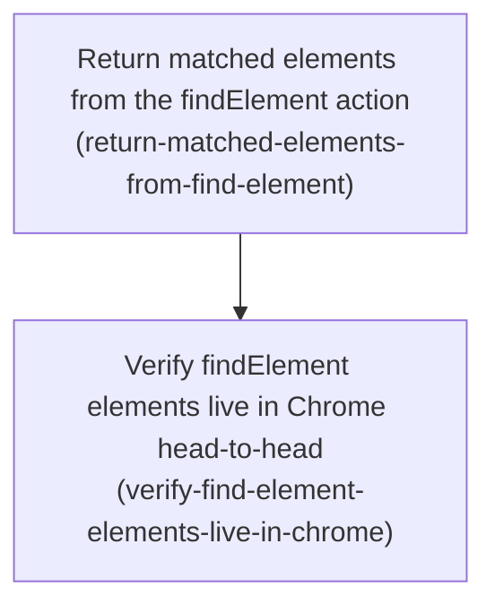

# Horizon 12 — Return matched elements from `findElement`

_agent-agnostic-browser-bridge · planned 2026-09-04 · lite path · technical domain shape · 2 phases_

---

## Executive Summary

### 🎯 What are we trying to achieve?

`tools/chrome-bridge/` is a standalone Chrome-control bridge that any MCP-capable terminal AI tool can point at to drive a real Chrome tab. Its `findElement` action today only answers "how many elements match this CSS selector" — a bare count. This horizon changes it into an **extraction tool**: given a selector, it returns the matched elements themselves — for each one a **stable locator string** (a CSS selector you can hand straight back to `findElement` or `clickElement` to re-target that same element), the element's **visible text**, and a **fixed set of identifying attributes** (tag name plus id, class, role, aria-label, href, name, type, data-testid). Done means the new shape is wired through every file that must move together for one action, the read stays safe (runs in the isolated content-script world, never evaluates a caller string, size-capped inside the page), no new browser permission is added, `npm run verify` is green, and a real-Chrome check compares it head-to-head against the `claude-in-chrome` extension's `find`.

### 🧠 Why does this change need to happen?

An agent extracting data from a page needs to *act on* a specific match, not just know one exists. The current `{ found, matches: 3 }` gives it nothing to work with — no text to read, no way to click the second result, no attributes to disambiguate. This was hit as a concrete wall (package blocker #6: "findElement returns only a count, not the elements … it's an existence check, not an extraction tool"). `claude-in-chrome`'s equivalent `find` returns usable element refs; this closes that gap for the standalone bridge.

### At a glance

| | |
|---|---|
| **Phases** | 2 |
| **Complexity** | Low–Medium — one action's result shape across a well-understood parity surface, plus a live check. The only genuinely new design is the locator-string ("ref") scheme, for which the package has no precedent. |
| **Main risk** | The deliberately-unfocused sandbox tab suspends the browser render pass (found in horizon 10). `innerText` is layout-dependent, so it *may* come back collapsed or empty from an isolated-world `chrome.scripting` read — earlier horizons only proved layout reads work via CDP. The live-verify phase checks this explicitly. |
| **Quality/performance target** | Result size bounded **in-page before serialization**: a match-count cap and a per-element text cap, with `total` and `truncated` fields — because the whole result is JSON-stringified straight to the agent with no size guard at the MCP layer. |
| **Testing focus** | CSP-safety / no string eval (selector only ever a serialized argument); cap enforced before the structured-clone boundary; the ref actually re-resolving to its element; atomic parity-surface completeness proven by `tsc`; the repo's first adversarial-selector test; live-Chrome head-to-head with all four branches (match / no-match / cap / hostile selector) exercised. |

---

## Implementation plan

### Order of work

1. **Return matched elements from the findElement action** — can start immediately.
2. **Verify findElement elements live in Chrome head-to-head** — after phase 1, because it live-runs the changed action and compares it to `claude-in-chrome`'s `find`; it cannot start until the new shape exists and the extension is rebuilt.

---

### Phase 1 — Return matched elements from the findElement action

Technical ID: `return-matched-elements-from-find-element` · context: page-actions extraction subsystem · layer: infrastructure · blast radius: medium

**Goal** — After this phase, `findElement` returns, for a CSS selector against the sandbox tab, an ordered, size-capped list of matched-element descriptors — each with a self-contained CSS-locator `ref`, the element's visible `innerText`, and the fixed key-attribute map — wired atomically across the whole parity surface with unit tests, and `PAGE_ACTIONS` still has 20 entries.

**Why** — `findElement`'s current `{ found, matches }` count is not actionable. An AI tool driving the browser needs a reusable locator, the text each element shows, and its identifying attributes. This is done as a pure isolated-world DOM read (a `chrome.scripting` call whose injected function runs in the content-script isolated world — not blocked by a site's Content-Security-Policy, and it never evaluates a caller string), with the payload bounded inside the page before it crosses the serialization boundary.

**Changes**
- Add `MAX_FIND_ELEMENT_MATCHES` (element-count cap) and `MAX_ELEMENT_TEXT_CHARS` (per-element `innerText` cap) constants in `page-actions.ts` next to `DEFAULT_MAX_CHARS`.
- Rewrite the `raw.findElement` injected isolated-world function (`ports.executeScript(tabId, fn, [selector])`, no options arg): slice the NodeList to the count cap, build a per-match descriptor with a size-bounded self-contained CSS-locator `ref` string, a capped visible `innerText`, and the fixed key-attribute map (`tagName` plus `id`, `class`, `role`, `aria-label`, `href`, `name`, `type`, `data-testid`; absent keys as `null`), and return an ordered array plus `total` (pre-slice count) and a `truncated` flag — all bounded before the structured-clone boundary. Keep the `try/catch` that makes a hostile selector return an empty result.
- Replace `FindElementResult` in `protocol/types.ts` with `{ readonly matches: readonly FindElementMatch[]; readonly total: number; readonly truncated: boolean }` and add adjacent `FindElementMatch` and key-attribute-map interfaces with nullable fields typed `T | null` (never `undefined`). The two `Record<PageAction, …>` mapped types reference the interface by name and need no edit.
- Add `coerceFindElementOutcome(raw)` mirroring `coercePointerOutcome`: guard `Array.isArray`, rebuild every descriptor from primitives (`asString` / null-coerce each attribute, `asString` the ref and text), return `{ result: { matches: [], total: 0, truncated: false } }` for a real empty match, and a CSP error sentinel for a malformed/empty injection return.
- Update the `findElement` `TOOL_CATALOG` entry description to state it returns the matched elements (ref, innerText, key attributes) with the result cap; leave `inputSchema` unchanged.
- Rewrite the three existing `findElement` unit tests to the new result shape (keep the `executeScript` `toHaveBeenCalledWith(7, expect.any(Function), ['.x'])` / `queryActiveTab`-not-called assertions), add an injected-function test that extracts the fn and runs it against a stubbed `document`, and add the repo's first adversarial-selector test proving the hostile string reaches `querySelectorAll` only as a serialized argument and yields an empty list.
- Update README read-actions prose to describe the new `findElement` output and its cap, and add a new numbered manual-e2e step (real selector → refs+text+attributes; no-match → empty list not error; high-cardinality → cap enforced; adversarial → no execution). Keep the "twenty"/"20" page-action counts unchanged.

**Files / areas** — `tools/chrome-bridge/src/extension/page-actions.ts` · `src/protocol/types.ts` · `src/mcp/tool-catalog.ts` · `src/extension/page-actions.unit.test.ts` · `README.md`

**How to verify**
- **CSP-safe ISOLATED-world extraction, no string eval** — `raw.findElement` is passed to `executeScript` as a function value, not a template string; the selector reaches the injected function only via the args array (no `${selector}` concatenation into a query); no `eval(` / `new Function(` / `Runtime.evaluate`-with-expression / `<script>` on the new path; the injected function closes over no page-world symbols.
- **Result cap enforced in-page before the structured-clone boundary** — both constants are referenced by the injected function; slicing happens before descriptor construction; `total` = full match count before slicing, `truncated` = (`total > cap`) OR any `innerText` was cut; a selector matching more than the cap returns exactly cap `matches` with the correct `total` and `truncated: true`.
- **Element ref is a re-usable self-contained CSS locator** — `ref` is a `string` and a valid CSS selector (parses; uses `>`, `nth-of-type`, `#id`, attribute selectors — not XPath); each `ref` selects exactly one node and differs between matches; no serialized DOM node / numeric node id / opaque token; the injected-function unit test asserts feeding a returned `ref` back yields the original element; a stable unique `id` is preferred over a long structural path.
- **Full parity surface migrated atomically, proven by tsc** — `FindElementResult` replaced; both `Record<PageAction, …>` mapped types still compile exhaustively; raw + guarded handler entries both updated; `TOOL_CATALOG` `inputSchema` byte-identical; README prose + new manual-e2e step added and "twenty"/"20" unchanged; `pnpm typecheck` + `pnpm lint` + unit tests green; grep for `FindElementResult` / old field names returns zero hits.
- **Nullable-field convention + adversarial-selector / malformed-injection handling** — every key-attribute field is `string | null`; the injected function emits explicit `null` for missing attrs; `coerceFindElementOutcome` reconstructs each field from primitives (no raw pass-through); empty match → `{matches:[],total:0,truncated:false}`, non-array/shape-mismatch → CSP error sentinel; the new adversarial-selector test feeds an invalid/hostile selector and asserts an empty result via the injected function's own `try/catch`, no exception propagated.

**Done when** — `findElement` returns an ordered, size-capped list of matched-element descriptors across the full parity surface, the reliably-green subset of `npm run verify` passes, `PAGE_ACTIONS` still has 20 entries, and every check under *How to verify* passes its bar.

**Depends on** — nothing; can start immediately.

Reference — full rubric + healer hint

| Dimension | minScore | Rule |
|---|---|---|
| `csp-safe-isolated-read` | 7 | Function-reference injection via `ports.executeScript` in the isolated world; selector only a serialized arg; no string eval anywhere on the new path. |
| `result-cap-before-clone-boundary` | 7 | Both caps applied inside the injected function; `total` = pre-slice count; `truncated` set for count overflow OR any text cut. |
| `element-ref-selfcontained-locator` | 7 | `ref` is a valid CSS selector that re-resolves to exactly that element; no handle/node-id/XPath/index; `#id` preferred when unique. |
| `parity-surface-atomic-completeness` | 7 | New shape threaded through every parity-surface file in one change; `tsc` + reliably-green verify subset pass; no old type/field name survives. |
| `nullable-convention-and-adversarial-coercion` | 7 | Absent attrs `null` not `undefined`; `coerceFindElementOutcome` rebuilds from primitives; hostile selector → empty via in-page `try/catch`. |

**Healer hint:** If a dimension fails, fix it inside the injected ISOLATED-world function and the coercion guard rather than in the guarded handler — the cap, the null-normalization, the ref construction, and the hostile-selector `try/catch` must all live before the structured-clone boundary, and every parity-surface file (both mapped types included) moves in the same commit so `tsc` proves completeness.

---

### Phase 2 — Verify findElement elements live in Chrome head-to-head

Technical ID: `verify-find-element-elements-live-in-chrome` · context: live-Chrome head-to-head verification · layer: cross-cutting · blast radius: small

**Goal** — In a fresh post-rebuild `chrome-bridge` MCP session, run the changed `findElement` against a real page, compare its output to `claude-in-chrome`'s `find`, confirm no manifest permission changed, and mark package blocker #6 resolved.

**Why** — A real-Chrome end-to-end check closes any horizon that changes the extension (project rule). Unit tests cannot prove the isolated-world DOM read returns real refs and non-collapsed visible text from the deliberately-unfocused sandbox tab (a background tab whose render pass is suspended). This phase runs that check and records the result; it legitimately stays `blocked` until it can be run in a genuinely fresh MCP session after rebuilding the extension.

**Changes**
- Rebuild and reload the extension, open a fresh `chrome-bridge` MCP session (use `--retry` if the tool catalog is stale from a prior session — the h9/h11 pattern).
- Run `findElement` on a real-page CSS selector and confirm real element refs, non-empty non-collapsed `innerText`, and a populated key-attribute map; a no-match selector → empty `matches` list (not an error); a high-cardinality selector → the element-count cap and `truncated` flag; the adversarial selector string → no code execution.
- Run `claude-in-chrome`'s `find` on the same page and record the head-to-head comparison.
- Confirm `git -C tools/chrome-bridge diff HEAD -- extension/manifest.json` is empty and `diff extension/manifest.json dist/extension/manifest.json` stays identical.
- Append a dated "Verified 2026-09-04 (horizon 12)" head-to-head block to the README, mark `blockers.md` item #6 resolved, and update the roadmap `state.md` / `discoveries.md` memory files.

**Files / areas** — `tools/chrome-bridge/README.md` · `tools/chrome-bridge/blockers.md` · `docs/roadmaps/agent-agnostic-browser-bridge/state.md`

**How to verify**
- **Fresh post-rebuild MCP session is evidenced, not asserted** — README block names the rebuild/reload step and shows a concrete freshness signal (session id, `--retry` note, a `ping`/`getTabState` round-trip, or catalog hash); the quoted `findElement` output shows the NEW extraction shape; if a fresh session could not be obtained, status is `blocked MANUAL_CHROME_CHECK_PENDING` and the README/blockers edits are withheld per the compensation.
- **Every findElement branch hit live with quoted output** — real quoted output for all four scenarios (normal match with ≥1 ref + non-collapsed text + populated attrs; no-match empty list with success status; high-cardinality cap + `truncated:true` + capped text; adversarial selector treated as a locator with no execution), each naming the real page/URL.
- **claude-in-chrome find corroborates on the same page** — `claude-in-chrome` `find` quoted for the same URL/target; a concrete field-by-field comparison (same nodes? refs point at the same elements? text and attributes agree?); any divergence listed and explained; a conclusion on parity.
- **Manifest unchanged, shown by real before/after diffs** — actual output (or explicit "empty" with the exact command) for both `git diff HEAD -- extension/manifest.json` and the source-vs-`dist` manifest comparison, both shown as actually run.
- **Deliverable edits and status recording are honest and complete** — README block dated exactly "Verified 2026-09-04 (horizon 12)" with evidence inline; `blockers.md` #6 resolved with a pointer (or left open if the check did not fully pass); `state.md` / `discoveries.md` updated (including any stale-catalog / `--retry` discovery); status is `passed` or `blocked MANUAL_CHROME_CHECK_PENDING` matching the evidence; no numeric self-score; claims backed by quoted output.

**Done when** — a dated "Verified 2026-09-04 (horizon 12)" head-to-head block exists in the README with `blockers.md` item #6 marked resolved; the phase ends `blocked MANUAL_CHROME_CHECK_PENDING` until executed in a fresh post-rebuild `chrome-bridge` MCP session; and every check under *How to verify* passes its bar.

**Depends on** — Phase 1 (Return matched elements from the findElement action).

**Rollback** — Revert the README verification block and the `blockers.md` #6 status change if the live head-to-head fails or cannot be run.

Reference — full rubric + healer hint

| Dimension | minScore | Rule |
|---|---|---|
| `fresh-session-provenance` | 6 | Evidence shows a genuinely fresh post-rebuild MCP session, or honest `blocked MANUAL_CHROME_CHECK_PENDING`. |
| `all-branches-exercised-live` | 6 | Real quoted output for match / no-match / cap / adversarial, each naming its page. |
| `independent-head-to-head-corroboration` | 6 | `claude-in-chrome` `find` on the identical page, compared field-by-field, divergences explained. |
| `manifest-permission-unchanged-diff` | 6 | Actual output of both manifest diffs, shown as run. |
| `honest-status-and-memory-updates` | 7 | README block + `blockers.md` #6 + memory files consistent with evidence; no self-grading. |

**Healer hint:** If a dimension is thin, run the missing branch live in a genuinely fresh post-rebuild `chrome-bridge` session and paste the real tool output (`findElement` and `claude-in-chrome` `find`) plus both manifest diff commands into the dated README block; if a fresh session is genuinely unavailable, record the phase as `blocked MANUAL_CHROME_CHECK_PENDING` and revert the README/blockers edits rather than asserting a pass.

---

## Discovery Findings

| Area | Finding | Where | Implication |
|---|---|---|---|
| current findElement handler | `raw.findElement` (page-actions.ts:391-409) calls `ports.executeScript(tabId, fn, [selector])` with no options (ISOLATED by omission), returns `asCount(...)` → `{ found, matches }`; guarded as `guard(raw.findElement)` at line 764. | `src/extension/page-actions.ts` | The in-page function changes number→descriptor-array; keep the same guard and call shape; replace `asCount` with a descriptor-array coercion + cap. |
| FindElementResult wiring | `FindElementResult { found; matches }` at types.ts:230; referenced only there and in `PageActionResults` (line 377). The two `Record<PageAction,…>` mapped types reference by name. | `src/protocol/types.ts` | Result-shape change is a single-interface edit + adjacent sub-interfaces; mapped types need no edit. |
| TOOL_CATALOG entry | findElement entry is input-only (`selector` string, `additionalProperties:false`); description is "Count how many elements…". | `src/mcp/tool-catalog.ts` | Only the description string changes; `inputSchema` untouched. |
| parity surface — exact edit sites | Changing a Result shape (not adding an action) does NOT touch `PAGE_ACTIONS`, the ordered-list test, the three `.toBe(20)` / `toHaveLength(20)` / `Object.keys` count assertions, the mapped `Record` types, `command-dispatch.ts`, or `mcp/server.ts`. Real sites: 1 type interface, 1 handler body, 1 catalog description, ~4-5 test blocks, README prose + 1 new manual-e2e step. | `src/protocol/actions.ts` | Phase (a) "build mechanism" and (b) "wire across surface" collapse into one honest phase; 20→20 count is automatic. |
| PAGE_ACTIONS count assertions | 20 entries, findElement at index 4; count hard-asserted in three test spots + README "twenty"/"20". | `src/protocol/actions.unit.test.ts` | Guardrail: if the implementer accidentally adds an action name, all three break. |
| ISOLATED-world read mechanics | `ports.executeScript` returns `injected[0]?.result` **raw** (Chrome structured-clones the return value; no JSON wrapper). getPageText/readPage/waitFor all omit options → ISOLATED. Only MAIN-world `executeScript`/`evaluatePage` use `{ ok, json }`. | `src/extension/ports.ts` | The new in-page function can `return` a plain array of objects directly; no envelope needed. The cap MUST be applied in-page before the structured-clone boundary. |
| result-size caps / helpers | `DEFAULT_MAX_CHARS = 200_000`, local `truncate(text, maxChars)` → `{ text, totalChars, truncated }`. getPageText/readPage apply the cap **handler-side** (full text is cheap to transfer). No element-count cap constant exists. | `src/extension/page-actions.ts` | Add `MAX_FIND_ELEMENT_MATCHES` + `MAX_ELEMENT_TEXT_CHARS`; apply **in-page** (unlike getPageText) because `innerText` for thousands of nodes would blow the payload. |
| result coercion helpers | `coercePointerOutcome` (clickAt/hover) rebuilds `{found,dispatched}` from primitives and returns an error sentinel on malformed input. No per-action result-validation registry — each handler validates inline. `mcp/server.ts:101` JSON-stringifies the whole result. | `src/extension/page-actions.ts` | Write `coerceFindElementOutcome(raw)` mirroring `coercePointerOutcome`: guard `Array.isArray`, rebuild each descriptor from primitives; empty match → `{matches:[],total:0,truncated:false}`, malformed → CSP error sentinel. |
| element-ref / locator precedent | **No precedent anywhere** in `tools/chrome-bridge/src` for element descriptors with a ref/locator — no nth-of-type generation, no cssPath util, no WeakMap handle registry. `data-testid` appears nowhere in source. | `src/extension` | The ref scheme is designed from scratch: a generated, size-bounded CSS-locator string, generated inside the ISOLATED injected function. |
| test helpers | `fakePorts(overrides)` (all `vi.fn()`), `fakeSandbox()` → tabId 7. Injected-fn extraction pattern (clickAt/hover): `vi.stubGlobal('document', stub)`, `vi.mocked(ports.executeScript).mock.calls[0][1]` as the fn, run it, `afterEach(vi.unstubAllGlobals)`. **No adversarial-selector test exists anywhere in the repo yet.** | `src/extension/page-actions.unit.test.ts` | The new injected-fn test stubs `document.querySelectorAll` returning fake elements; the adversarial test is the repo's first. |
| README sites | findElement in enumerations at README:46, 88, 303; "20 tools" at 211; the numbered manual-verification list (steps 1-15) has **no findElement step**; each recent horizon appended a dated "Verified YYYY-MM-DD (horizon NN)" block. | `README.md` | Add a describing sentence + a new numbered manual-e2e step + a dated verification block. "twenty"/"20" unchanged. |
| manifest / no-new-permission proof | permissions: `tabs, activeTab, scripting, storage, alarms, debugger`; host `<all_urls>`. Build copies the manifest verbatim. h11 method: `git diff` vs HEAD empty AND source-vs-`dist` manifest identical. | `extension/manifest.json` | `chrome.scripting` isolated-world reads are already fully covered; reading `innerText`/attributes/generating a selector adds zero API surface. |
| unfocused sandbox tab — innerText | The sandbox tab is deliberately unfocused and its render pass is suspended (h10). h9/h10 got real layout reads but **via CDP `evaluatePage`**, not `chrome.scripting`. No code comment establishes whether isolated-world `innerText` collapses in the unfocused tab. | `README.md` | Use `innerText` (matches getPageText + the task requirement); the live head-to-head must explicitly check the text is non-empty/non-collapsed. |
| MCP result rendering | `mcp/server.ts:101` JSON-stringifies every non-image result with no MCP-layer size guard. | `src/mcp/server.ts` | The in-handler cap is the only thing preventing an enormous tool response — it must be real and in-page. |

## Out of Scope

- **Network response bodies for text/JSON (blocker #4)** — separate capture-layer slice; this horizon ships exactly one capability.
- **`clickElement` by text/role or a fuller pointer-event sequence (blocker #5)** — separate deferred slice.
- **Reviving the horizon-05 DOM page-model / bounding-box snapshot** — a different, larger capability.
- **Full-page / element screenshots, `captureTab({fullPage})` (blocker #7)** — unrelated deferred slice.
- **Trusted CDP `Input.dispatch*` input / any persistent CDP session** — contraindicated (h10) until a rendering/focused-tab story exists.
- **Deleting the dead active-tab surface** — only folded in if given its own horizon; not bundled.
- **`findElement` accepting text/XPath/role locators as *input*** — this horizon changes the output shape only.
- **Caller-configurable attribute lists / a `fields` parameter** — the key-attribute set is fixed this horizon.
- **Any new manifest permission or a CDP session-model switch** — explicitly forbidden by the task.
- **Wiring `tools/chrome-bridge/` into the repo-root build / migrating boky onto it** — binding decision 2026-09-02 (h1).
- **A caller-supplied `fields` param / a dedicated `clickElement`-by-ref path / a persistent CDP session** — fail YAGNI gates 1 and 3.

## Success Criteria

1. `findElement` returns, for a CSS selector against the sandbox tab, an ordered list of matched elements each carrying a stable CSS-locator `ref`, visible `innerText`, and the fixed key-attribute map, capped in-page with `total` + `truncated` fields.
2. The implementation is a single pure ISOLATED-world `chrome.scripting.executeScript` function-ref DOM read — no `chrome.debugger`/CDP, no caller-supplied string eval, selector reaches `querySelectorAll` only as a serialized argument, an adversarial selector cannot execute code.
3. The change lands atomically across the parity surface (types + both mapped `Record` types, raw + guarded handlers, `TOOL_CATALOG` description, the edited findElement unit tests plus the two count-assertion test files still passing at 20 and a new adversarial-selector test, the README) with the reliably-green subset of `npm run verify` passing.
4. No new manifest permission: `git diff` of `extension/manifest.json` vs HEAD is empty and the built `dist` manifest permissions are unchanged.
5. Phase 1 deliverable: `findElement` returns an ordered, size-capped descriptor list across the full parity surface, reliably-green verify subset passing, `PAGE_ACTIONS` still 20.
6. Phase 2 deliverable: a dated "Verified 2026-09-04 (horizon 12)" head-to-head block in the README with `blockers.md` item #6 resolved; the phase ends `blocked MANUAL_CHROME_CHECK_PENDING` until run in a fresh post-rebuild `chrome-bridge` MCP session.

## Quality Gate

- **Path:** lite (technical, code-local, one subsystem, 2 phases).
- **Stages run:** Analyze → Discovery (existing system) → Decompose → Alignment Preview (non-blocking, no concerns call) → Prepare Next Horizon → per-phase rubrics → assemble → 1 critic pass.
- **Critic verdict:** pass — all 10 rubric dimensions pass, every score ≥ minScore. Lowest: `success-coverage` 7/7.
- **Issues:** 0 blockers, 0 majors, 1 minor (successCriteria wording drift — "three unit test files" implied edits to files only kept passing). Fixed mechanically before writing this file; not carried as debt.
- **Verify / heal:** not triggered (no blocker/major).
- **Final verdict:** gate passed on iteration 1.

## Full analysis

- **Domain shape:** technical — a protocol/adapter change inside a single extraction subsystem (one page action, its typed parity surface, an isolated-world DOM read, a live-Chrome verification), no business rules or domain model.

### Ubiquitous language

| Term | Meaning |
|---|---|
| page action | One entry in `PAGE_ACTIONS` (the single source of truth); `findElement` is an existing one being **changed**, not added. |
| parity surface | The files that must change together for one action: Params/Result interfaces + both `Record<PageAction,…>` mapped types, raw + guarded handlers, `TOOL_CATALOG` schema, the unit test files, the README. |
| sandbox tab | The dedicated, deliberately-unfocused Chrome tab that is the sole target of every page action (decision h6); its render pass is suspended while unfocused. |
| ISOLATED-world DOM read | A `ports.executeScript` call with a function reference running in the content-script isolated world — CSP-safe, no string eval, selector passed only as a serialized argument. |
| element ref | The stable per-match CSS-locator string `findElement` returns so a match can be re-targeted later, without a live handle or CDP node id. |
| key attributes | The fixed per-match map: `tagName` plus `id`, `class`, `role`, `aria-label`, `href`, `name`, `type`, `data-testid`. |
| result cap | The documented size limit (max element count + per-element `innerText` length, with a `truncated` flag) applied in-page before serialization. |
| live-Chrome head-to-head | The mandatory horizon-closing check: run the changed action in a fresh post-rebuild `chrome-bridge` MCP session and compare against `claude-in-chrome`'s `find` on the same real page. |

### Assumptions

- The `ref` is a self-contained CSS-locator string (a generated selector — an `:nth-of-type` chain or the caller selector plus an index token), not a live handle or CDP node id.
- `innerText` (visible, layout-aware) is returned, truncated per-element to a documented cap distinct from the list cap.
- The key-attribute set is exactly the task's list plus `tagName`; no caller-configurable selection this horizon.
- Nullable/absent fields are `T | null`, never `undefined` (`exactOptionalPropertyTypes`).
- The result cap mirrors an existing read action's pattern (`MAX_*` constant + `truncated` + total count), reusing `truncate` per-element.
- The h9/h11 stale-MCP-catalog symptom may recur and is cleared by `--retry` in a fresh post-rebuild session, not by code.
- `executeScript` in the read is `ports.executeScript` (chrome.scripting, function ref, ISOLATED by omission) — not the MAIN-world `executeScript` page action.
- Live verification is Claude Code only (decision 2026-09-03 h4).

### Risks

- Changing `FindElementResult` while keeping the `findElement` name is a breaking protocol change; the atomic-diff discipline must catch every site or `tsc`/tests break.
- `ref` design: index-based is unstable across DOM mutation; a generated selector can be non-unique or huge on obfuscated-class pages — the scheme must be defensible without over-engineering.
- The unfocused sandbox tab's suspended render pass can make `innerText` collapsed/empty or a mid-hydration snapshot; verification page choice must account for this and the tool must not silently imply the text is complete.
- `innerText` on many nodes plus attributes can blow past result size; the cap must be in-page, before serialization.
- In-session MCP catalog staleness can force `MANUAL_CHROME_CHECK_PENDING` before `--retry` clears it — expected, but blocks a same-session green close.
- Long `class` values on framework pages: not truncating defeats the cap, truncating can break a class-based ref.
- `innerText` depends on the node being rendered; confirm the isolated-world read returns visible-text semantics in the unfocused tab, not a `textContent` fallback.
