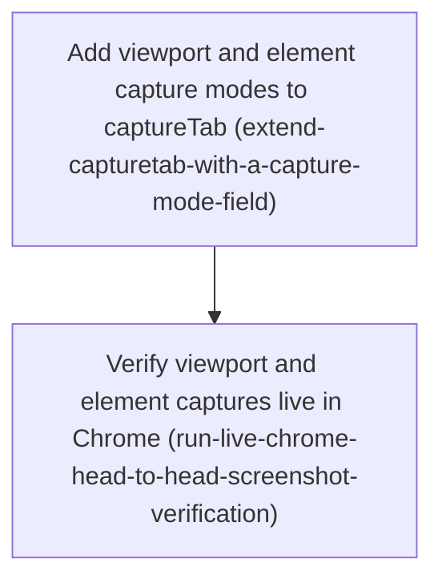

# Horizon 13 — Viewport and single-element screenshots (roadmap rev1)

> ⚠️ **This `.md` twin describes rev1. The authoritative plan is now `horizon-13-…-roadmap.json` rev2** (REPLAN #2 `revise-phases`, 2026-09-04). What rev2 changed: the rev1 live verification attempt found the shipped phase-0 output does not hold end-to-end — (1) the flat size-guard ceiling `MAX_SCREENSHOT_BASE64_CHARS = 600_000` sits **below** the real ~845 KB (844 960-char) dpr-2 viewport base64, so it wrongly rejects the *default* capture; (2) `mcp/server.ts` emits only the image block, never the `width/height/clipped` metadata the cross-check needs; (3) an **un-scrolled** below-the-fold element captures **blank** on the unfocused sandbox tab (h10 render-pass suspension — the rev0 probe's success was a one-off), though the same element **scrolled into view first** captures correctly. Phase 0 is frozen (done, 10/10). Rev2 **adds** a corrective phase (recalibrate the ceiling to `1_200_000`, keep the guard flat, surface the metadata as a sibling text block, fix the stale `~275 KB` prose) and **replaces** the verification phase — narrowed to the default viewport capture plus an element scrolled into view via `scrollPage`, with un-scrolled below-the-fold capture deferred behind the same render-the-tab prerequisite full-page sits behind. rev1 content preserved at `…-roadmap.rev1.json`.

Project: **agent-agnostic-browser-bridge** · Horizon 13 of an ongoing effort · Domain shape: **technical** (browser-automation plumbing — no business rules) · Path taken: **full** · **Revision 1** (REPLAN `revise-phases`, 2026-09-04) · Gate: rev1 critic pass, all 10 dimensions pass, 0 blockers/majors, 2 minors fixed in place.

> **What changed in rev1.** The original horizon aimed at *full-page* **and** *single-element* screenshots. A live phase-0 probe against real Chrome proved the full-page mechanism (CDP `Page.captureScreenshot({captureBeyondViewport:true})`) **does not work** on the deliberately-unfocused sandbox tab — it hangs past the 15-second debugger-session cap and wedges the capture path, or errors `CDP -32000`, and never returns an image. Single-element **clip** capture, by contrast, worked cleanly (it composited a genuinely below-the-fold element with a clean debugger detach). So full-page is **dropped from this horizon** and deferred behind a future "briefly render the sandbox tab" capability; the now-spent probe phase is removed; and the two remaining phases are narrowed to **viewport-default + single-element** capture. The previous plan is preserved at `horizon-13-full-page-element-screenshots-roadmap.rev0.json`.

---

## 🎯 What are we trying to achieve?

The standalone `tools/chrome-bridge` tool lets any MCP-capable terminal AI drive a real Chrome tab. Its screenshot action, `captureTab`, currently returns **only the visible slice** of the page and takes no arguments. This horizon adds **one specific element** as a capture target — you point at it with the same locator string `findElement` already returns, and get back a PNG cropped to just that element, even if it is below the fold. It also adds a guard so an over-large screenshot returns a clean "too large" result (measured bytes + the ceiling) instead of an unusable multi-megabyte blob or a crash. The visible-viewport capture stays the default and is unchanged.

"Done" means: the new `mode` option is wired consistently through every coupled part of the code (a missed spot is a compile error), `PAGE_ACTIONS` stays at 20 (the shape changes in place, not a new action), every failure path returns a defined non-crashing result, `npm run verify` is green, and a hands-on check in real Chrome confirms the captured element image dimensions match what the page actually measures (device-pixel-ratio reconciled).

## 🧠 Why does this change need to happen?

An agent reading a page often needs to *see* one component — a chart, a table, a rendered widget — without the surrounding noise of a full-viewport shot, and without being limited to what is currently on screen. Element capture closes that gap. It is the next capability in a deliberately incremental build-out (one capability per horizon, verified live).

Full-page capture was the other half of the original goal, but the tool targets a Chrome tab that is **kept unfocused on purpose**, and an unfocused tab **stops running its rendering pass** (discovered in horizon 10). The rev0 phase-0 experiment settled the open question: Chrome will **not** paint offscreen content into that tab for a beyond-viewport screenshot. Clip capture of an individual element *does* work there. So this horizon ships what is proven to work now, and full-page waits for a horizon that first solves "make the unfocused tab paint".

## At a glance

| | |
|---|---|
| **Phases** | 2 |
| **Complexity** | Medium — one atomic multi-file parity-surface change, plus a live-Chrome verification. The feasibility risk that dominated rev0 is now resolved. |
| **Main risk** | Live verification is repeatedly blocked in this project by a down relay or a frozen MCP tool catalog (h9, h11, h12); the horizon may again close `MANUAL_CHROME_CHECK_PENDING` and need a `--retry` in a later fresh session. |
| **Quality/performance target** | Returned element image dimensions track a CDP `getBoundingClientRect` measurement (device-pixel-ratio 2 reconciled). No new browser permission. Returned image stays within MCP result-size limits via a documented flat too-large guard. |
| **Testing focus** | Compiler-proven parity-surface completeness; defined non-throwing outcomes for no-match / zero-area / relay-unavailable / oversized; the pinned CDP call assertion kept exact for the viewport call and updated for the element clip; MCP server routes non-image outcomes as text/error not a corrupt image block; a mandatory live head-to-head with recorded numbers or an honest `MANUAL_CHROME_CHECK_PENDING`. |

---

## Implementation plan

### Order of work

1. **Add viewport and element capture modes to captureTab** — no dependencies; can start immediately. The rev0 probe shim (clip plumbing, a temporary `captureBeyondViewport?`/`clip?` params shape, 5 unit tests) is already on disk and is the starting point: keep the clip plumbing, drop `captureBeyondViewport`, add the real `mode`/`elementRef` shape.
   ↓ *you can only verify what has been built, and the numeric cross-check needs the `width`/`height` this phase adds*
2. **Verify viewport and element captures live in Chrome** — depends on phase 1's build.

---

### Phase 1 — Add viewport and element capture modes to captureTab

`Technical ID: extend-capturetab-with-a-capture-mode-field` · Context: chrome-bridge parity surface · Layer: infrastructure · Blast radius: medium

**Goal** — In one atomic change across the whole `captureTab` "parity surface", add a single mutually-exclusive **two-value** `mode` field (`visible viewport` | `element`) plus an element-ref field, resolve the element ref to a clip rect, return `width`/`height`/`clipped` metadata in the result, add a flat non-throwing guard turning an oversized image into a defined too-large outcome, and generalise the MCP server's rendering branch so non-image outcomes render as text/error rather than a corrupt image block.

**Why** — `captureTab` today takes no arguments and captures only the visible area, and nothing anywhere checks screenshot size. The "parity surface" is the coupled set of definitions and consumers — `PAGE_ACTIONS`, both `Record<PageAction, …>` maps, the Params/Result types, the raw + guarded handler maps, `TOOL_CATALOG`, the count/ordered-list tests, and the README — that a changed action must land across at once, so a missed consumer is a `tsc` error. The action count stays 20 because the shape changes in place, not via a new action (horizon 12 precedent). The phase-0 probe proved clip capture composites a below-the-fold element (`table.wikitable` at y≈4460, never scrolled into view) in ~2s with a clean detach, while `captureBeyondViewport` is non-functional there — so only two modes ship.

**Changes**
- `protocol/types.ts`: add to `CaptureTabParams` one required-with-default `mode` field of exactly **two** values, plus an `elementRef` field read only when `mode` is `element`; add `width`, `height`, `clipped` (true only in element mode when the element rect exceeds the composited viewport so the image is cropped), and a too-large marker (measured bytes + ceiling) to `CaptureTabResult`; keep both `Record<PageAction, …>` map entries in lockstep; **remove the probe-only `captureBeyondViewport` param field entirely**.
- `extension/debugger-ports.ts`: give `DebuggerPorts.captureScreenshot` an optional options arg passing `clip:{x,y,width,height,scale}` for element mode (**no `captureBeyondViewport` branch**); update the pinned `Page.captureScreenshot` unit-test assertion in the same commit so the viewport call is still asserted to send exactly `{format:'png'}`.
- `extension/page-actions.ts` `raw.captureTab`: read + validate params; for element mode resolve the ref to a rect via `Runtime.evaluate document.querySelector(ref).getBoundingClientRect()` mirroring `readScrollMetrics`, with defined non-throwing outcomes for no-match, zero-area, and relay/tab-unavailable; add a size guard measuring the returned base64 length against a documented ceiling constant (sibling to `MAX_EXECUTE_SCRIPT_RESULT_CHARS`) and, when exceeded, return the defined too-large outcome carrying measured size + ceiling — no downscale, no re-capture.
- `mcp/tool-catalog.ts`: replace `NO_ARGS` with a real `inputSchema` for `captureTab` (`mode` as an enum of the two exact strings with the viewport default documented, `elementRef` as an optional string); update the captureTab-specific unit assertions; update README step 5 prose + the `captureTab` paragraph; confirm `PAGE_ACTIONS` stays 20.
- `mcp/server.ts`: generalise the `toolName === 'captureTab'` branch so a real capture still renders as an MCP image content block, but a structured too-large / element-not-found / zero-area outcome is surfaced via `textResult` (with `isError` as appropriate) rather than forced through `readDataUrl`/`imageResult`; add `server.unit.test.ts` coverage for each non-image outcome and the success case.

**Files / areas** — `tools/chrome-bridge/src/protocol/types.ts`, `src/extension/debugger-ports.ts`, `src/extension/page-actions.ts`, `src/mcp/tool-catalog.ts`, `src/mcp/server.ts`, `src/mcp/server.unit.test.ts`, `src/extension/debugger-ports.unit.test.ts`, `src/extension/page-actions.unit.test.ts`, `src/mcp/tool-catalog.unit.test.ts`, `README.md`

**How to verify**
- *Parity surface lands atomically* — `tsc --noEmit` clean; both handler maps updated in lockstep with no `@ts-expect-error`/`as`/`any`/`!`; `PAGE_ACTIONS` still 20 and the count + ordered-list tests pass unchanged; no `captureBeyondViewport` string left anywhere; `clipped` is defined and unit-tested; `git diff` of `extension/manifest.json` is empty.
- *Capture mode is a single 2-value enum, viewport-defaulted* — exactly one `mode` field of exactly two literal values; no `fullPage?/element?` boolean pair; absent `mode` behaves identically to today; a unit test asserts the value set and the default.
- *Every failure path returns a defined non-throwing outcome* — no-match, zero-area, relay/tab-unavailable, and oversized image each resolve to a distinct structured result; the too-large outcome carries measured size AND the ceiling; the ceiling is a single named module constant; unit tests cover each path.
- *Pinned CDP assertion and all unit suites updated together* — the viewport call is still asserted (deep-equal) to send exactly `{format:'png'}`; an element-mode test asserts the exact `clip` shape and no `captureBeyondViewport` key; no `it.skip`, loosened matchers, or bumped timeouts.
- *Non-image captureTab outcomes round-trip through server.ts* — `server.ts` detects a non-image result before the `imageResult` path and returns `textResult` (JSON, `isError` where a failure); a real capture still returns an image block; `readDataUrl` only reached with an actual `data:image/png` URL; `server.unit.test.ts` asserts all cases.

**Done when** — `captureTab` accepts the two-value `mode` field plus an element ref and returns dimension metadata or a defined too-large outcome, the MCP rendering layer emits an image block for a real capture and a text/error block otherwise, `npm run verify` is green, `PAGE_ACTIONS` is still 20 — and every check above passes its bar.

**Depends on** — nothing; can start immediately.

**Rollback** — `CaptureTabParams`/`CaptureTabResult` are an advertised MCP tool contract; to roll back, restore the no-args params and dataUrl-only result, revert `NO_ARGS` in the tool catalog, and revert the pinned `captureScreenshot` assertion — all in one commit.

**Reference** — full rubric (5 dimensions: `parity-surface-completeness` 7, `element-ref-resolution-failure-paths` 6, `size-guard-behavior` 6, `pinned-cdp-assertion-integrity` 7, `server-outcome-routing` 6) and `healerHint` in the roadmap JSON.

---

### Phase 2 — Verify viewport and element captures live in Chrome

`Technical ID: run-live-chrome-head-to-head-screenshot-verification` · Context: chrome-bridge live verification · Layer: cross-cutting · Blast radius: small

**Goal** — In a fresh post-rebuild MCP session against real signed-in Chrome, capture **both** modes on a real long page — visible viewport, and a single large below-the-fold element by ref — cross-check the returned element image pixel width/height against a CDP `evaluatePage` `getBoundingClientRect` measurement (device-pixel-ratio reconciled), confirm the flat too-large guard returns its defined outcome on a genuinely large element clip, confirm no orphaned debugger attachment, and record a dated Verified README block — or end the horizon `MANUAL_CHROME_CHECK_PENDING` if the live environment is unavailable.

**Why** — The binding project rule (horizon 2 decision) is that any horizon changing the extension closes only after a real end-to-end Chrome check. The phase-0 probe already proved clip capture composites off-screen content on the unfocused sandbox tab; this phase verifies the *shipped* `captureTab` viewport and element modes end to end and performs the numeric returned-image-vs-measurement cross-check that phase 0 structurally could not do (the phase-0 MCP image block carries no dimensions — phase 1 adds `width`/`height` to `CaptureTabResult`).

**Changes**
- Rebuild + reload the chrome-bridge extension, start a fresh MCP session, navigate the sandbox tab to a stable long public page.
- Call `captureTab` element mode with a ref for a large below-the-fold element and confirm the returned image `width`/`height` track its measured `getBoundingClientRect` (record both number pairs and reconcile device-pixel-ratio 2); call visible-viewport mode and confirm the default is unchanged (image at viewport size).
- Confirm the flat size guard returns the defined too-large outcome (measured bytes + ceiling) on a genuinely large element clip, and that no `chrome.debugger` attachment is left orphaned on the sandbox tab after the run.
- Add a dated Verified block + a new manual-e2e step recording the target URL, the element ref, the measured-vs-returned dimensions, and the guard/detach observations; leave `MANUAL_CHROME_CHECK_PENDING` if the environment is unavailable, naming the blocker and the manual steps.

**Files / areas** — `tools/chrome-bridge/README.md`

**How to verify**
- *Dated Verified block or honest pending note exists* — a `Verified` section with an ISO date and a manual-e2e step for the two modes, OR a `MANUAL_CHROME_CHECK_PENDING` note naming the concrete blocker and the manual steps; no "effectively verified" hedge.
- *Returned element image dimensions vs CDP measurement, both numbers recorded* — two explicit numeric width/height pairs (returned image; measured `getBoundingClientRect`) plus the DPR value and the reconciliation arithmetic, within a stated tolerance; the element ref and the page URL quoted verbatim.
- *Viewport-default mode confirmed at viewport size* — a no-`mode` call's returned image dimensions recorded, stated to equal `innerWidth`/`innerHeight` × DPR; the block notes full-page mode is not offered.
- *Result-size guard observed firing* — a specific large element whose clip exceeded the ceiling; the flat too-large outcome quoted with its measured byte count and the ceiling constant; a note that a normal clip did not trip it.
- *Post-run debugger-detach check recorded* — an explicit check (method named, clean result observed, timestamped after the captures), ideally after the guard-trip path too.
- *Fresh post-rebuild MCP session evidenced* — rebuild command + extension reload + new-session start noted; the running session's `captureTab` confirmed to accept the `mode` field (an element-mode call succeeded, not "unknown argument"); or the stale-catalog blocker named in the pending case.

**Done when** — a dated Verified README block records the two captures cross-checked against CDP measurements plus the guard/detach observations, or an honest `MANUAL_CHROME_CHECK_PENDING` note names the blocker — and every check above passes its bar.

**Depends on** — Add viewport and element capture modes to captureTab.

**Reference** — full rubric (6 dimensions: `verified-block-present-and-dated` 7, `element-dimension-cross-check-recorded` 7, `viewport-default-unchanged-recorded` 7, `too-large-guard-observed-firing` 7, `no-orphaned-debugger-attachment` 6, `session-freshness-and-rebuild-recorded` 6) and `healerHint` in the roadmap JSON.

---

## Discovery Findings

| Area | Finding | File | Implication |
|---|---|---|---|
| phase-0 probe — captureBeyondViewport | `Page.captureScreenshot({captureBeyondViewport:true})` on the unfocused sandbox tab hung 17.1s past the 15s cap and wedged the capture path (reloadTab recovered it), then errored `CDP -32000`; never returned an image | `README.md` | Full-page capture is infeasible in the unfocused tab; dropped from h13, deferred behind a render-the-tab prerequisite |
| phase-0 probe — clip capture | `Page.captureScreenshot({clip})` on the same tab returned a PNG cropped to exactly a below-the-fold element (y≈4460, scrollY 0) in 2058ms with a clean auto-detach | `README.md` | Single-element clip capture is feasible with no render-pass prerequisite — the retained capability |
| captureTab params/result | `CaptureTabParams` was `{ _?: never }`, `CaptureTabResult` `{ dataUrl: string }`; the rev0 probe shim temporarily added `captureBeyondViewport?`+`clip?` | `src/protocol/types.ts` | Add `mode`/`elementRef` + `width`/`height`/`clipped`/too-large; delete the probe-only `captureBeyondViewport` field |
| MCP image block | `server.ts` special-cases `toolName === 'captureTab'` → `imageResult(readDataUrl(result))`; `readDataUrl` returns `''` on a shapeless result | `src/mcp/server.ts` | A non-image outcome would emit an empty/corrupt image block — the branch must be generalised |
| withDebuggerSession | `withDebuggerSession(tabId, label, run, timeoutMs=15000)`; attach `'1.3'`, guaranteed detach in `finally` | `src/extension/debugger-ports.ts` | The rect read and the clip screenshot reuse existing labels; the 15s cap and lifecycle come free |
| Page.captureScreenshot invocation | Currently `sendCommand({tabId}, 'Page.captureScreenshot', {format:'png'})` — the unit test pins this exactly; the rev0 shim added an options arg | `src/extension/debugger-ports.ts` | Element = add `clip`; drop the `captureBeyondViewport` branch; keep the pinned viewport assertion exact |
| CDP evaluate read path | `DebuggerPorts.evaluate` calls `Runtime.evaluate {returnByValue,awaitPromise}`; a private `readScrollMetrics` already reads geometry the same way | `src/extension/debugger-ports.ts` | ref→rect resolution runs as a `Runtime.evaluate` returning the rect JSON — no new CDP domain |
| h12 findElement ref | The ref is a plain CSS selector (`#id` or `… > tag:nth-of-type(n)`), consumed by `clickElement`/`findElement` via `querySelector` | `src/extension/page-actions.ts` | Element-screenshot-by-ref resolves the rect with `querySelector(ref).getBoundingClientRect()` — no new ref format |
| parity surface | `PAGE_ACTIONS` (20 entries) is the single source of truth; `Record<PageAction,…>` maps make `tsc` enforce completeness; a shape-only change does not touch `PAGE_ACTIONS` or the count tests | `src/protocol/actions.ts` | Folding into captureTab keeps the count at 20 with no count-test churn |
| manifest permissions | `tabs, activeTab, scripting, storage, alarms, debugger` — `debugger` already present since h6 | `extension/manifest.json` | `clip` / `Runtime.evaluate` need NO new permission |
| result-size guards | Only `MAX_EXECUTE_SCRIPT_RESULT_CHARS`, `DEFAULT_MAX_CHARS`, `MAX_FIND_ELEMENT_MATCHES`; nothing guards screenshot byte size | `src/extension/page-actions.ts` | The screenshot size guard is greenfield; a flat too-large outcome in the handler; a large element clip can still be big |
| h12 phase shape | h12: one atomic parity-surface phase proven by `tsc` + a live head-to-head phase (ending `MANUAL_CHROME_CHECK_PENDING` if the env is down) | roadmap files | The rev1 roadmap is exactly this 2-phase shape (the rev0 feasibility gate is spent) |

## Out of Scope

Full-page / `captureBeyondViewport` screenshots (dropped after the phase-0 probe; deferred behind a render-the-tab prerequisite); a "briefly render the sandbox tab" capability; a scroll-and-stitch full-page fallback; network response-body capture (#4); click-by-visible-text/ARIA + fuller synthetic input (#5); reviving the h5 DOM page-model/bbox snapshot; deleting the dead active-tab surface; verifying from Gemini/Codex/Cursor (h4 binds verification to Claude Code); PDF/JPEG/other capture formats; migrating boky onto the tool (h1 forbids); a generic cross-tool MCP result-size guard; downscale-and-retry for oversized screenshots (kept flat). Each carries its reason in the roadmap JSON `deferred` array.

## Required Materials

| Material | Kind | Why | How to acquire |
|---|---|---|---|
| Live signed-in Chrome + chrome-bridge extension + running relay | tool | Phase 2 is a live-Chrome experiment; the cross-check and guard-firing can only be observed live | `npm start` for the relay; rebuild + reload the unpacked extension; fresh MCP session. Budget for a `--retry` / a `MANUAL_CHROME_CHECK_PENDING` close |
| A real scrollable public page + a real large below-the-fold element | dataset | Phase 2's cross-check needs a large element to measure and one large enough to trip the guard | Pick a stable long public page at verification time; `findElement` a large table/figure; record URL + ref. rev0 probe used `en.wikipedia.org/wiki/Chromium_(web_browser)` / `table.wikitable` |
| CDP `Page.captureScreenshot` clip + device-scale-factor semantics | knowledge | Returned pixel dimensions may not equal measured CSS-pixel dimensions (sandbox tab dpr 2), which would weaken the cross-check | Chrome DevTools Protocol docs; confirm against the actual Chrome build during verification |
| Concrete MCP result-size / image content-block byte limit | knowledge | The flat guard needs a real ceiling to enforce; only the ~275KB viewport baseline is known | Determine empirically during live verification and/or from MCP SDK/host limits |

## Success Criteria

1. The narrowed seven-part success definition in the roadmap JSON `analysis.successDefinition` (viewport-default + single-element clip; full-page explicitly out).
2. *Phase 1*: the two-value `mode` field + element ref, dimension metadata or a defined too-large outcome, `npm run verify` green, `PAGE_ACTIONS` still 20.
3. *Phase 2*: a dated Verified README block cross-checked against CDP `getBoundingClientRect` measurements (DPR reconciled), the guard firing on a large element clip, a clean post-run detach check — or an honest `MANUAL_CHROME_CHECK_PENDING`.
4. Delivered as one atomic parity-surface change (phase 1) closed by the phase-2 head-to-head; `protocol/actions.ts` (`PAGE_ACTIONS`) verified **unchanged** at 20.
5. Full-page / `captureBeyondViewport` is not shipped and is recorded (`decisions.md` + `discoveries.md`) as infeasible on the unfocused sandbox tab, deferred behind a render-the-tab prerequisite.

## Revision history

- **rev0 → rev1 (REPLAN `revise-phases`, 2026-09-04).** Trigger: phase-0 (`probe-beyond-viewport-and-clip-paint-in-sandbox-tab`) blocked `REPLAN_REQUIRED` after 5 attempts. Attempt 5 ran the full live probe against the unfocused sandbox tab (`en.wikipedia.org/wiki/Chromium_(web_browser)`, scrollHeight ~9271–10194, dpr 2) — SPLIT verdict: viewport capture PASS, clip-rect capture of a below-the-fold element PASS (2058ms, clean detach), `captureBeyondViewport:true` FAIL (hung 17.1s past the 15s cap + wedged the capture path; retry `CDP -32000`; never an image). Changes: phase 0 **dropped** (feasibility question answered, findings in `discoveries.md`/`blockers.md`); phases 1 & 2 **replaced** — `mode` enum 3→2 values, `DebuggerPorts.captureScreenshot` loses the `captureBeyondViewport` branch, live verification narrows to the element-image-vs-`getBoundingClientRect` cross-check (now possible via `CaptureTabResult.width/height`) plus the too-large guard on a large element clip; objective/successDefinition narrowed; corrective `decisions.md` line added. rev1 critic: pass, 10/10 dimensions, 0 blockers/majors, 2 minors (`clipped` field definition, manifest-permission passCriteria) fixed in place. Previous content: `horizon-13-full-page-element-screenshots-roadmap.rev0.json`.

## Full analysis

**Domain shape:** technical — extending a Chrome extension's CDP screenshot path and its MCP/protocol parity surface; no business entities, rules, or workflows.

**Ubiquitous / subsystem language:** *parity surface* (the coupled `PAGE_ACTIONS` + maps + types + handlers + catalog + tests + README set); *captureTab* (the screenshot action); *sandbox tab* (the dedicated unfocused tab every action targets, dpr 2); *clip* (the CDP one-rect screenshot option); *withDebuggerSession* (per-command attach/detach, 15s cap); *element ref* (the findElement CSS-locator string); *render-pass suspension* (the unfocused tab running no paint pass — why `captureBeyondViewport` is infeasible there); *result-size guard* (the flat too-large outcome carrying measured bytes + the ceiling).

**Assumptions:** extend `captureTab` in place (count stays 20); element addressed by the h12 CSS-locator ref; element capture via `clip`, through `withDebuggerSession` with no persistent session; result stays a `data:image/png;base64` dataUrl surfaced as an MCP image block (text/error block for a structured non-image outcome); verification is Claude-Code-only, live signed-in Chrome, fresh post-rebuild session; the phase-0 probe already proved clip capture feasible so there is no remaining feasibility gate.

**Risks:** a very large element clip PNG can still exceed ~275KB (→ flat size guard); large-image CDP encode may approach the 15s cap; the measure→capture per-command detach can race scroll/lifecycle state; device-scale-factor may make returned dimensions diverge from CSS pixels unless DPR is reconciled; live verification is often blocked by relay-down / frozen catalog (→ honest `MANUAL_CHROME_CHECK_PENDING`); an element ref matching nothing / a zero-area / off-screen node needs a defined non-throwing outcome consistent with existing precedents.
