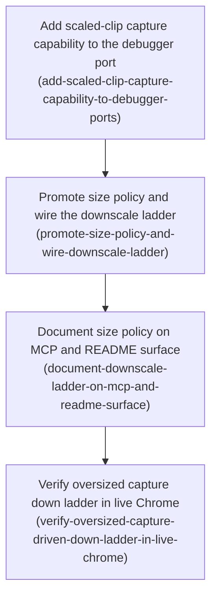

# Horizon 14 — Screenshot downscale ladder & size policy

> Planning Horizon 14 of the **agent-agnostic-browser-bridge** project. One gate-passed slice; later work is listed under *Out of Scope* and carried by the project's Planning Brief.

## 🎯 What are we trying to achieve?

The `chrome-bridge` tool can take a screenshot of a background browser tab. Right now, if that screenshot is too big for the AI client to accept, the tool just gives up and returns a "too large" error with no picture at all. This horizon makes the tool **automatically re-take the screenshot at a smaller scale**, stepping down a short fixed sequence of sizes (a "downscale ladder") until the picture is small enough to return — and only reporting failure if even the smallest step is still too big. It also turns today's single hard-coded size limit into a small **named, documented "size policy"** (the limit, the ladder steps, and the give-up point).

## 🧠 Why does this change need to happen?

A screenshot of a large, dense web page rendered at a high-resolution (2× device pixel ratio) display can encode to well over a megabyte of base64 text. The AI client that consumes these tool results rejects payloads past a ceiling (currently proxied at 1,200,000 base64 characters). Horizon 13 shipped only a *flat* guard: over the ceiling → `{captured:false, reason:"too-large"}`, no picture. So the single most common "big page" case returns nothing useful. Shrinking the render scale is a cheap, lossy-but-legible way to get *a* usable screenshot instead of none.

### At a glance

- **Phases:** 4
- **Complexity:** Low — one subsystem (`captureTab` and its CDP capture port), additive type changes, no new browser permission, no new MCP tool.
- **Main risk:** Downscaling a viewport capture may require `Emulation.setDeviceMetricsOverride` or always wrapping the viewport in a scaled clip; either can blur or offset output, or interact badly with the unfocused sandbox tab's suspended render pass (h10).
- **Quality/performance target:** a full multi-rung ladder run must stay inside the existing 15-second per-command CDP session cap; the give-up outcome must be genuinely reachable and explicitly tested.
- **Testing focus:** bounded/terminating ladder, strictly-decreasing rungs with a real floor, purely-additive protocol types, no orphaned `chrome.debugger` attachment, both capture modes downscale on one shared path, and a mandatory live-Chrome head-to-head on a genuinely oversized page.

## Order of work

1. **Add scaled-clip capture capability to the debugger port** — starting point.
2. **Promote size policy and wire the downscale ladder** — after *Add scaled-clip capture capability to the debugger port* (consumes the new capture option).
3. **Document size policy on MCP and README surface** — after *Promote size policy and wire the downscale ladder* (documents/verifies what the prior phase shipped).
4. **Verify oversized capture down ladder in live Chrome** — after *Document size policy on MCP and README surface* (documents/verifies what the prior phase shipped).

## Phase 1 — Add scaled-clip capture capability to the debugger port

Technical ID: `add-scaled-clip-capture-capability-to-debugger-ports` · subsystem: captureTab debugger capture port (scaled-clip capability) · layer: infrastructure · blast radius: small

**Goal** — Teach the chrome-bridge debugger capture port to produce a downscaled viewport capture: add an optional `scale` option to `CaptureScreenshotOptions` that, when supplied without a clip, reads the tab's layout-viewport geometry and builds a full-viewport clip at that scale, while keeping the no-option payload byte-identical and full-page capture un-offered.

**Why** — A scaled screenshot can only be produced by asking Chrome DevTools Protocol for a rectangle ('clip') covering the whole visible area with a scale below 1 — CDP has no scale param outside a clip. Element mode already sends a clip so it only needs a lower scale number, but viewport mode has no geometry read at all today. This phase adds just that capture capability to the port (and its exact-payload unit tests), with no handler, size-policy, or protocol-type changes — those land in the next phase that consumes this option.

**Changes**

- In debugger-ports.ts, widen CaptureScreenshotOptions with an optional scale (0 < scale <= 1); when scale is supplied without a clip, read the tab's layout-viewport width/height via a Runtime.evaluate geometry expression (mirroring the existing scroll-metrics / element-rect reads) and build a full-viewport clip { x:0, y:0, width, height, scale }. Keep the doc comment's existing note that full-page / captureBeyondViewport is deliberately not offered (updated to also mention the new scaled-clip capability); keep the Promise<string> return type and the withDebuggerSession label union unchanged; do not add any Emulation.* call.
- Update the debugger-ports unit tests that assert the exact Page.captureScreenshot payload to also cover the new scaled-clip params for scale-supplied-without-clip (clip x/y/width/height from the stubbed layout-viewport read, scale = the requested rung) and the element-mode lowered clip.scale case (x/y/width/height preserved), while leaving the unchanged no-option path asserted byte-identical to today's { format:'png' } / { format:'png', clip } fixtures.

**Files / areas**

- `tools/chrome-bridge/src/extension/debugger-ports.ts`
- `tools/chrome-bridge/src/extension/debugger-ports.unit.test.ts`

**How to verify**

- **Scaled viewport clip is built from layout-viewport metrics, not innerWidth** — The scale-without-clip path issues a Runtime.evaluate geometry read before building the clip
- **The new scale option is optional and the no-option path is byte-identical** — `scale` is declared `scale?: number` with the 0 < scale <= 1 bound documented
- **debugger-ports.unit.test.ts pins the scaled-clip CDP payloads** — A test stubs installStubDebugger and asserts sendCommand(..., 'Page.captureScreenshot', { format:'png', clip: { x:0, y:0, width:<vp>, height:<vp>, scale:<rung> } }) for the scale-without-clip case
- **Full-page capture is not reintroduced and the port return contract is stable** — Grepping debugger-ports.ts for 'captureBeyondViewport' and 'Emulation.' returns nothing added by this phase

**Done when** — The debugger capture port can produce a downscaled viewport capture: CaptureScreenshotOptions gains an optional scale (0 < scale <= 1) that, supplied without a clip, reads the tab's layout-viewport width/height via Runtime.evaluate and builds a full-viewport clip { x:0, y:0, width, height, scale }; the no-scale path emits byte-identical Page.captureScreenshot params; full-page/captureBeyondViewport stays un-offered and the Promise<string> return is unchanged — covered by new debugger-ports.unit.test.ts payload assertions, with tsc/eslint/vitest green. And every check under *How to verify* passes its bar (minScore per dimension).

**Depends on** — nothing — can start immediately

**Rollback** — Revert the scale field on CaptureScreenshotOptions and the viewport geometry read in debugger-ports.ts, and drop the new payload assertions; no consumer exists yet (the handler rewiring lands in a later phase), so the port returns to its prior single-shape behaviour.

Reference — full rubric

**`scaled-viewport-clip-from-layout-viewport-metrics`** (minScore 7) — Scaled viewport clip is built from layout-viewport metrics, not innerWidth  
Rule: When `scale` is supplied without a `clip`, the full-viewport clip is built from the tab's layout-viewport width/height read via Runtime.evaluate (the same class of geometry read as the existing scroll-metrics / element-rect expressions), never from `window.innerWidth`/`innerHeight` alone or a hardcoded size, so the downscaled capture shrinks the whole visible viewport rather than cropping it. Scale: 10 = a debugger-ports unit test asserts the emitted clip's width/height equal the layout-viewport values returned by the stubbed Runtime.evaluate and x/y are 0, the geometry expression reads layout-viewport metrics (visualViewport / documentElement client-size family), and a comment explains why innerWidth is insufficient; 8 = clip dimensions come from a Runtime.evaluate geometry read and a test asserts the clip shape; minScore 7 = clip width/height are read from the page at capture time (not hardcoded) and the clip covers the whole viewport from origin 0,0. Below 7: innerWidth/innerHeight used raw, or a fixed size.  
Pass criteria:
  - The scale-without-clip path issues a Runtime.evaluate geometry read before building the clip
  - The built clip is { x:0, y:0, width, height, scale } with width/height from that read
  - A unit test stubs the geometry read and asserts the emitted Page.captureScreenshot clip carries those exact width/height and scale === the requested value
  - Code or comment distinguishes layout-viewport metrics from innerWidth so a later reader does not 'simplify' it
Failure examples:
  - The port reads `window.innerWidth`/`window.innerHeight` via Runtime.evaluate; on a dpr-2 page the clip is half the real captured area and the downscaled screenshot silently crops to the top-left quarter — base64 shrinks, size-based tests pass, image is wrong
  - Developer hardcodes a 1280x720 clip because 'the sandbox tab viewport is fixed', so any real viewport that differs is mis-clipped
  - Clip width/height are read correctly but x/y are set to the current scroll offset, so the scaled capture is shifted off the top-left of the viewport

**`scale-option-optional-and-no-option-path-byte-identical`** (minScore 7) — The new scale option is optional and the no-option path is byte-identical  
Rule: The new `scale` field on `CaptureScreenshotOptions` is optional (`scale?: number`, 0 < scale <= 1) and every existing call path that passes no `scale` produces a `Page.captureScreenshot` payload byte-identical to today's ({ format:'png' } for viewport, { format:'png', clip } for element with the element clip untouched); the `Promise<string>` return type and the `withDebuggerSession` label union are unchanged. Scale: 10 = a debugger-ports unit test asserts the no-`scale` viewport and element payloads are exactly equal to the pre-change fixtures and a type-level check pins `scale` as optional; 8 = the no-option path is asserted unchanged by an existing test that was not edited and `scale` is optional; minScore 7 = `scale` is optional and no pre-existing debugger-ports payload test needed editing. Below 7: the no-option path changes shape, or `scale` is required.  
Pass criteria:
  - `scale` is declared `scale?: number` with the 0 < scale <= 1 bound documented
  - Existing 'asserts { format:'png' }' / '{ format:'png', clip }' debugger-ports tests pass without modification
  - `DebuggerPorts.captureScreenshot` still returns `Promise<string>`; the label union still reads 'capturing' | 'evaluating' | 'scrolling'
  - The no-scale branch of the params builder shows no change to the emitted object
Failure examples:
  - Developer refactors the params builder to always start from `{ format:'png', quality: undefined }` for symmetry; the emitted payload now carries an extra key and every payload-assertion fixture needs editing
  - `scale` defaults to 1 and is always spread into the clip, so a no-scale element capture now sends `clip.scale: 1` explicitly where before it sent whatever element mode already set — a spurious diff that breaks the element payload test
  - The label union gains 'downscaling' to tag re-capture sessions, widening a closed union other code exhaustively switches on

**`debugger-ports-scaled-clip-payload-assertions`** (minScore 7) — debugger-ports.unit.test.ts pins the scaled-clip CDP payloads  
Rule: debugger-ports.unit.test.ts covers the new capability with exact `Page.captureScreenshot` payload assertions: for `scale` supplied without `clip`, the emitted params carry a clip whose width/height equal the stubbed layout-viewport values and whose `scale` equals the requested rung; for element mode, lowering `clip.scale` leaves the clip's x/y/width/height unchanged between full-size and downscaled attempts. Scale: 10 = both the scale-without-clip case and the element lowered-clip.scale case are asserted with exact payload objects, plus the no-option path asserted byte-identical; 8 = the scale-without-clip payload shape is asserted once and the element case is exercised; minScore 7 = at least one new test asserts a scaled-clip payload with the requested scale value as a literal. Below 7: no payload-level assertion of the scaled clip.  
Pass criteria:
  - A test stubs installStubDebugger and asserts sendCommand(..., 'Page.captureScreenshot', { format:'png', clip: { x:0, y:0, width:<vp>, height:<vp>, scale:<rung> } }) for the scale-without-clip case
  - A test asserts element-mode downscale sends the same x/y/width/height with only `scale` reduced
  - The pre-existing { format:'png' } and { format:'png', clip } assertions remain and still pass
  - Tests use the requested scale value as the assertion literal, not a wildcard matcher
Failure examples:
  - The new test asserts only that sendCommand was called with a clip containing a `scale` key (expect.objectContaining) without pinning width/height, so a clip that mis-reads the viewport still passes
  - Element-mode downscale is exercised through page-actions only; debugger-ports.unit.test.ts never asserts the element clip keeps its geometry, so a regression that rebuilds a full-viewport clip in element mode is not caught here
  - Developer asserts the scaled payload but drops the original no-clip assertion, so the byte-identical guarantee for the common path is untested

**`full-page-not-reintroduced-and-return-contract-stable`** (minScore 7) — Full-page capture is not reintroduced and the port return contract is stable  
Rule: The scaled-clip work does not reintroduce `captureBeyondViewport` / full-page capture: both the `CaptureScreenshotOptions` and `DebuggerPorts.captureScreenshot` doc comments still state full-page is deliberately not offered (citing the horizon), the scaled path stays within the viewport/clip, and no `Emulation.setDeviceMetricsOverride` or `captureBeyondViewport` param is added. Scale: 10 = doc comments retain the full-page-not-offered note updated to also mention the scaled-clip capability, and a grep confirms no `captureBeyondViewport` / `Emulation.` string was added; 8 = the note survives and no beyond-viewport param is present; minScore 7 = no full-page capability is added and the existing doc-comment convention (long block comment citing the horizon) is followed for the new option. Below 7: `captureBeyondViewport` or a device-metrics override introduced, or the full-page-not-offered note deleted.  
Pass criteria:
  - Grepping debugger-ports.ts for 'captureBeyondViewport' and 'Emulation.' returns nothing added by this phase
  - Both doc comments still say full-page capture is deliberately not offered and cite the horizon
  - The new `scale` option is documented in a block comment matching the file's existing convention
  - The downscale path builds a clip no larger than the layout viewport
Failure examples:
  - Developer adds `captureBeyondViewport: false` explicitly 'for clarity' and, in the same edit, adds a commented-out `true` branch that a later horizon flips on without re-reading the h13 probe
  - The full-page-not-offered sentence is dropped from the CaptureScreenshotOptions comment because the option list was 'reorganized', leaving only the method comment to carry it
  - Viewport downscale is implemented via Emulation.setDeviceMetricsOverride to change dpr instead of a scaled clip, adding an emulation code path the assumptions explicitly wanted to avoid

Healer hint: If a dimension misses, keep `scale` optional and the no-scale payload byte-identical, build the viewport clip from a Runtime.evaluate layout-viewport read (not innerWidth) at origin 0,0, retain the full-page-not-offered doc note and the Promise<string> return, and assert the exact scaled-clip payload (viewport case) and lowered clip.scale (element case) in debugger-ports.unit.test.ts.

## Phase 2 — Promote size policy and wire the downscale ladder

Technical ID: `promote-size-policy-and-wire-downscale-ladder` · subsystem: captureTab size policy + downscale ladder (page-actions handler layer) · layer: application · blast radius: medium

**Goal** — Turn the flat MAX_SCREENSHOT_BASE64_CHARS guard into a named size policy (base64 ceiling + ordered scale-only downscale-ladder rungs + give-up floor), add a shared ladder helper, and rewire captureViewport/captureElement so captureTab automatically re-captures an oversized screenshot smaller down that ladder — in both viewport and element mode — until the payload fits or the floor is reached; make the protocol type changes additive and record the superseding decision.

**Why** — Today the screenshot handler compares one capture's base64 length against a single constant and, if it is over, returns a failure outcome with no image at all — so an AI client asking for a screenshot of a large dense page just gets nothing. This phase adds automatic recovery: shrink the render scale (via the port `scale` option delivered by the prior phase for viewport mode, and by lowering `clip.scale` for element mode) and re-take the picture along a short bounded sequence of steps (the 'downscale ladder') until it is small enough, recording which scale worked and how many tries it took. It also promotes the flat constant into one co-located, documented 'size policy' block and appends the superseding decision entry.

**Changes**

- In page-actions.ts, keep the name MAX_SCREENSHOT_BASE64_CHARS as the base64 ceiling but rewrite its doc comment (remove the 'no downscale, no re-capture' sentence); add co-located constants for the ordered downscale-ladder rungs (scale-only, e.g. 0.75 / 0.5 / 0.33) and the give-up floor, each doc-commented so the policy reads as one block described as one 'size policy' (base64 ceiling + downscale ladder rungs + give-up floor).
- Add a shared ladder helper in page-actions.ts that takes a (scale) => Promise<string> re-capture callback, walks the rungs in order, strips the data-URL prefix and measures base64 length after each attempt, and stops at the first rung whose payload is at or below the ceiling, or at the floor.
- Rewire captureViewport (passing the new port scale option) and captureElement (lowering clip.scale) to call the ladder helper only after an initial full-size capture exceeds the ceiling; a first capture that already fits is returned unchanged (appliedScale === 1, attempts === 1, helper not called). All rung attempts stay inside the one existing withDebuggerSession with detach in a finally.
- In protocol/types.ts, additively add appliedScale and attempts to CaptureTabImageResult; add floor and attempts to the too-large CaptureTabFailureResult; update the CaptureTabResult doc comment enumerating failure reasons. Keep 'too-large' as the floor-exhaustion reason (no new union member). Keep CaptureTabParams / resolveCaptureParams a two-field shape (mode + elementRef) — no caller-supplied scale knob.
- Add page-actions unit tests: a first capture that fits is unchanged (attempts 1, no appliedScale below 1, helper not called); an over-ceiling capture that fits on a rung returns captured:true with appliedScale < 1 and attempts > 1; every rung still over the floor returns captured:false reason 'too-large' carrying size, limit, floor and attempts — for BOTH viewport and element mode; the ladder call count equals the rungs attempted; a mid-ladder capture rejection cleans up the session exactly once; the existing bad-mode / missing-elementRef rejections still hold.
- Append one superseding entry to docs/roadmaps/agent-agnostic-browser-bridge/decisions.md stating horizon 14 supersedes the horizon 13 'flat guard, no downscale/re-capture' decision (a step within this phase, not a separate phase).

**Files / areas**

- `tools/chrome-bridge/src/extension/page-actions.ts`
- `tools/chrome-bridge/src/extension/page-actions.unit.test.ts`
- `tools/chrome-bridge/src/protocol/types.ts`
- `docs/roadmaps/agent-agnostic-browser-bridge/decisions.md`

**How to verify**

- **Downscale ladder always terminates within its rungs** — The helper iterates a fixed array of rung constants; there is no `while (true)`, no recursion without a decrementing bound, and no re-push of rungs onto the work list
- **Ladder is strictly decreasing and the give-up floor is the true floor** — Rung constants and floor are co-located and each is < the previous; floor === last rung value (or is explicitly the terminal rung)
- **Protocol type changes are purely additive** — `git diff` on protocol/types.ts shows only added lines within the result types plus doc comments — no deletions/renames of existing members
- **Every ladder attempt runs inside one bounded debugger session with no leak** — The ladder helper receives a `(scale) => Promise<string>` callback and never itself calls attach/detach — session lifecycle stays in the existing wrapper
- **Both capture modes downscale through the shared ladder** — page-actions.unit.test.ts: first-capture-fits -> captured:true, appliedScale === 1, attempts === 1, ladder helper not called
- **MAX_SCREENSHOT_BASE64_CHARS is promoted into one documented policy block** — The old comment text asserting no re-capture / no downscale is gone (grep the file)

**Done when** — The flat MAX_SCREENSHOT_BASE64_CHARS becomes one documented size policy (ceiling + ordered scale-only ladder rungs + give-up floor) and captureTab drives an over-ceiling capture (viewport and element mode) down that ladder via a shared helper — returning captured:true with appliedScale/attempts on a fitting rung, or captured:false reason 'too-large' carrying size/limit/floor/attempts at the give-up floor — with additive protocol type changes, a superseding decisions.md entry, and new page-actions.unit.test.ts cases, tsc/eslint/vitest green. And every check under *How to verify* passes its bar (minScore per dimension).

**Depends on** — Add scaled-clip capture capability to the debugger port

**Rollback** — Restore the flat MAX_SCREENSHOT_BASE64_CHARS guard and the immediate too-large return in captureImageOutcome; revert the additive type fields (no consumer outside chrome-bridge keys on them per discovery), the shared ladder helper and the captureViewport/captureElement rewiring, and the decisions.md entry. The port scale option from the prior phase can remain unused.

Reference — full rubric

**`bounded-ladder-termination`** (minScore 7) — Downscale ladder always terminates within its rungs  
Rule: The shared ladder helper walks the ordered rungs at most once each and provably halts: it returns on the first rung whose measured base64 length <= the ceiling, or after attempting the give-up floor, and never loops, recurses unboundedly, or re-attempts a rung. Scale: 10 = iteration count is statically bounded by rungs.length + 1 (initial full-size capture) with a test asserting the exact re-capture callback invocation count for both the fits-on-a-rung and floor-exhausted paths; 8 = clearly bounded for-loop over the rung array with a test that the floor path yields captured:false without hanging; minScore 7 = bounded loop, no unbounded recursion or while(true), even if call-count is not asserted exactly.  
Pass criteria:
  - The helper iterates a fixed array of rung constants; there is no `while (true)`, no recursion without a decrementing bound, and no re-push of rungs onto the work list
  - A page-actions unit test drives an always-oversized capture and asserts the result is captured:false reason 'too-large' (test completes, does not time out)
  - A test asserts the re-capture callback is invoked exactly `attempts - 1` times (or an explicit expected integer) for a case that fits on rung 2+
  - `attempts` in both success and failure results equals initial capture (1) plus number of rungs actually tried
Failure examples:
  - Helper re-measures and, when still over ceiling at the floor, falls through to call the re-capture callback once more with the floor scale in an outer retry wrapper, so `attempts` is off-by-one and one extra CDP screenshot is taken per failed capture
  - Ladder is implemented as a recursive `tryNext(remainingRungs)` that on an empty list recurses once more with the full ladder as a 'last resort', creating a second full pass before giving up
  - Loop iterates rungs but `continue`s past a rung whose capture threw instead of surfacing/counting it, so a transient CDP error silently consumes a rung and the reported `attempts` undercounts

**`monotonic-downscale-and-floor-semantics`** (minScore 7) — Ladder is strictly decreasing and the give-up floor is the true floor  
Rule: The rung constants form a strictly decreasing sequence in (0,1], the give-up floor is the smallest scale ever applied, and a capture that still exceeds the ceiling at the floor is reported as captured:false with reason 'too-large' carrying size, limit/ceiling, floor, and attempts — never captured:true at a scale below the floor and never a different reason string. Scale: 10 = a unit test asserts the rung array is sorted strictly descending and that `floor` in the failure result equals the last rung applied; 8 = constants visibly ordered 0.75/0.5/0.33 with the floor constant equal to the last rung and failure result carries all four fields; minScore 7 = ordering correct and failure result reason unchanged as 'too-large' with size and floor present.  
Pass criteria:
  - Rung constants and floor are co-located and each is < the previous; floor === last rung value (or is explicitly the terminal rung)
  - Failure result object literally contains size (measured base64 length at floor), the ceiling/limit value, floor, and attempts
  - Failure reason string is exactly 'too-large' (unchanged token), asserted by a test
  - No code path returns captured:true with appliedScale < floor
  - A test covers 'fits exactly at floor' -> captured:true, appliedScale === floor
Failure examples:
  - Rungs are [0.75, 0.5, 0.33] but the give-up-floor constant is set to 0.25 independently, so the helper does one more capture at 0.25 that was never a declared rung — floor and ladder disagree
  - Failure result reports `limit` but omits `size`, or reports `size` as the pre-downscale original length rather than the measured length at the floor rung, making the payload useless for diagnosing how close it got
  - Developer changes the failure reason to 'too-large-after-downscale' to be more informative, breaking existing consumers/tests that match on 'too-large'

**`additive-backward-compatible-types`** (minScore 7) — Protocol type changes are purely additive  
Rule: New fields (appliedScale, attempts on CaptureTabImageResult; floor, attempts on CaptureTabFailureResult) are added without removing, renaming, or making required any previously-optional field, without narrowing existing unions, and CaptureTabParams stays two-field. Scale: 10 = new result fields are added such that all pre-existing call sites and tests compile unchanged, the label union and Promise<string> port return are untouched, and a test or type-level assertion pins the param shape at two fields; 8 = fields added, params unchanged, existing tests still green; minScore 7 = no removed/renamed field and params still two-field, even if a new field is non-optional in a way that forces trivial updates only within this phase's own new code.  
Pass criteria:
  - `git diff` on protocol/types.ts shows only added lines within the result types plus doc comments — no deletions/renames of existing members
  - CaptureTabParams still has exactly two fields (mode + elementRef); no third field added
  - The port signature stays `Promise<string>`; CaptureScreenshotOptions gains only an optional `scale` (0 < scale <= 1)
  - The label union is byte-identical to before
  - Pre-existing page-actions/debugger-ports tests that were not intentionally modified still pass without edits
Failure examples:
  - appliedScale is added as a required field on CaptureTabImageResult; every historical fixture and helper that builds that result now needs a value, and the dev updates them all — compiles, tests pass, but any external/serialized consumer of the old shape and any un-migrated fixture breaks
  - Developer 'tidies' CaptureTabFailureResult by renaming `limit` to `ceiling` for consistency with the new size-policy vocabulary while adding `floor`, silently breaking wire compatibility
  - `scale` is added to CaptureScreenshotOptions but typed as `number` with the 0<scale<=1 bound only enforced at runtime, and a separate exported `ScaledClip` type widens an existing return union

**`no-orphaned-debugger-session`** (minScore 7) — Every ladder attempt runs inside one bounded debugger session with no leak  
Rule: All re-capture attempts for a single captureTab command execute within the existing withDebuggerSession wrapper (15s cap) and the debugger is detached exactly once on every exit path — fit, floor exhaustion, or thrown error mid-ladder — with no attach performed per-rung that could leak on failure. Scale: 10 = a test asserts detach/cleanup is called once even when a mid-ladder capture rejects, and the ladder does not open a new CDP session per rung; 8 = ladder reuses the single session and the error path is covered by a test; minScore 7 = no per-rung attach/detach pairing that can orphan a session, cleanup in a finally.  
Pass criteria:
  - The ladder helper receives a `(scale) => Promise<string>` callback and never itself calls attach/detach — session lifecycle stays in the existing wrapper
  - Debugger detach / session disposal is in a `finally` (or equivalent) that covers the whole ladder walk
  - A unit test simulates a rejection on rung 2's capture and asserts the command rejects/returns cleanly AND the session cleanup spy was called exactly once
  - Total ladder work stays within the 15s cap budget (no added per-rung sleeps/waits that could blow it); if a wait is added it is bounded and documented
  - No `chrome.debugger.attach` call added inside the rung loop
Failure examples:
  - Ladder helper, to isolate failures, wraps each rung in its own withDebuggerSession call; when rung 2 throws, its session is detached but the outer session opened for the initial capture is already gone and a subsequent rung re-attaches — under a fast repeated-command load this races into a 'Another debugger is already attached' error and one session stays attached to the tab
  - Cleanup is placed after the ladder `await` but not in a finally, so a rejection from the floor-rung capture propagates before detach runs, orphaning the CDP session until the 15s cap force-closes it
  - Each rung adds a fixed 500ms settle wait; a 3-rung walk plus initial capture plus Runtime.evaluate for viewport size pushes a slow page past the 15s cap, turning an over-ceiling capture into a timeout instead of a captured:false floor result

**`viewport-element-mode-parity`** (minScore 7) — Both capture modes downscale through the shared ladder  
Rule: captureTab downscales in BOTH viewport mode (via the port `scale` option delivered by the prior phase) and element mode (via lowering clip.scale), the shared ladder helper is invoked only after an initial full-size capture exceeds the ceiling (a first capture that fits is returned untouched with appliedScale === 1, attempts === 1, helper not called), and both modes' fits-on-a-rung and floor-exhausted results are produced on the same code path with the same failure object shape (including floor and attempts). Scale: 10 = page-actions.unit.test.ts has, for BOTH modes, (a) first-capture-fits unchanged, (b) over-ceiling-then-fits-on-a-rung with appliedScale < 1 and attempts > 1, (c) every-rung-over-floor -> captured:false 'too-large' with size/limit/floor/attempts, plus a ladder call-count assertion; 8 = both modes exercised for the fits-on-rung and floor paths and the first-capture-fits fast path asserted for at least one mode; minScore 7 = both modes downscale and first-capture-fits is asserted unchanged for at least one mode. Below 7: only one mode downscales, or the fast path routes through the helper.  
Pass criteria:
  - page-actions.unit.test.ts: first-capture-fits -> captured:true, appliedScale === 1, attempts === 1, ladder helper not called
  - over-ceiling then fits on a rung -> captured:true, appliedScale < 1, attempts > 1 — for both viewport and element mode
  - every rung over floor -> captured:false 'too-large' with size/limit/floor/attempts — for BOTH viewport and element mode, built on the same code path
  - A test asserts the ladder helper call count equals the number of rungs actually attempted
  - Existing bad-mode and missing-elementRef rejections still hold (tests unchanged and green)
Failure examples:
  - Element mode reuses the viewport code path and builds a fresh full-viewport clip at reduced scale, ignoring the element's bounding box, so a downscaled element capture returns the whole page instead of the element
  - Ladder is wired into the common post-capture check but the initial-fit fast path still routes through the helper with a single-element rung list, so first-capture-fits reports attempts === 2 and appliedScale set, breaking the 'unchanged' guarantee even though the payload is fine
  - Only viewport mode gets the floor-exhausted test; element mode's failure result is assumed identical but actually omits `floor` because captureElement builds its failure object on a separate code path

**`size-policy-named-and-documented`** (minScore 7) — MAX_SCREENSHOT_BASE64_CHARS is promoted into one documented policy block  
Rule: The ceiling keeps its name and value (MAX_SCREENSHOT_BASE64_CHARS = 1_200_000) but its stale doc comment ('no downscale, no re-capture') is removed, and it sits in a single co-located, doc-commented policy block alongside the ordered ladder-rung constants and the give-up-floor constant, described as one 'size policy' (base64 ceiling + downscale ladder rungs + give-up floor); a superseding entry is appended to decisions.md. Scale: 10 = one block comment explains all three parts, why the ladder values were chosen, and that the floor yields captured:false; decisions.md entry explicitly supersedes the prior flat-ceiling decision; 8 = constants grouped with a shared doc comment naming the policy and decisions.md updated; minScore 7 = stale comment removed, rungs+floor+ceiling co-located, decisions.md touched.  
Pass criteria:
  - The old comment text asserting no re-capture / no downscale is gone (grep the file)
  - Ceiling name and numeric value are unchanged (`MAX_SCREENSHOT_BASE64_CHARS` === 1_200_000)
  - Ladder rung constants and the floor constant are declared adjacent to the ceiling under a single doc comment that uses the 'size policy' framing and lists all three parts
  - Rung constants are the scale-only values described (e.g. 0.75 / 0.5 / 0.33) exported/typed as an ordered readonly sequence
  - decisions.md has exactly one new appended entry that references and supersedes the previous flat-ceiling decision (not an edit-in-place of the old one)
Failure examples:
  - Dev renames the constant to `SCREENSHOT_SIZE_POLICY.ceiling` for clarity; the name `MAX_SCREENSHOT_BASE64_CHARS` no longer exists and every existing import + the dead-export scanner + external references break
  - Ladder rungs are defined in page-actions.ts next to the helper while the ceiling stays in debugger-ports.ts, so the 'policy' is split across two files with no single doc block and a future reader tuning the floor never sees the ceiling
  - decisions.md is updated by editing the original flat-ceiling entry's text rather than appending a superseding entry, erasing the history of why the flat ceiling existed

Healer hint: If a dimension misses, fix the deliverable in place — keep the ceiling's name/value and the two-field params, add result fields as optional-and-additive, confine all rung attempts to the one existing withDebuggerSession with detach in a finally, ensure the rung array is strictly decreasing with floor === last rung, keep the size policy as one co-located documented block with a superseding decisions.md entry, and cover both modes' fits-on-rung and floor-exhausted paths plus the unchanged first-capture-fits fast path.

## Phase 3 — Document size policy on MCP and README surface

Technical ID: `document-downscale-ladder-on-mcp-and-readme-surface` · subsystem: MCP client-facing parity surface (server + tool-catalog + README) · layer: interface · blast radius: small

**Goal** — Make the downscale ladder and give-up floor visible on the client-facing surface: the MCP metadata text block, the tool-catalog description, and the README captureTab section plus a new size-policy subsection.

**Why** — An AI client sees captureTab only through the MCP image and text blocks it returns, the tool-catalog description of the tool, and the README. After the previous phases the success result carries appliedScale and attempts that the MCP server never emits, the catalog text still claims a flat 'too-large outcome ... rather than a blocking image', and the README still says 'with no downscale' and carries a horizon-13 note that the guard branch cannot fire on a real capture. This phase updates only the descriptive surface — no capture logic changes.

**Changes**

- In server.ts, extend the captureTab image-result sibling text block to include appliedScale and attempts alongside width/height/clipped; leave the image mimeType as image/png (the ladder is scale-only PNG).
- Update server.unit.test.ts to assert the extended metadata object, and add a sibling test for the give-up (captured:false 'too-large' with floor/attempts) routing through the generic isError text path.
- Reword TOOL_CATALOG.captureTab.description to describe the automatic downscale ladder and the give-up floor outcome; leave the JSON schema (mode enum + elementRef, no required) untouched so the schema/required tests still pass.
- Rewrite the README captureTab oversized-result paragraph and add a new 'Screenshot size policy' subsection documenting the base64 ceiling, each downscale-ladder rung, the give-up floor, how the ladder progresses, and the captured:false give-up outcome shape; note the horizon-13 'guard branch cannot fire' claim is now superseded.

**Files / areas**

- `tools/chrome-bridge/src/mcp/server.ts`
- `tools/chrome-bridge/src/mcp/server.unit.test.ts`
- `tools/chrome-bridge/src/mcp/tool-catalog.ts`
- `tools/chrome-bridge/README.md`

**How to verify**

- **Size-policy documentation matches shipped constants** — Open the size-policy source (the module that replaced MAX_SCREENSHOT_BASE64_CHARS's flat comment) and list ceiling value, each ladder rung scale, and the give-up floor.
- **captured:false give-up outcome shape is documented and accurate** — Read the handler branch that emits the too-large give-up result and record the exact keys.
- **MCP sibling-text metadata block documentation matches emission** — Read the captureTab image-result branch in server.ts and list every key in the sibling text object.
- **No stale pre-hardening claims survive anywhere on the surface** — Grep the README for 'no downscale' / 'with no downscale' and confirm no current-tense hit remains.
- **Size-policy section is usable by someone who has never seen the code** — Read only the README 'Screenshot size policy' subsection and the captureTab section; do not read source.

**Done when** — The MCP surface describes the size policy — server.ts emits appliedScale/attempts metadata (asserted by server.unit.test.ts), and the tool-catalog description plus a new README 'Screenshot size policy' subsection document the ladder rungs and the give-up outcome — with tsc/eslint/vitest green. And every check under *How to verify* passes its bar (minScore per dimension).

**Depends on** — Promote size policy and wire the downscale ladder

**Rollback** — Revert the four files to their prior text; purely descriptive, no behavioural rollback needed.

Reference — full rubric

**`size-policy-doc-matches-shipped-constants`** (minScore 7) — Size-policy documentation matches shipped constants  
Rule: Scale: 10 = the README 'Screenshot size policy' subsection names the base64 ceiling, every downscale-ladder rung, and the give-up floor with the exact values/identifiers present in the shipped size-policy module, and a reader could reconstruct the constant table from prose alone; 8 = all values present and correct, phrasing slightly loose; minScore 7 = ceiling, at least the first and last rung, and the floor are stated and numerically correct; below 7 = any stated number contradicts the code or a rung is missing.  
Pass criteria:
  - Open the size-policy source (the module that replaced MAX_SCREENSHOT_BASE64_CHARS's flat comment) and list ceiling value, each ladder rung scale, and the give-up floor.
  - Confirm every one of those values appears in the README 'Screenshot size policy' subsection with matching magnitude and unit.
  - Confirm the subsection labels each value with the ubiquitous-language term (base64 ceiling / downscale ladder rung / give-up floor), not ad-hoc names.
  - Confirm no value appears in the README that is absent from or different than the code.
Failure examples:
  - Dev documents the ceiling and the ladder rung count accurately but writes the rung scales as '75%, 50%, 25%' when the shipped ladder is '0.8, 0.6, 0.4' — an honest paraphrase that now misstates behavior.
  - Dev copies the rung list correctly but omits the give-up floor value, describing it only as 'the lowest rung' so a reader cannot tell what scale that is.
  - Dev documents values that were correct at the time of writing but the constant was tuned later in the same phase and the README was not re-synced.

**`give-up-outcome-shape-documented`** (minScore 7) — captured:false give-up outcome shape is documented and accurate  
Rule: Scale: 10 = README and the tool-catalog description together specify the full give-up result object (captured:false plus size, limit, floor, attempts) with field names exactly as emitted, explain it fires only after the whole ladder is exhausted, and note it routes through the generic isError text path; 8 = all fields named correctly and the trigger condition stated; minScore 7 = captured:false and the presence of size/limit/floor/attempts fields are documented with the correct trigger; below 7 = a field name is wrong, invented, or the outcome is described as an exception/throw rather than a structured result.  
Pass criteria:
  - Read the handler branch that emits the too-large give-up result and record the exact keys.
  - Confirm README documents each of those keys with the same spelling.
  - Confirm README states the give-up result only occurs after the give-up floor rung is still over the ceiling.
  - Confirm the tool-catalog captureTab description mentions the automatic ladder and the give-up outcome.
  - Confirm server.unit.test.ts has a test asserting the give-up 'too-large' outcome renders through the generic isError text path.
Failure examples:
  - Dev writes that on an oversized screenshot captureTab 'returns an error' without showing the object, so a client cannot know to read attempts or floor.
  - Dev documents fields as size/limit/scale/tries when the code emits size/limit/floor/attempts — reasonable guesses that break anyone parsing the result.
  - Dev describes the give-up as happening 'if the screenshot is too large' without stating that the ladder is attempted first, implying no retry occurs.

**`metadata-block-doc-parity`** (minScore 7) — MCP sibling-text metadata block documentation matches emission  
Rule: Scale: 10 = the client-facing surface documents that a successful captureTab image result carries a sibling text block including width, height, clipped, appliedScale, and attempts, matching the keys server.ts emits and asserted by server.unit.test.ts, with image mimeType image/png stated; 8 = appliedScale and attempts documented as new siblings alongside the pre-existing fields; minScore 7 = the doc mentions that applied scale and attempt count are reported on a successful capture; below 7 = the doc still describes the old metadata block with no mention of scale/attempts, or names fields server.ts does not emit.  
Pass criteria:
  - Read the captureTab image-result branch in server.ts and list every key in the sibling text object.
  - Confirm server.unit.test.ts asserts that exact object including appliedScale and attempts.
  - Confirm README (or tool-catalog) tells a client the successful result reports applied downscale and attempt count.
  - Confirm the image part is still documented as mimeType image/png.
Failure examples:
  - Dev updates server.ts and the test but the README captureTab section still lists only 'width, height, clipped' for the success case, so the documented surface lags the shipped one.
  - Dev documents 'appliedScale' in the README but server.ts emits it as 'scale', a naming drift between code and doc introduced in the same phase.
  - Dev writes that the success metadata 'includes scaling info' without naming appliedScale or attempts, leaving a client unable to key off either.

**`no-stale-superseded-claims`** (minScore 7) — No stale pre-hardening claims survive anywhere on the surface  
Rule: Scale: 10 = every prior statement that contradicts the new ladder behavior is either removed or explicitly marked superseded, specifically the horizon-13 'guard branch cannot fire' / 'oversized capture is impossible' claim, and a repo-wide search for the old phrasing returns only intentional historical references; 8 = the horizon-13 claim is marked superseded and the README oversized paragraph is rewritten; minScore 7 = no active (non-historical) doc text still claims oversized screenshots cannot occur or that the ceiling guard is unreachable; below 7 = any current-tense doc or comment still asserts the guard cannot fire, or 'with no downscale' still appears as current behavior.  
Pass criteria:
  - Grep the README for 'no downscale' / 'with no downscale' and confirm no current-tense hit remains.
  - Grep for 'cannot fire', 'guard branch', 'impossible', 'never exceed' near screenshot text and confirm each surviving hit is past-tense or annotated as superseded.
  - Read the horizon-13 README Verified block 'Guard coverage' note and confirm the 'guard branch cannot fire on a real capture' claim is annotated as superseded by horizon 14.
  - Read the full README captureTab section and confirm the old oversized-result paragraph was rewritten, not merely appended to.
Failure examples:
  - Dev rewrites the README captureTab paragraph but leaves the horizon-13 Verified block's 'Guard coverage' note reading 'the too-large branch cannot fire on a real capture' untouched because it lives further down the file.
  - Dev adds the new size-policy subsection while the paragraph two lines above still says 'Behaviour is unchanged from before' for viewport mode, producing two contradictory claims in one section.
  - Dev leaves the code comment on the ceiling constant saying 'the flat captureTab size guard ... no downscale, no re-capture' that a future reader will trust over the README.

**`usable-by-outsider`** (minScore 7) — Size-policy section is usable by someone who has never seen the code  
Rule: Scale: 10 = a developer with only the README can predict, for a given oversized page, how many capture attempts happen, what scales are tried in what order, when they get an image versus captured:false, and how to read each field of both outcomes — with a concrete worked example; 8 = ladder progression order and both outcome shapes are explained in prose without needing a worked example; minScore 7 = an outsider can determine that retries are automatic, that scale decreases across attempts, and can identify the give-up result by its captured:false field; below 7 = the section lists constants but never explains the progression, or uses undefined internal terms without connecting them to captureTab params.  
Pass criteria:
  - Read only the README 'Screenshot size policy' subsection and the captureTab section; do not read source.
  - Answer: does the caller need to retry oversized captures themselves? (doc must say no.)
  - Answer: in what order are the ladder rungs applied, and does scale go up or down? (doc must make this unambiguous.)
  - Answer: how do you distinguish a downscaled-but-successful result from a give-up result? (doc must name the discriminating field.)
  - Confirm every internal term used (render scale, clip, viewport|element mode) is tied back to a captureTab param or result field the client can see.
Failure examples:
  - Dev writes an accurate constant table and a sentence 'the ladder is applied on oversized captures' but never states the rungs are tried in descending-scale order, so a reader cannot tell if 0.4 or 0.8 comes first.
  - Dev explains the mechanism correctly but in terms of 'the renderer's devicePixelRatio downscale factor' without connecting that to anything visible in the captureTab result, leaving the outsider unable to map prose to observed output.
  - Dev documents the success and give-up outcomes in separate distant subsections with no statement of which field distinguishes them, so a client parsing results must guess.

Healer hint: Pull the actual shipped size-policy constants and both captureTab result shapes (success sibling-text keys and the captured:false give-up object) from the code first, then make the README subsection, the tool-catalog description, and the server.ts metadata all state those exact names and values — and grep out every prior claim that oversized captures can't happen.

## Phase 4 — Verify oversized capture down ladder in live Chrome

Technical ID: `verify-oversized-capture-driven-down-ladder-in-live-chrome` · subsystem: captureTab live head-to-head verification · layer: cross-cutting · blast radius: small

**Goal** — Run a mandatory live-Chrome head-to-head that drives a genuinely oversized real captureTab down the downscale ladder to a passing image (or the documented give-up outcome) and record it before the horizon closes.

**Why** — Every extension-changing horizon in this project closes with a check against the actually-running extension in a real Chrome, because the unit tests use hand-built PNG stubs and cannot prove the CDP scaled-clip path works on a real deliberately-unfocused sandbox tab. The horizon-13 verification recorded that the too-large branch 'cannot fire on a real capture', so horizon 14 must deliberately produce an oversized capture (a large dense page at device-pixel-ratio 2) and observe the ladder engage.

**Changes**

- In a fresh chrome-bridge MCP session with the relay and extension running, capture a deliberately oversized page (large dense content, dpr 2) via captureTab in viewport mode and confirm the result is captured:true with appliedScale < 1 and attempts > 1, or the documented captured:false give-up outcome at the floor.
- Where the MCP tool catalog is stale (known recurring horizon 9 / 11 / 13 issue), cross-check the capture and its payload size via a direct CDP Page.captureScreenshot measurement.
- Add a dated 'Verified 2026-09-04 (horizon 14)' block to the README recording the observed pre-ladder base64 size, the applied scale, the attempt count, and the final outcome, and note it supersedes the horizon-13 'guard branch cannot fire' claim.
- If the live environment cannot be exercised, end the phase blocked with status MANUAL_CHROME_CHECK_PENDING recording exactly what was attempted and the runtime prerequisite (fresh post-rebuild MCP session).

**Files / areas**

- `tools/chrome-bridge/README.md`

**How to verify**

- **The check exercised a genuinely oversized capture** — Block identifies the target page (URL or explicit synthetic-page description), viewport dimensions, and devicePixelRatio
- **Recorded evidence is specific and falsifiable** — Pre-ladder size: concrete number
- **Direct-CDP cross-check where the MCP catalog is stale** — Block states whether the MCP catalog reflected the current captureTab return shape
- **Stale horizon-13 claim explicitly superseded** — The specific h13 claim (guard/ladder branch untestable or unfireable in live Chrome) is identified
- **A blocked outcome is recorded honestly, not papered over** — Outcome label (Verified pass | captured:false give-up | MANUAL_CHROME_CHECK_PENDING) matches the evidence recorded beneath it

**Done when** — A dated horizon-14 live-Chrome head-to-head block in tools/chrome-bridge/README.md recording an oversized real capture driven down the ladder (pre-ladder size, applied scale, attempts, final outcome), or the phase ends blocked MANUAL_CHROME_CHECK_PENDING with the attempt recorded. And every check under *How to verify* passes its bar (minScore per dimension).

**Depends on** — Document size policy on MCP and README surface

**Rollback** — Remove the README verified block; detach any lingering chrome.debugger session — the check changes no code or persisted state.

Reference — full rubric

**`oversized-capture-genuinely-exercised`** (minScore 7) — The check exercised a genuinely oversized capture  
Rule: Scale: 10 = no reviewer could ask for more — the block names the exact page/URL, viewport, and dpr used, states the pre-ladder base64/byte size AND the configured ceiling so the reader can see size > ceiling by a clear margin, and shows why the content was oversized (dense/large DOM, dpr 2); 8 = competent complete — pre-ladder size and ceiling both recorded and size clearly exceeds ceiling, page described well enough to reproduce; minScore 7 = the recorded pre-ladder size is stated and exceeds the ceiling, so the ladder demonstrably had to engage. Below 7: the capture may have fit trivially.  
Pass criteria:
  - Block identifies the target page (URL or explicit synthetic-page description), viewport dimensions, and devicePixelRatio
  - Records the pre-ladder capture size (base64 length or bytes) as a concrete number
  - Records the size ceiling in effect and the give-up floor
  - size > ceiling is evident from the numbers, by a non-marginal margin
  - captureTab mode (viewport) is stated
Failure examples:
  - Dev captures a normal tab at default dpr, gets captured:true on the first attempt with appliedScale 1 and attempts 1, and records it as a pass — the ladder never engaged so nothing was verified
  - Block says 'captured an oversized page, ladder worked' and gives the final image size but never the pre-ladder size or the ceiling, so a reader cannot tell the capture was actually over the limit
  - Dev sets dpr 2 but on a near-empty page; pre-ladder size (e.g. 180 KB) is recorded but is well under the ceiling, yet the block claims the ladder drove it down

**`evidence-specific-and-falsifiable`** (minScore 7) — Recorded evidence is specific and falsifiable  
Rule: Scale: 10 = every ladder observable is pinned to a concrete value a later reader could re-run and refute — pre-ladder size, each attempted render-scale rung, the appliedScale that passed (or the floor reached), the attempt count, and the final captured:true/false with its full payload (size/limit/floor/attempts on give-up); 8 = competent complete — pre-ladder size, appliedScale, attempts>1, and final outcome all recorded as concrete values; minScore 7 = appliedScale, attempt count, and final outcome are all concrete numbers/booleans, not prose approximations. Below 7: evidence is vague ('it scaled down and worked').  
Pass criteria:
  - Pre-ladder size: concrete number
  - Applied scale on success: concrete value < 1 (or 'reached give-up floor')
  - Attempt count: concrete integer > 1
  - Final outcome: captured:true with final size, OR captured:false with the documented size/limit/floor/attempts payload
  - Numbers are internally consistent (final size < pre-ladder size; attempts matches ladder rungs traversed)
Failure examples:
  - Block reads 'the ladder retried a couple of times and produced a smaller image that passed' — honest and probably true, but no appliedScale, no attempt count, no sizes, so nothing is falsifiable
  - appliedScale 0.5 and attempts 3 are recorded but the pre-ladder and final sizes are omitted, so a reader cannot check the scale actually reduced the payload below the ceiling
  - Dev records final captured:true but the stated final size is larger than the stated pre-ladder size, an unreconciled contradiction left in the block

**`cdp-cross-check-when-catalog-stale`** (minScore 7) — Direct-CDP cross-check where the MCP catalog is stale  
Rule: Scale: 10 = no reviewer could ask for more — the block states whether the chrome-bridge MCP tool catalog exposed the current captureTab payload, and where it was stale (the recurring h9/h11/h13 pattern) records an independent Page.captureScreenshot measurement of the same page giving image dimensions and encoded byte size, and reconciles the two numbers; 8 = competent complete — catalog freshness stated, and either the MCP payload was trusted because it was fresh, or a CDP measurement is recorded when it was not; minScore 7 = the block explicitly addresses catalog freshness and does not silently rely on a stale MCP result for the load-bearing numbers. Below 7: numbers taken from a stale/assumed catalog with no independent check.  
Pass criteria:
  - Block states whether the MCP catalog reflected the current captureTab return shape
  - If stale: a direct CDP Page.captureScreenshot measurement of the same target is recorded (dimensions + byte/base64 size)
  - The MCP-reported size and the CDP-measured size are compared and any divergence noted
  - If the catalog was fresh, that is asserted explicitly rather than assumed
Failure examples:
  - Dev takes the MCP captureTab JSON at face value, records appliedScale and attempts from it, and never mentions that the catalog has been stale for three prior horizons — the load-bearing evidence rests on an unverified surface
  - Block says 'catalog looked stale so results may be unreliable' but does no CDP measurement, leaving the whole verification inconclusive without saying so
  - CDP screenshot is taken but only a PNG is saved to disk with no recorded dimensions or byte size, so it cannot corroborate the ladder's size numbers

**`supersedes-h13-guard-claim`** (minScore 7) — Stale horizon-13 claim explicitly superseded  
Rule: Scale: 10 = the block quotes or precisely paraphrases the h13 'guard branch cannot fire' / 'cannot be exercised' claim, states that this live check fired that branch (or reached the give-up floor), and marks the h13 statement superseded with both horizon numbers and the date; 8 = competent complete — the h13 claim is named and explicitly marked superseded by this observation; minScore 7 = the block references the prior h13 claim and asserts this observation supersedes it. Below 7: no acknowledgement that a prior README claim is now wrong.  
Pass criteria:
  - The specific h13 claim (guard/ladder branch untestable or unfireable in live Chrome) is identified
  - The block states this check exercised that exact branch, with the observation that proves it
  - The word 'supersedes' (or equivalent) ties the new block to the old claim
  - Dated 'Verified 2026-09-04 (horizon 14)' heading present
Failure examples:
  - New Verified block is added with all the ladder numbers but never mentions the h13 text, so the README now carries two blocks that contradict each other and a reader cannot tell which is current
  - Block says 'this updates earlier notes' without pointing at the specific 'guard branch cannot fire' sentence, so the stale claim stays findable and authoritative-looking
  - Dev edits the h13 block in place to soften it instead of leaving it and adding a dated superseding block, erasing the audit trail

**`blocked-outcome-recorded-honestly`** (minScore 7) — A blocked outcome is recorded honestly, not papered over  
Rule: Scale: 10 = if the live environment could not be exercised, the block is titled MANUAL_CHROME_CHECK_PENDING, lists each thing attempted (relay start, extension load, MCP session, CDP fallback) with how it failed, names the exact runtime prerequisite still missing, and makes no claim of a passing capture; if it DID pass, this dimension checks that no give-up/pending language is left dangling; minScore 7 = the outcome stated in the block matches the evidence in it — a pass has real ladder numbers, a blocked outcome has the attempt log and prerequisite and no fabricated size/scale values. Below 7: the stated outcome is not supported by the block's own content.  
Pass criteria:
  - Outcome label (Verified pass | captured:false give-up | MANUAL_CHROME_CHECK_PENDING) matches the evidence recorded beneath it
  - A pass contains concrete ladder observations; a blocked block contains an attempt log and the named missing prerequisite
  - A blocked block claims no capture sizes, scales, or attempt counts it did not observe
  - A stale-catalog block-out is presented as an acceptable blocked outcome (with what was attempted), not as a failure or as a pass
  - No contradictory 'pending' / 'verified' language coexists in the block
Failure examples:
  - Relay wouldn't start in-session, so the dev writes plausible-looking numbers ('pre-ladder ~1.4 MB, appliedScale 0.6, attempts 2, captured:true') as an educated guess of what the ladder would do, and labels it Verified
  - Block is labelled MANUAL_CHROME_CHECK_PENDING but the body still says 'the ladder is confirmed working' from reading the code, conflating code-reading with a live observation
  - Dev hits the stale-catalog wall, can't do the CDP fallback either, and records it as a plain failure of the phase rather than a documented blocked outcome, understating that the attempt was made and what it needs

Healer hint: Make the README block state the pre-ladder byte size next to the ceiling, the applied scale and attempt count, and the final captured:true/false payload as concrete falsifiable numbers from a real oversized capture (CDP-measured where the MCP catalog is stale), explicitly mark the horizon-13 'guard branch cannot fire' claim superseded, and if Chrome could not be driven in-session label it MANUAL_CHROME_CHECK_PENDING with the attempt log and missing prerequisite rather than inventing a pass.

## Discovery Findings

| Area | Finding | File | Implication |
|---|---|---|---|
| debugger-ports: capture params build | screenshotTab builds Page.captureScreenshot params as a mutable Record<string,unknown> seeded only with { format: 'png' }, adding clip verbatim from options.clip when present. Format is hardcoded png; there is no quality | `tools/chrome-bridge/src/extension/debugger-ports.ts` | A downscaled viewport capture is reachable today only via a clip covering the whole viewport with scale < 1 (CDP has no scale param outside a clip). Building that clip needs viewport width/height, whi |
| debugger-ports: CaptureScreenshotOptions / API surface | CaptureScreenshotOptions is { clip?: { x,y,width,height,scale? } } only. DebuggerPorts.captureScreenshot(tabId, options?) returns Promise<string> (a data:image/png;base64, URL) and rejects on attach/CDP failure. withDebu | `tools/chrome-bridge/src/extension/debugger-ports.ts` | The ladder can be driven entirely from the handler by calling captureScreenshot repeatedly with different options (each retry = its own 15s-capped session, multiplying CDP round-trips against the MCP  |
| debugger-ports: doc comments assert full-page is out | Both the CaptureScreenshotOptions doc comment and the DebuggerPorts.captureScreenshot doc comment explicitly state full-page capture is deliberately not offered (horizon-13 phase-0 probe). | `tools/chrome-bridge/src/extension/debugger-ports.ts` | The size-policy work must not reintroduce captureBeyondViewport; the downscale ladder stays within the viewport/clip. New doc comments should follow the established convention (long block comments cit |
| page-actions: size-guard constants block | Three sibling caps live at the top of page-actions.ts as flat export const numeric-separator literals with doc comments: DEFAULT_MAX_CHARS = 200_000, MAX_EXECUTE_SCRIPT_RESULT_CHARS = 1_000_000 (imported by debugger-port | `tools/chrome-bridge/src/extension/page-actions.ts` | Promoting to a 'size policy' means either a named object/as const group or a set of co-located export consts (ceiling + ladder rungs + floor) with rewritten doc comments; the existing 'no downscale, n |
| page-actions: captureImageOutcome is where the guard fires | captureImageOutcome(dataUrl, clipped) strips /^data:image\/png;base64,/, compares payload.length > MAX_SCREENSHOT_BASE64_CHARS, and on exceed returns { captured:false, reason:'too-large', size, limit }; otherwise decodes | `tools/chrome-bridge/src/extension/page-actions.ts` | The retry ladder cannot live inside captureImageOutcome as-is - it must move up into captureViewport/captureElement (which have the port + tabId), or captureImageOutcome must be refactored to take a r |
| page-actions: PNG-specific decoding assumes png | readPngDimensions hard-strips data:image/png;base64, and validates the x89PNG magic, returning undefined (-> width/height 0) for anything else. captureImageOutcome also strips only the png prefix. There is no JPEG dimens | `tools/chrome-bridge/src/extension/page-actions.ts` | A JPEG ladder rung breaks width/height metadata (silently reports 0x0) unless a JPEG dimension reader is added and the prefix strip is generalized. A scale-only PNG ladder avoids all of this - JPEG is |
| page-actions: captureViewport vs captureElement asymmetry | captureViewport calls captureScreenshot(tabId) with no options and passes clipped:false. captureElement first resolves the element rect via captureDebugger.evaluate (buildElementRectExpression), rejects no-match (element | `tools/chrome-bridge/src/extension/page-actions.ts` | Viewport mode has no geometry read today - adding a downscale ladder there needs a new viewport-size read (or a full-viewport scaled clip). Element mode already has a clip and a rect, so lowering clip |
| page-actions: param validation | resolveCaptureParams (the analysis calls it validateCaptureTabParams) accepts only {}, mode:'viewport', or mode:'element' + non-empty elementRef; anything else is an { error } sentinel. Returns a discriminated ParsedCapt | `tools/chrome-bridge/src/extension/page-actions.ts` | The analysis (outOfScope) forbids a caller-supplied scale/quality/target-size knob - so resolveCaptureParams and CaptureTabParams should stay a 2-field shape; the ladder is fully automatic. 'Param val |
| protocol/types: CaptureTab result union | CaptureTabImageResult = { captured:true, dataUrl, width, height, clipped }. CaptureTabFailureReason = 'element-not-found' | 'zero-area' | 'too-large' | 'tab-unavailable' (a 4-member string union). CaptureTabFailureResult | `tools/chrome-bridge/src/protocol/types.ts` | A fit-on-a-rung success needs new optional metadata on CaptureTabImageResult (applied scale, format?, attempts) - additive. Floor-exhaustion needs either a reworked too-large payload (add floor, attem |
| protocol/actions: PAGE_ACTIONS tuple is frozen at 20 | PAGE_ACTIONS is a 20-element as const tuple; captureTab is index 7. actions.unit.test.ts hard-codes the full ordered 20-name array (line 8), asserts .length === 20 (line 34) and no-duplicates. tool-catalog.unit.test.ts a | `tools/chrome-bridge/src/protocol/actions.ts` | The 'single capability across the parity surface' constraint is mechanically enforced - the horizon must NOT add an action. No changes needed to actions.ts or its test. tool-catalog count stays 20. |
| mcp/server: captureTab branch and hardcoded png | handleToolCall's toolName === 'captureTab' branch: if isCaptureTabImage(result) (checks captured===true && typeof dataUrl==='string') -> captureImageResult() which emits an image block with mimeType: 'image/png' hardcode | `tools/chrome-bridge/src/mcp/server.ts` | The metadata text block must be extended if new success fields (scale/attempts) should be visible to the client - server.unit.test.ts asserts the exact {width,height,clipped} object, so that test chan |
| mcp/tool-catalog: captureTab description asserts current behavior | TOOL_CATALOG.captureTab.description states 'An oversized result returns a defined too-large outcome (measured size + ceiling) rather than a blocking image' and 'Full-page capture is not offered'. Schema: properties: { mo | `tools/chrome-bridge/src/mcp/tool-catalog.ts` | The description should be reworded to describe the downscale ladder + give-up outcome. Schema stays unchanged (no new params) so the schema/required tests still pass - only the free-text description c |
| README: captureTab section + size policy doc + Verified blocks | README has a ### captureTab section (lines 60-93) describing the 'flat result-size guard, ceiling MAX_SCREENSHOT_BASE64_CHARS (1_200_000 ... ~845KB measured live 2026-09-04)' and 'with no downscale'. The word 'twenty' ap | `tools/chrome-bridge/README.md` | Needs: rewrite of the captureTab oversized-result paragraph, a NEW size-policy subsection (ceiling + ladder rungs + floor, describing ladder progression and the give-up outcome), and a fresh dated Ver |
| test patterns: extension unit tests | debugger-ports.unit.test.ts uses installStubDebugger(handler?) stubbing the chrome.debugger global; it asserts the exact sendCommand(...,'Page.captureScreenshot', { format:'png' }) / { format:'png', clip:{...} } payloads | `tools/chrome-bridge/src/extension/page-actions.unit.test.ts` | Ladder tests can use fakeDebugger with a captureScreenshot mock that returns progressively smaller payloads keyed on the options arg (scale/format), asserting: (a) fit-on-a-rung -> captured:true with  |
| package.json scripts / eslint | Scripts: typecheck=tsc --noEmit, lint=eslint . --max-warnings 0, test=vitest run, verify=all three. ESLint is tseslint.configs.strictTypeChecked plus custom rules: no-explicit-any, no-non-null-assertion, consistent-type- | `tools/chrome-bridge/eslint.config.mjs` | A size-policy as const object is allowed but not mandated by lint; either flat export consts or a frozen object work. strictTypeChecked means any new union member forces exhaustive handling. New type- |
| h13 landing of metadata + too-large + superseding decision | decisions.md records (2026-09-04, horizon 13): the size guard is FLAT with 'downscale / re-capture' explicitly deferred; a replan entry set the ceiling to 1_200_000 because the rev1 600_000 rejected the real viewport; an | `docs/roadmaps/agent-agnostic-browser-bridge/decisions.md` | h14 must record a SUPERSEDING decision entry (not a silent contradiction of the h13 'flat, no downscale' decision). The brief pre-authorizes this scope. Cross-tool result-size guard generalization is  |
| downstream consumers of reason:'too-large' | Grep across the repo (excluding node_modules) finds the literal too-large only inside tools/chrome-bridge: the type union (types.ts), the handler (page-actions.ts), page-actions.unit.test.ts, server.unit.test.ts, and REA | `tools/chrome-bridge/src/mcp/server.ts` | Adding or renaming a CaptureTabFailureReason is safe outside chrome-bridge - only in-package types/tests/README need updating, and server.ts needs no branch change. Keeping too-large as the floor-exha |

## Out of Scope

- Full-page / beyond-viewport capture - proven non-functional on the deliberately-unfocused sandbox tab by the h13 phase-0 probe; deferred behind the render-the-tab prerequisite.
- The 'briefly render the unfocused sandbox tab' prerequisite itself - explicitly named as a later-horizon dependency and it would disturb the unfocused-tab invariant h9-h13 rely on.
- Un-scrolled below-the-fold single-element capture - same render-the-tab deferral as h13; the caller still scrolls the element into view via `scrollPage` first.
- Re-measuring the true AI-client image-block reject size - h13 set the 1_200_000 proxy; a fresh empirical ceiling study is a separate task.
- A caller-supplied explicit scale/quality/target-size parameter beyond what the automatic ladder needs - YAGNI; the hardening goal is automatic fit, not a manual tuning knob.
- Caching, deduplicating, or persisting screenshots to disk - unrelated to size-policy hardening.
- Changes to any other page action or to the relay/protocol frame shape - the horizon is scoped to `captureTab` and its size policy only.
- Adding a new MCP tool or growing the `PAGE_ACTIONS` tuple - the binding h13 decision keeps this one in-place capability.
- JPEG / quality ladder rungs — analysis and decisions.md make JPEG explicitly optional; a scale-only PNG ladder is a complete delivery, and a JPEG rung would force a new JPEG SOF0 dimension parser, a generalized data-URL prefix strip, a format field on the result, and format-branching in the MCP image block. YAGNI: not needed for automatic fit.
- Generalizing the size guard into a cross-tool result-size policy — analysis scopes the horizon to captureTab only; the next-horizon brief flags this as an open question, not committed work.
- A brand-new CaptureTabFailureReason for floor exhaustion — discovery shows no consumer outside chrome-bridge keys on the reason string and the MCP server does not switch on it, so reusing 'too-large' with added floor/attempts fields is lower churn; a distinct reason can be added later if a consumer needs to discriminate.

## Success Criteria

- Done means: (1) when a viewport- or element-mode capture's base64 exceeds the ceiling, the handler retries the capture along a defined, bounded downscale ladder (reduced scale and/or JPEG quality) — a rung that fits returns a normal `captured: true` image whose metadata records the applied scale/format and attempt count, and exhausting the give-up floor returns a defined non-throwing `captured: false` outcome whose existing `too-large` reason is extended with the floor and attempts alongside the measured size and the ceiling (a distinct or new reason string is intentionally deferred per the deferred list); (2) the flat `MAX_SCREENSHOT_BASE64_CHARS` is replaced by a single documented size policy — named constants for the ceiling, each ladder rung, and the floor, co-located with doc comments; (3) the established single-capability parity shape is kept intact — `PAGE_ACTIONS` tuple count unchanged, `CaptureTabParams`/`CaptureTabResult` types updated, handler raw + guarded maps, `TOOL_CATALOG`, `mcp/server.ts` image+text blocks, README `captureTab` section plus a new size-policy subsection describing the ladder and give-up outcome, and unit tests covering ladder progression, fit-on-a-rung, floor exhaustion, and param validation; (4) `tsc --noEmit`, `eslint --max-warnings 0`, and vitest are green for `tools/chrome-bridge`, the mechanical parity check passes, and boky's own verify pipeline is unaffected; (5) a mandatory live-Chrome head-to-head in a fresh MCP session drives a genuinely oversized real capture down the ladder to a passing image (or the documented give-up outcome) and is recorded before the horizon closes.
- Add scaled-clip capture capability to the debugger port: The debugger capture port can produce a downscaled viewport capture — CaptureScreenshotOptions gains an optional scale (0 < scale <= 1) that, supplied without a clip, reads the tab's layout-viewport width/height via Runtime.evaluate and builds a full-viewport clip; the no-scale path emits byte-identical Page.captureScreenshot params; full-page/captureBeyondViewport stays un-offered and the Promise<string> return is unchanged — covered by new debugger-ports.unit.test.ts payload assertions, with tsc/eslint/vitest green.
- Promote size policy and wire the downscale ladder: The flat MAX_SCREENSHOT_BASE64_CHARS becomes one documented size policy (ceiling + ordered scale-only ladder rungs + give-up floor) and captureTab drives an over-ceiling capture (viewport and element mode) down that ladder via a shared helper — returning captured:true with appliedScale/attempts on a fitting rung, or captured:false reason 'too-large' carrying size/limit/floor/attempts at the give-up floor — with additive protocol type changes, a superseding decisions.md entry, and new page-actions.unit.test.ts cases, tsc/eslint/vitest green.
- Document size policy on MCP and README surface: The MCP surface describes the size policy — server.ts emits appliedScale/attempts metadata (asserted by server.unit.test.ts), and the tool-catalog description plus a new README 'Screenshot size policy' subsection document the ladder rungs and the give-up outcome — with tsc/eslint/vitest green.
- Verify oversized capture down ladder in live Chrome: A dated horizon-14 live-Chrome head-to-head block in tools/chrome-bridge/README.md recording an oversized real capture driven down the ladder (pre-ladder size, applied scale, attempts, final outcome), or the phase ends blocked MANUAL_CHROME_CHECK_PENDING with the attempt recorded.

## Quality Gate

- **Path:** lite (technical, code-local, single subsystem).
- **Iterations:** 1 critic pass + 1 heal.
- **Issues raised → resolved:** `phase-blast-radius` (major) — the original ladder phase bundled the CDP port capability with its handler consumer; **healed** by splitting into *Add scaled-clip capture capability to the debugger port* + *Promote size policy and wire the downscale ladder*. `success-coverage` (major) — success criterion 1 demanded a "distinct reason" the roadmap deliberately defers; **healed** by rewording criterion 1 (and the analysis success definition) to "the existing `too-large` reason extended with `floor` and `attempts`", noting a distinct reason is deferred.
- **Accepted debt (minor, not healed):** `resources-gathered` — `requiredMaterials` is empty though phase 4 needs a running relay + loaded extension + live Chrome + a large dense dpr-2 page; mitigated by phase 4's explicit `MANUAL_CHROME_CHECK_PENDING` fallback.
- **Verdict:** passed.

## Full analysis

**Domain shape:** technical — The work is about the screenshot-capture machinery of a browser-control MCP tool - payload-size thresholds, CDP capture options, and a retry ladder - with no business entity, rule, or workflow involved.

**Ubiquitous / subsystem language**

| Term | Meaning |
|---|---|
| parity surface | The fixed set of touchpoints every page action must be wired through - PAGE_ACTIONS tuple, PageActionParams/Results, handler raw + guarded maps, TOOL_CATALOG, tests, README - asserted equal by the mechanical parity check. |
| captureTab | The single page action that screenshots the deliberately-unfocused sandbox tab, discriminated by mode 'viewport' | 'element'. |
| size policy | The named, documented set of constants governing screenshot payload size - the base64 ceiling, the downscale ladder rungs, and the give-up floor - replacing the flat MAX_SCREENSHOT_BASE64_CHARS constant. |
| base64 ceiling | MAX_SCREENSHOT_BASE64_CHARS (1_200_000), the encoded payload length above which a capture is considered too large for the AI client. |
| downscale ladder | The ordered, bounded sequence of reduced render-scale and/or JPEG-quality settings the handler retries a too-large capture at. |
| give-up floor | The lowest ladder rung; a capture still over the ceiling there yields a defined non-throwing captured:false outcome carrying size, ceiling, floor, and attempt count. |
| capture outcome | The discriminated CaptureTabResult - captured:true image plus width/height/clipped/scale metadata, or captured:false with a discriminating reason. |
| withDebuggerSession | The per-command CDP session wrapper with a 15-second cap inside which each individual (re-)capture attempt runs. |

**Assumptions**

- Reducing render scale or switching to JPEG shrinks the encoded base64 payload monotonically enough that a 3-4 rung ladder reliably converges.
- A downscaled viewport (non-clip) capture is achievable with a CDP mechanism already available to the extension (scaled clip covering the viewport, or an emulation/device-metrics override) without adding a new manifest permission.
- The h13-recalibrated ceiling of 1_200_000 base64 chars remains an acceptable proxy for the client reject threshold; h14 does not need a fresh empirical measurement of the true client limit.
- Each re-capture runs in its own `withDebuggerSession` inside the existing 15s cap and a full ladder run completes in acceptable wall-clock time.
- JPEG/quality support is optional - a scale-only ladder is a complete delivery if the JPEG path proves disproportionately costly.
- Live verification is done via the `chrome-bridge` MCP against the running extension; `claude-in-chrome` may be absent (per h12) and CDP cross-checks substitute where needed.

**Risks**

- The h13 decision dated 2026-09-04 fixed the screenshot size guard as FLAT with explicitly 'no downscale, no re-capture'; h14 deliberately supersedes it - this must be recorded as a superseding decision entry, not treated as a silent contradiction.
- Downscaling a viewport capture may require `Emulation.setDeviceMetricsOverride` or always wrapping the viewport in a scaled clip; either can blur or offset output, or interact badly with the unfocused sandbox tab's suspended render pass (h10).
- A JPEG path touches PNG-specific code - the `data:image/png;base64,` prefix strip in `captureImageOutcome`, `readPngDimensions`, and the hardcoded `image/png` mimeType in `mcp/server.ts` - so dimension decoding and the MCP image block must branch on format or the metadata/image response breaks.
- Sequential re-captures multiply CDP round-trips, risking approach to the 15s `withDebuggerSession` cap or an h10-style orphaned `chrome.debugger` attachment on a slow encode.
- The monotonic-shrink assumption can fail (a photographic full-viewport page may stay above the floor even at minimum JPEG quality), so the give-up outcome must be genuinely reachable and explicitly tested.
- Adding or renaming a `CaptureTabFailureReason` changes the union and the `mcp/server.ts` text rendering; any downstream consumer keying on the literal `too-large` reason could break.
- The closing live head-to-head has repeatedly hit stale-MCP-catalog issues (h9, h11, h13) needing a fresh-session retry; the plan must budget for that.

