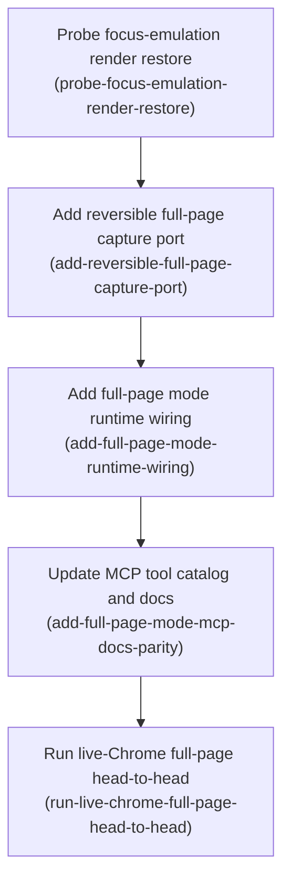

# Horizon 15 — Render the sandbox tab & ship full-page capture

## 🎯 What are we trying to achieve?

The `chrome-bridge` extension drives a dedicated "sandbox" Chrome tab that is deliberately kept
unfocused so it never steals the user's attention. The catch: Chrome suspends an unfocused tab's
rendering, so screenshots of anything below or beyond the visible viewport have come back blank —
horizons 13 and 14 shipped viewport and single-element screenshots only, explicitly deferring
full-page capture behind a "make the tab actually render" prerequisite. This horizon builds that
prerequisite — a temporary, reversible way to give the tab a real render pass — and uses it to ship
full-page (whole-document) screenshots as `captureTab`'s one new mode.

## 🧠 Why does this change need to happen?

Every attempt so far to capture beyond what's visibly on screen in the backgrounded sandbox tab has
failed for the same underlying reason: an unfocused tab doesn't paint. Horizon 13 tried the CDP
"capture beyond viewport" flag directly and it hung or produced blank pixels. The candidate fix this
horizon investigates is an experimental Chrome DevTools Protocol method,
`Emulation.setFocusEmulationEnabled`, that tells Chrome's rendering engine to treat the tab as focused
without actually giving it OS-level focus — in principle exactly the "make it render without stealing
attention" trick this project needs. Nobody has tried it here before, so the horizon opens with a
live-Chrome experiment before any permanent code is written.

**At a glance**
- **Phases:** 5
- **Complexity:** Medium — one experimental CDP call, but gated by a real feasibility risk and a live-Chrome closing check
- **Main risk:** the experimental mechanism might not actually restore rendering on a backgrounded tab, or might restore it but not fast enough to fit the 15-second capture budget
- **Testing focus:** reversibility (the temporary render state must always turn back off, even on error), the existing size-shrinking ladder from horizon 14 must be reused unchanged, and a real screenshot on a real tall webpage must be captured and measured

## Order of work

1. **Probe focus-emulation render restore in sandbox tab** — must run first and prove the whole idea
   works before anything else is built.
2. **Add reversible full-page capture to debugger-ports** — comes after the probe because it's only
   worth writing once the probe says the mechanism actually works.
3. **Add full-page mode runtime wiring in captureTab** — needs the port function from step 2 to call.
4. **Update MCP tool catalog and docs for full-page mode** — needs the runtime support from step 3 to
   exist before the schema/docs can honestly advertise it.
5. **Run live-Chrome full-page capture head-to-head** — the closing proof, needs every earlier step
   shipped and wired.

### Phase 0 — Probe focus-emulation render restore in sandbox tab

Technical ID: `probe-focus-emulation-render-restore` · bounded context: chrome-bridge live verification
· layer: cross-cutting · blast radius: small

**Goal:** Prove, against real signed-in Chrome and before any permanent wiring, whether CDP
`Emulation.setFocusEmulationEnabled(true)` on the unfocused sandbox tab restores enough of a render
pass that a subsequent `Page.captureScreenshot({captureBeyondViewport:true})` returns non-blank pixels
beyond the initial viewport, within the 15-second CDP session cap.

**Why:** Nothing in this codebase has ever called an `Emulation.*` CDP method, and the horizon-13
version of "capture beyond the viewport" was removed from the source after its own probe proved it
non-functional without a render-restoring mechanism. This candidate must be confirmed live before any
port function, capture mode, or documentation change is built around it.

**Changes:**
- From a fresh MCP session against a real scrollable test page loaded in the sandbox tab, send
  `Emulation.setFocusEmulationEnabled({enabled:true})` then
  `Page.captureScreenshot({captureBeyondViewport:true})` over the same debugger attachment and inspect
  the returned PNG for non-blank pixels beyond the initial viewport
- Compare the returned image height against a measured document scroll-height, and record the
  wall-clock duration against the 15-second cap
- Send `Emulation.setFocusEmulationEnabled({enabled:false})` and confirm the debugger detaches cleanly
- Record a dated finding in `discoveries.md` with the measured numbers, ending in an explicit
  proceed/replan verdict

**Files / areas:** `docs/roadmaps/agent-agnostic-browser-bridge/discoveries.md`

**How to verify:**
- Dated finding recorded with measured numbers — width/height, scroll-height, duration, non-blank pixels (min 8/10)
- Explicit proceed or replan verdict, logically consistent with the numbers (min 8/10)
- Probe followed the specified CDP sequence over one real attachment on the sandbox tab, on a genuinely tall page (min 7/10)
- Debugger detaches cleanly with no orphaned session (min 7/10)
- Timing measured and compared against the 15s cap (min 7/10)

**Done when:** A dated finding in `discoveries.md` states, with measured numbers and timing, whether
the mechanism restores a real render pass, ending in an explicit proceed/replan verdict — and every
check above passes its bar.

**Depends on:** nothing — can start immediately.

**Rollback:** If the finding is negative, stop and REPLAN the horizon rather than building anything
further; the horizon may close here as a probe-only result with the negative finding recorded.

Reference — full rubric detail

healerHint: If the finding is missing measured numbers or an explicit verdict, don't re-run the probe
from scratch — first check whether the raw CDP responses were captured anywhere and backfill the
derived numbers into `discoveries.md`.

### Phase 1 — Add reversible full-page capture to debugger-ports

Technical ID: `add-reversible-full-page-capture-port` · bounded context: chrome-bridge debugger ports
· layer: infrastructure · blast radius: small

**Goal:** Add a new capability that, within one debugger session, enables CDP focus emulation on the
sandbox tab, captures a beyond-viewport PNG, and disables focus emulation in its own `try`/`finally`
around the capture step — so the "turn it back off" step always runs, even if the capture itself
throws.

**Why:** The existing screenshot options only support a clip rectangle or a scale factor — nothing
about capturing beyond the viewport exists yet, it must be built from scratch. The existing
attach/detach wrapper only guarantees the debugger session itself gets detached; it has no built-in
"undo what I just enabled" pattern, so the enable/disable pair needs its own safety net.

**Changes:**
- Add a `captureBeyondViewport` option and a params-building branch that sends the beyond-viewport
  capture flag with no synthesized clip rectangle
- Add a new port function that runs inside one debugger session: enable focus emulation, then in a
  `try`/`finally` capture the screenshot and, in `finally`, unconditionally disable focus emulation
- Update the doc comment that currently says full-page capture is not offered
- Add unit tests proving the exact enable → capture → disable command order on success, and proving
  disable is *still* sent when the capture step itself fails

**Files / areas:** `tools/chrome-bridge/src/extension/debugger-ports.ts`,
`tools/chrome-bridge/src/extension/debugger-ports.unit.test.ts`

**How to verify:**
- Focus emulation is disabled on every exit path, including a thrown capture error (min 8/10)
- Unit tests assert the exact CDP command sequence in order, for both success and failure (min 7/10)
- Screenshot params match full-page semantics: no synthesized clip, `png` format explicit (min 8/10)
- Doc comment corrected, no longer contradicts the shipped capability (min 7/10)
- New port function has its own session label and typed, non-swallowed error handling (min 7/10)

**Done when:** A new full-page capture port function exists whose unit tests prove the disable command
fires on every exit path, including when capture throws.

**Depends on:** Probe focus-emulation render restore in sandbox tab.

**Rollback:** Revert the new port function, the new options field, and the doc-comment change in one
commit; nothing else consumes this file yet, so rollback is isolated.

Reference — full rubric detail

healerHint: If the capture-throws unit test still passes when the disable call is deleted, the
enable/disable pair isn't in its own try/finally around the capture step — move it there rather than
relying on the outer session wrapper's finally, which only detaches the debugger.

### Phase 2 — Add full-page mode runtime wiring in captureTab

Technical ID: `add-full-page-mode-runtime-wiring` · bounded context: chrome-bridge parity surface ·
layer: infrastructure · blast radius: small

**Goal:** Add a new `full-page` value to `captureTab`'s existing mode field and wire it to the new
port function from phase 1, reusing horizon 14's size-shrinking ladder unchanged for oversized
results.

**Why:** Adding a mode value touches the type definition, the request-validation function, and the
dispatch logic together — a missed spot is a compile error or a test failure, which is exactly the
safety net this coupling is meant to provide. This phase covers the runtime half of that surface
(types + validation + dispatch + reusing the ladder); the MCP-facing half (tool schema and docs) is a
separate following phase so each stays independently reviewable.

**Changes:**
- Add the new mode value to the mode type and update its doc comment
- Extend the request-validation function to accept and validate the new mode (including updating its
  error message, which currently only lists two valid values), add a full-page capture function
  mirroring the existing viewport capture's pattern, and feed both into the existing size-shrinking
  ladder helper unchanged
- Add unit test coverage for the new mode being accepted, and for both ladder outcomes (fits under the
  limit; hits the shrink-floor)

**Files / areas:** `tools/chrome-bridge/src/protocol/types.ts`,
`tools/chrome-bridge/src/extension/page-actions.ts`,
`tools/chrome-bridge/src/extension/page-actions.unit.test.ts`

**How to verify:**
- Request validation and mode dispatch correctly extended, including the error message (min 7/10)
- The action-count stays the same — this is a new mode, not a new action (min 8/10)
- The size-shrinking ladder is reused as-is, not reimplemented (min 8/10)
- Unit tests cover both the normal-size and shrink-to-floor outcomes for the new mode (min 7/10)

**Done when:** `captureTab` accepts and dispatches full-page mode, with ladder reuse proven by unit
tests.

**Depends on:** Add reversible full-page capture to debugger-ports.

Reference — full rubric detail

healerHint: If the new mode is rejected at runtime even though the type compiles, the type was updated
but the runtime validation/error string was not — fix the validation function, not the type.

### Phase 3 — Update MCP tool catalog and docs for full-page mode

Technical ID: `add-full-page-mode-mcp-docs-parity` · bounded context: chrome-bridge parity surface ·
layer: interface · blast radius: small

**Goal:** Update the tool schema that AI clients see, plus the server's internal documentation and the
project README, so they all advertise the new full-page mode consistently with what the runtime
(phase 2) actually accepts.

**Why:** A tool schema that doesn't list a mode the runtime actually supports means AI clients calling
this tool can't discover or use the new capability; stale docs have bitten this project in past
horizons. This phase is the surface-facing half of the same file coupling phase 2 covers — split out so
each half stays independently reviewable.

**Changes:**
- Update the tool schema's mode list and description
- Update the server's header doc comment, which currently says only two modes are supported
- Update the README's capture section, removing the "full-page capture is not offered" language
- Add a unit test asserting the schema's mode list includes the new value

**Files / areas:** `tools/chrome-bridge/src/mcp/tool-catalog.ts`,
`tools/chrome-bridge/src/mcp/tool-catalog.unit.test.ts`, `tools/chrome-bridge/src/mcp/server.ts`,
`tools/chrome-bridge/README.md`

**How to verify:**
- All four files touched consistently, no stale "not offered" language left behind (min 8/10)
- A unit test asserts the literal new mode string is in the schema (min 7/10)
- The advertised schema exactly matches what the runtime dispatcher accepts — no more, no fewer modes (min 7/10)

**Done when:** The MCP tool schema and docs advertise full-page mode consistently with the runtime.

**Depends on:** Add full-page mode runtime wiring in captureTab.

Reference — full rubric detail

healerHint: If a catalog/docs file was skipped, grep the diff for the new mode string across all four
files and patch whichever one is missing it before touching anything else.

### Phase 4 — Run live-Chrome full-page capture head-to-head

Technical ID: `run-live-chrome-full-page-head-to-head` · bounded context: chrome-bridge live
verification · layer: cross-cutting · blast radius: small

**Goal:** In a fresh session against real signed-in Chrome (after rebuilding and reloading the
extension), capture a real beyond-viewport page in full-page mode on the unfocused sandbox tab,
cross-check the returned dimensions against a measured scroll size, confirm the tab is unfocused again
afterward, and record a dated finding.

**Why:** This is the mandatory closing proof the whole horizon exists to produce. Because the tool
that reports tab focus state can't actually see the CDP-level focus-emulation trick this horizon
introduces, "the tab went back to normal" has to be checked explicitly rather than assumed from the
capture succeeding.

**Changes:**
- Rebuild/reload the extension, start a fresh session (retrying once if the tool list is stale
  immediately after a rebuild, a known pattern from prior horizons), and load a real page taller than
  one screen
- Call full-page capture and record the returned pixel dimensions
- Measure the same page's scroll size independently and cross-check against the returned dimensions
- Confirm the tab is unfocused again and no debugger session was left behind; record a dated Verified
  or an honest "couldn't fully verify" note naming the blocker

**Files / areas:** `docs/roadmaps/agent-agnostic-browser-bridge/discoveries.md`

**How to verify:**
- Pixel dimensions cross-checked against measured scroll size, with the arithmetic shown (min 8/10)
- Any stale-tool-list retry reported honestly, or its absence stated plainly (min 7/10)
- Sandbox tab confirmed unfocused and clean afterward via an explicit, separate check (min 8/10)
- A dated finding exists, either Verified or an honest named blocker (min 8/10)

**Done when:** A dated finding in `discoveries.md` records the real capture's dimensions cross-checked
against measured scroll size and confirms the tab is unfocused afterward — or an honest named blocker
if the run couldn't complete.

**Depends on:** Update MCP tool catalog and docs for full-page mode.

Reference — full rubric detail

healerHint: If the full-page capture call fails or times out right after the rebuild, retry with a
freshly-started session before touching any capture code — it's very likely the known stale-tool-list
issue, not a real regression.

## Discovery Findings

| Area | Finding | File | Implication |
|---|---|---|---|
| No existing full-page capture shim | The horizon-13 attempt at beyond-viewport capture was removed from source after failing; nothing survives except historical README prose | `debugger-ports.ts` | Must be built from scratch, not re-enabled |
| Parity surface | Adding a mode value touches types, request validation, dispatch, the debugger-port options, the MCP tool schema, server docs, README, and tests | `protocol/actions.ts` | 8 files/areas must move together |
| Session wrapper has no "undo" pattern | The attach/detach wrapper's own cleanup only detaches the debugger — it never sends a compensating command | `debugger-ports.ts` | The enable/disable pair needs its own try/finally |
| No experimental focus-emulation usage anywhere | Zero CDP `Emulation.*` calls exist in this codebase today | `debugger-ports.ts` | This is genuinely new ground, hence the probe-first phase |
| Downscale ladder is already reusable | Horizon 14's shrink-if-too-big logic is mode-agnostic and already used by two existing modes | `page-actions.ts` | Full-page mode can reuse it with zero ladder-code changes |
| No direct "scale, no clip" path exists | Today, supplying a scale factor always synthesizes a clip rectangle | `debugger-ports.ts` | Full-page-at-scale needs its own branch |
| Sandbox tab is never programmatically focused | No code anywhere calls the tab/window focus APIs on the sandbox tab | `sandbox-ports.ts` | The focus-emulation trick operates at a different layer than the tab-focus reporting tool can see |
| Manifest permissions already sufficient | The `debugger` permission and broad host access are already declared | `manifest.json` | No manifest change needed |

## Out of Scope

- JPEG / quality downscale rungs — a JPEG rung would force a new image-dimension parser and format
  branching; explicitly deferred by the horizon-14 decision.
- Generalizing the screenshot size policy into a cross-tool result-size policy — scoped by the user as
  a separate future horizon.
- Replacing per-command debugger attach/detach with a persistent multi-command session — explicitly
  kept as-is per the horizon-10 decision.
- Removing the dead active-tab code surface — user-deferred cleanup unrelated to this horizon's
  deliverable.
- A second consumer of the render primitive (virtualized/lazy content reads, trusted keyboard/mouse
  input) — full-page capture is the one consumer this horizon ships.
- Un-scrolled below-the-fold single-element clip capture — a distinct deferred item behind the same
  render prerequisite.
- Empirically re-measuring the true AI-client image-size reject ceiling — the existing proxy constant
  is carried forward unchanged.
- A distinct failure-reason value for "shrunk to the floor and still too big" — reuses the existing
  "too-large" outcome per the horizon-14 decision.
- Any change to boky's own extension or bridge — this project never migrates boky onto the new tool.
- New page actions, or touching any page action other than `captureTab`.

## Required Materials

| Material | Kind | Why needed | How to get it |
|---|---|---|---|
| CDP Emulation domain reference (`setFocusEmulationEnabled`) | document | Confirm method signature and experimental-status caveats before writing probe code | Fetch the official Chrome DevTools Protocol docs; cross-check against the actual Chrome build's protocol version |
| Live running Chrome with the extension loaded | tool | The probe and closing check both need a real backgrounded tab and real `chrome.debugger` access | Build/reload the extension unpacked in a real signed-in Chrome profile, connected through the project's bridge |
| A test page taller/wider than one screen | dataset | Distinguishing "the tab actually rendered beyond the viewport" from "nothing changed" needs a genuinely scrollable page | Author or reuse a simple static page with visually distinct content well beyond one screen height |

## Success Criteria

- A live-Chrome feasibility probe has recorded whether the experimental method restores a real render
  pass, ending in an explicit proceed/replan verdict.
- The render primitive is bounded and reversible, leaving no orphaned debugger session or lingering
  focus-emulation state.
- `captureTab` gains a full-page mode across the full parity surface, with the action count unchanged.
- An oversized full-page result goes through horizon 14's existing shrink ladder unchanged.
- Typecheck, lint, and tests all pass for `tools/chrome-bridge`, with unit tests covering the
  primitive's always-restore behavior and the full-page ladder.
- A live-Chrome head-to-head captures a real beyond-viewport page, cross-checks dimensions, confirms
  the tab is unfocused again, and is recorded dated.
- boky's own extension, bridge, and verify pipeline keep passing unchanged.

## Alignment Preview

The user was shown a plain-language preview of all 5 phases (pre-split) before the expensive stages
ran and chose "Build the full roadmap from this" on the first pass — no redirect. One light-critique
concern was raised and folded in directly before the preview: `mcp/server.ts`'s doc comment was missing
from the parity-surface phase's file list; it was added. A second, cosmetic concern (the objective
sentence read as if the probe had already succeeded) was left for this document's phrasing rather than
re-running planning.

## Quality Gate

**Path:** Full (technical shape; a real feasibility risk and a live-Chrome closing check justified the
full pipeline over lite).

**Iterations:** 2. Iteration 0's critic raised one `major` issue — `phase-blast-radius` on the
combined parity phase (7 files, an `expectedResult` spanning "types through tool-catalog through
README"). The healer split it into a runtime-wiring phase (types/validation/dispatch/ladder, 3 files)
and an MCP/docs-parity phase (schema/server-doc/README, 4 files), each independently reviewable, and
rewired the live-verify phase's dependency accordingly. Iteration 1's critic re-scored all 10 rubric
dimensions: 0 blockers, 0 majors, all 9-10 dimensions scored 8-9 as minor with no fixes required.
Verdict: **pass**.

**Accepted debt:** none recorded as a numbered minor issue beyond ordinary scoring notes (e.g. two
rubric dimensions in the docs-parity phase check overlapping but still-distinct facts — not worth
splitting further).

## Full Analysis

**Domain shape:** technical — browser-automation machinery (a CDP render-state primitive and a
screenshot capture mode), no business entities, rules, or workflows a domain expert would recognize.

**Ubiquitous language:**

| Term | Meaning |
|---|---|
| sandbox tab | the dedicated Chrome tab the extension drives, deliberately kept unfocused/backgrounded |
| unfocused-tab invariant | the guarantee the sandbox tab stays unfocused outside a capture |
| render pass | Chrome's compositing/paint work for a tab; suspended on the backgrounded sandbox tab |
| render-the-tab primitive | the new bounded, reversible mechanism this horizon builds |
| setFocusEmulationEnabled | the candidate experimental CDP method under test |
| feasibility probe | a live-Chrome test done before wiring anything permanent |
| full-page (beyond-viewport) mode | the one consumer shipped this horizon |
| downscale ladder / size policy | horizon 14's scale-only PNG re-capture rungs + floor, reused unchanged |
| withDebuggerSession | the per-command chrome.debugger attach/detach wrapper, 15s cap |
| parity surface | the set of files that must change together for a new captureTab mode |

**Assumptions:**
- The horizon-9/13 CDP precedent is broad enough authorization to call one additional experimental
  Emulation method; it does not reopen the still-deferred persistent-session or trusted-input
  decisions.
- The primitive continues to use per-command attach/detach (horizon-10 decision), not a new persistent
  session.
- Full-page capture is the single consumer this horizon ships.
- The full-page result reuses the existing success/failure result shapes exactly as horizon 14 left
  them.
- The existing size ceiling is used as-is; empirically re-measuring it is not part of this horizon.
- The live head-to-head runs through the project's own MCP bridge against a real signed-in Chrome.
- Reversibility is satisfied by disabling focus emulation within the same debugger session, in its own
  try/finally.
- If the probe refutes the mechanism, the horizon replans rather than shipping full-page capture
  unverified.
- The tab-focus-reporting tool cannot see CDP-level focus-emulation state — the "restored" contract
  needs an explicit check, not an inference from that tool.

**Risks:**
- The experimental mechanism might not actually resume real rendering on a backgrounded tab.
- Even if it does, encoding a large full-page image might not finish inside the 15-second session cap.
- Enabling focus emulation could visibly alter tab state in a way that breaks the unfocused invariant
  or confuses the focus-reporting tool.
- A crash between enable and disable could leave the tab in an emulated-focus state or an orphaned
  debugger session.
- The mechanism sits at the edge of a previously narrow CDP-usage decision; a reviewer might read it as
  reopening a closed decision.
- The live head-to-head may hit the known stale-tool-list problem after a rebuild.
- Device-pixel-ratio effects may make returned dimensions diverge from measured scroll size.
- The shrink ladder may hit its floor often enough on real photographic pages to make full-page mode
  frequently return no image.
