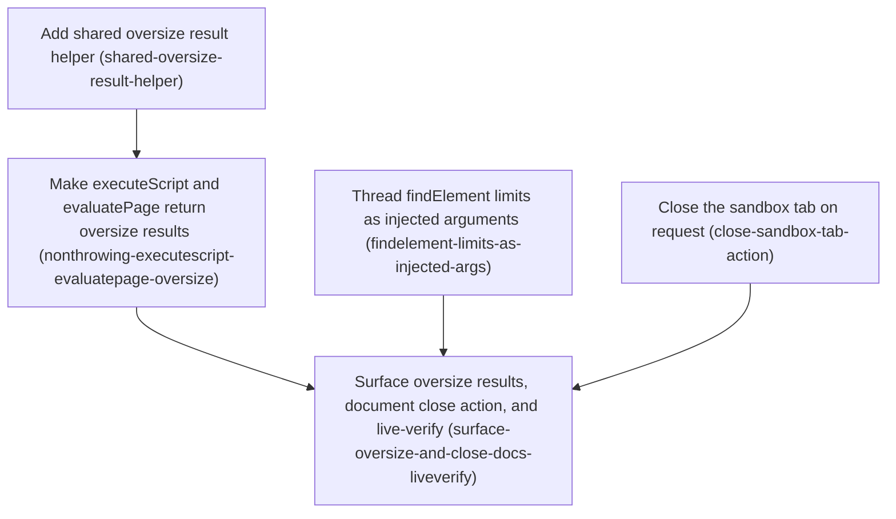

# Horizon 16 — Generalize the "too large" result pattern, and let the sandbox tab be closed

## 🎯 What are we trying to achieve?

Right now, if `executeScript` or its CDP twin `evaluatePage` produces a result that's too big to
send back safely, the tool call just throws an error — the caller can't tell "too big" apart from
a real bug. Meanwhile `findElement` has the exact same size-limit numbers declared twice in two
places that can't share code (a real Chrome platform constraint), so they can silently drift apart.
And the single Chrome tab this extension drives everything through is created automatically the
first time it's needed, but there is currently no way to close it — it just stays open forever.

This horizon fixes all three: `executeScript`/`evaluatePage` get the same non-throwing "too large"
result shape the screenshot tool already uses; `findElement`'s duplicated limits get reduced to one
true definition; and a new action lets a caller close that tab on purpose when they're done with it.

## 🧠 Why does this change need to happen?

The screenshot tool (`captureTab`) already solved "what happens when a result is too big" the right
way — a defined result the caller can check, not a thrown error. `executeScript`/`evaluatePage`
still use the old, worse pattern, and they share one size-limit constant despite going through
completely different code paths (one calls the page directly, the other goes through Chrome
DevTools Protocol) — so fixing only one would leave them inconsistent.

`findElement`'s duplicated constants are a real bug waiting to bite: the code that enforces the
50-match/500-character limits lives inside a function that Chrome copies into an isolated sandbox
before running it, and that copy can't see the "real" constants declared elsewhere in the file — so
someone maintaining this code could change one copy and not the other without any error.

The sandbox tab issue was raised directly by the project owner: it stays open indefinitely today,
with no way to close it. Investigation confirmed there is no existing close mechanism anywhere in
the code, and that the project's established style is "the caller asks explicitly," not automatic
cleanup — so this ships as a new action, not a hidden background behavior.

### At a glance

- **Phases:** 5
- **Complexity:** Medium — touches two different code transports (in-page vs. Chrome DevTools
  Protocol) and adds one new capability end-to-end across the whole tool surface
- **Main risk:** The two size-limited tools (`executeScript`/`evaluatePage`) use different
  underlying mechanisms despite sharing one limit number — assuming they behave identically without
  checking first could produce two subtly different "too large" results
- **Testing focus:** No-op safety (never throwing, safe to call twice), scoping (only the sandbox
  tab is ever touched, no other tab), and live-Chrome evidence (not just "it worked," but actual
  before/after proof)

## Order of work

1. **Add shared oversize result helper** — nothing else can be built until this exists; it's the
   shared building block.
2. **Make executeScript and evaluatePage return oversize results** — depends on the helper from
   step 1.
3. **Thread findElement limits as injected arguments** — independent of the other work; can run any
   time.
4. **Close the sandbox tab on request** — independent of the other work; can run any time.
5. **Surface oversize results, document close action, and live-verify** — the closing step; needs
   steps 2, 3, and 4 all finished first, since it verifies and documents everything together.

## Phase 1 — Add shared oversize result helper

Technical ID: `shared-oversize-result-helper` · bounded context: chrome-bridge-extension · layer:
infrastructure · blast radius: small

**Goal:** Introduce a small colocated helper that turns an over-cap byte size into a consistent
structured result, plus a shared type for it, with zero behavior change to any existing tool.

**Why:** executeScript and evaluatePage currently throw on oversize results with duplicated ad-hoc
logic; before either can be made non-throwing, the codebase needs one shared, unit-tested primitive
that both call sites will consume in the next phase. Building it standalone first keeps this phase's
blast radius tiny. The new type is deliberately named `SizeCeilingOutcome`, not something implying
captureTab's ladder/downscale behavior, since this helper only does a flat ceiling comparison.

**Changes:**
- Add a `SizeCeilingOutcome` type (flat ceiling result) with a doc comment distinguishing it from
  captureTab's ladder-aware downscale sizing
- Add `checkSizeLimit(bytes, limitBytes)` — pure flat comparison, no I/O, treating exactly-at-cap as
  within limit
- Add `buildOversizeResult(...)` — shapes a consistent non-throwing payload, generic across tools
- Unit-test both helpers: under-cap, exactly-at-cap, and over-cap cases

**Files / areas:** `tools/chrome-bridge/src/extension/size-limits.ts` (new),
`tools/chrome-bridge/src/extension/size-limits.unit.test.ts` (new)

**How to verify:**
- `SizeCeilingOutcome` type is correctly shaped and documented (min score 7)
- `checkSizeLimit` is a pure, correct flat comparator (min score 8)
- `buildOversizeResult` produces a consistent, consumable non-throwing payload (min score 7)
- Both helpers are unit-tested across the three required boundary cases (min score 7)
- No existing file touched, no existing test behavior altered (min score 8)
- New code follows repo TypeScript strictness and layering rules (min score 7)

**Done when:** A new, fully unit-tested `size-limits.ts` module exists exporting all three symbols,
and every check above passes its bar.

**Depends on:** nothing — can start immediately

---

## Phase 2 — Make executeScript and evaluatePage return oversize results

Technical ID: `nonthrowing-executescript-evaluatepage-oversize` · bounded context:
chrome-bridge-extension · layer: infrastructure · blast radius: medium

**Goal:** Replace the current throw-on-oversize behavior of executeScript and evaluatePage with a
non-throwing structured result built on the new helper, updating the tests that hard-assert the old
throw contract.

**Why:** Both tools currently throw when their result is too big — an inconsistent caller
experience versus a normal too-large result the caller can branch on. The two tools reach oversize
handling through genuinely different transports (executeScript goes through `chrome.scripting`,
evaluatePage through Chrome DevTools Protocol) despite sharing one size-limit constant, so the two
code paths must be compared side by side before assuming they can share one result shape.

**Changes:**
- Diff the two current oversize branches before editing to confirm they can converge on one shape
- Rewrite executeScript's oversize handling to use the shared helper instead of throwing
- Rewrite evaluatePage's CDP-side oversize handling the same way, reconciling any transport
  differences explicitly
- Rewrite the two existing tests that assert the old throw behavior
- Add new tests proving normal (under-cap) results are unaffected for both tools

**Files / areas:** `tools/chrome-bridge/src/extension/page-actions.ts`,
`tools/chrome-bridge/src/extension/debugger-ports.ts`,
`tools/chrome-bridge/src/extension/page-actions.unit.test.ts`

**How to verify:**
- Both executeScript and evaluatePage were actually rewired, not just one (min score 7)
- The two oversize branches were genuinely diffed before implementation (min score 6)
- Non-oversize behavior is unchanged (min score 7)
- Both old hard-assert tests are rewritten and new under-cap tests pass (min score 8)
- Only size-ceiling errors become non-throwing — other errors still surface as errors (min score 7)

**Done when:** executeScript and evaluatePage both return a structured too-large result instead of
throwing, backed by passing tests, and every check above passes its bar.

**Depends on:** Add shared oversize result helper

---

## Phase 3 — Thread findElement limits as injected arguments

Technical ID: `findelement-limits-as-injected-args` · bounded context: chrome-bridge-extension ·
layer: infrastructure · blast radius: small

**Goal:** Pass the match-count and text-length limits into the injected page-scanning function as
explicit arguments instead of relying on duplicated local constants inside it.

**Why:** The function injected into the page via `chrome.scripting` currently redeclares its own
local copies of the limits instead of using the "real" ones — because Chrome copies that function
into an isolated sandbox that can't see the extension's regular code, so it's physically impossible
for it to share a variable the normal way. The only real fix is to pass the numbers in as arguments
when the function is called.

**Changes:**
- Grep the codebase first to confirm nothing else calls this same injected function (a silent
  `undefined` bug would result if another caller existed and wasn't updated)
- Extend the call's argument list to include both limit numbers
- Update the injected function to accept them as parameters instead of hardcoding local copies
- Remove the now-duplicated local declarations
- Update existing tests to check against the real constants instead of hardcoded numbers

**Files / areas:** `tools/chrome-bridge/src/extension/page-actions.ts`,
`tools/chrome-bridge/src/extension/page-actions.unit.test.ts`

**How to verify:**
- The pre-change grep for other callers was actually performed and documented (min score 6)
- Limits are threaded as call arguments, not attempted via closure (min score 7)
- No duplicated local declarations remain (min score 7)
- The module-level constants remain the single source of truth (min score 7)
- Tests assert against the imported constants, not re-hardcoded numbers (min score 7)
- Behavior and typing are preserved, with a test covering the new argument shape (min score 6)

**Done when:** The limits are defined exactly once and threaded through as arguments, with every
check above passing its bar.

**Depends on:** nothing — can start immediately

---

## Phase 4 — Close the sandbox tab on request

Technical ID: `close-sandbox-tab-action` · bounded context: chrome-bridge-extension · layer:
infrastructure · blast radius: medium

**Goal:** Add a new `closeSandboxTab` action that closes the current sandbox tab and clears its
saved identity, so it no longer stays open indefinitely — the next action after this one will
create a fresh tab automatically, exactly like it does today when no tab exists yet.

**Why:** The dedicated tab this extension drives everything through is created automatically the
first time it's needed, but nothing ever closes it — confirmed by searching the whole codebase for
any tab-closing code, and finding none. This ships as an action the caller invokes on purpose,
never as something that happens automatically when a connection drops or the extension goes idle —
because those events are routine and happen constantly on their own, and automatically closing the
tab in response would be surprising and inconsistent with how every other part of this tool already
works (nothing here does anything the caller didn't explicitly ask for).

**Changes:**
- Add the new action to the tool's action list and result-type definitions
- Implement it: look up the saved tab, close it if it exists, clear the saved reference — safely
  doing nothing if there's no tab to close
- Reuse the tab-closing cleanup that already exists for other tabs, rather than writing new cleanup
  logic
- Add it to the MCP tool listing so external callers can actually invoke it
- Unit-test: closing an existing tab, doing nothing when there's no tab, and confirming no other
  open tab is ever touched

**Files / areas:** `tools/chrome-bridge/src/protocol/actions.ts`,
`tools/chrome-bridge/src/extension/sandbox-ports.ts`, `tools/chrome-bridge/src/extension/page-actions.ts`,
`tools/chrome-bridge/src/protocol/types.ts`, `tools/chrome-bridge/src/mcp/server.ts`,
`tools/chrome-bridge/src/extension/page-actions.unit.test.ts`

**How to verify:**
- Safe to call when nothing's open, and safe to call twice in a row (min score 7)
- Only ever affects the sandbox tab, never any other open tab (min score 7)
- Reuses existing cleanup rather than duplicating it (min score 7)
- Fully wired across every place a tool action needs to exist (min score 7)
- Covered by tests for the close, no-op, and non-interference cases (min score 6)

**Done when:** The new action exists everywhere it needs to, safely closes the tab and clears its
saved reference, and every check above passes its bar.

**Depends on:** nothing — can start immediately

---

## Phase 5 — Surface oversize results, document close action, and live-verify

Technical ID: `surface-oversize-and-close-docs-liveverify` · bounded context: chrome-bridge-mcp ·
layer: interface · blast radius: medium

**Goal:** Make the new "too large" outcome show up as an error to the calling AI tool (matching how
the screenshot tool already works), document the new close action, run the full test/quality
pipeline, and prove both new behaviors actually work against a real, running Chrome browser.

**Why:** Every previous horizon in this project closes with one combined documentation-and-real-
verification step, so this one does too. Two things still need tying together here: the new
non-throwing "too large" result needs to actually be flagged as an error at the level the AI client
sees (today, only the screenshot tool does this), and the new close action needs both a written
description for callers and proof — with actual before/after tab identifiers, not just "it worked"
— that it really closes the tab and a fresh one really gets created next time.

**Changes:**
- Add error-flagging for the new too-large outcome, matching the screenshot tool's existing pattern,
  scoped only to executeScript/evaluatePage
- Document the new close action in the tool listing and the project README, explicitly noting the
  next action will create a fresh tab automatically
- Correct README wording that's now out of date (executeScript no longer "comes back as an error")
- Run the complete verification pipeline and fix anything it finds — no skipped checks
- Verify against a real, running Chrome browser: trigger an oversized result and confirm it comes
  back flagged as an error the right way; call the close action, capture the tab's identity, confirm
  it's gone, then confirm the very next action creates a genuinely different tab

**Files / areas:** `tools/chrome-bridge/src/mcp/server.ts`, `tools/chrome-bridge/README.md`

**How to verify:**
- The too-large outcome is correctly wired to show up as an error (min score 7)
- The close action is accurately documented in both places it's described (min score 7)
- The full verification pipeline runs clean (min score 8)
- Real-browser verification covers both concerns with concrete, measured evidence (min score 7)
- Nothing about this change leaks into or breaks unrelated tools (min score 7)

**Done when:** Both new behaviors are wired, documented, verified clean, and proven against a real
Chrome session — and every check above passes its bar.

**Depends on:** Make executeScript and evaluatePage return oversize results, Thread findElement
limits as injected arguments, Close the sandbox tab on request

---

## Discovery Findings

| Area | Finding | File | Implication |
|---|---|---|---|
| captureTab result shape | `CaptureTabFailureResult` is the reusable discriminant+size/limit shape (not the ladder) | protocol/types.ts | New helper generalizes only the flat-ceiling shape |
| executeScript/evaluatePage shared mechanism | Both throw over the same constant, tested by 2 existing hard-throw tests | page-actions.ts, debugger-ports.ts | Both must move together or diverge |
| findElement duplicated constants | Injected function can't close over module scope — a real platform constraint | page-actions.ts:883-972 | Only fix is threading constants as call arguments |
| Sandbox tab creation | Created lazily via `chrome.tabs.create`, id persisted in `chrome.storage.local` | sandbox-ports.ts | No existing `chrome.tabs.remove` call anywhere — greenfield |
| Existing cleanup listener | `onTabRemoved` already evicts capture buffers for any closed tab | capture-ports.ts | Close action should reuse this, not duplicate it |
| getTabState contract | Documented, binding read-only peek (horizon 7 decision) | page-actions.ts:1225-1253 | Close must be a new action, never folded into getTabState |
| No natural session boundary | Relay disconnects are routine/auto-reconnecting; SW suspension undetectable | bridge-client.ts | Confirms explicit caller-invoked close, not automatic |
| MCP surfacing | Only captureTab gets special-cased `isError` handling today | mcp/server.ts:135-165 | New branch needed for executeScript/evaluatePage only |

## Out of Scope

- Byte-size caps for readConsoleMessages/readNetworkRequests — dropped from this horizon at the
  user's request during the Alignment Preview; they remain uncapped by byte size until a future
  horizon
- JPEG/quality downscale rung for captureTab (deferred per horizon 14 decision)
- Removing the dead active-tab code surface — repeatedly deferred since horizon 6
- The persistent-CDP-session redesign
- A second render-the-tab primitive consumer
- Measuring the true AI-client image-block reject size (still-open blocker since horizon 4)
- Any pagination/continuation retrieval mechanism for truncated/oversize results
- Any change to captureTab's own image ladder mechanism or ceiling value
- Automatic/implicit sandbox-tab closing on relay disconnect or service-worker suspension —
  explicitly rejected in favor of an explicit caller-invoked action

## Required Materials

None — this horizon works entirely from the existing repo; no external material was needed.

## Success Criteria

- executeScript and evaluatePage both return a defined non-throwing too-large result instead of
  throwing, surfaced as isError:true at the MCP layer
- findElement's match/text-length limits are defined exactly once and threaded as arguments
- A new closeSandboxTab action closes the sandbox tab and clears its persisted id (no-op-safe,
  scoped only to the sandbox tab)
- tools/chrome-bridge's own `npm run verify` is green
- README and MCP tool catalog updated
- Live-Chrome head-to-head confirms both the oversize isError path and the close/recreate tab
  lifecycle

## Alignment Preview

The user reviewed the first 5-phase preview (which included byte-size caps for
readConsoleMessages/readNetworkRequests) and redirected once: drop the console/network caps, add an
explicit tab-close action instead. A follow-up discovery pass grounded the tab-close design (no
existing close mechanism; established project precedent favors explicit, caller-invoked actions over
automatic cleanup), and the user confirmed the explicit-action design via a follow-up question. The
revised 5-phase plan was then accepted as-is on the second preview. Total: 1 redirect round used (of
a 2-round budget).

## Quality Gate

Full path. Gate passed on the first critic iteration — 0 blockers, 0 majors, 6 minor/advisory notes
(mostly "none needed" confirmations; one suggestion to tighten two rubric minScores from 6 to 7 for
consistency, left as-is since the looser bar for judgment-heavy "was this check actually performed"
dimensions was intentional). No verification or healing round was required.

## Full analysis

**Domain shape:** technical — Developer-tooling machinery (result-shape policy and tab lifecycle
code) inside an MCP bridge, with no business entities a domain expert would recognize.

**Ubiquitous language:** sandbox tab, page action, PAGE_ACTIONS, chrome.scripting injected function,
CDP (chrome.debugger), SizeCeilingOutcome, size ceiling, oversize outcome, isError, MCP tool
catalog, closeSandboxTab, MAX_FIND_ELEMENT_MATCHES, MAX_ELEMENT_TEXT_CHARS,
MAX_EXECUTE_SCRIPT_RESULT_CHARS, chrome-bridge-extension, chrome-bridge-mcp.

**Assumptions:**
- Horizon 15 completed successfully so this horizon does not need to revisit the render-the-tab
  primitive
- evaluatePage moves in lockstep with executeScript since they share the exact same constant and
  near-identical mechanism today
- findElement's injected function genuinely cannot close over module scope (confirmed platform
  constraint); the only fix is threading limits as call arguments, after confirming sole-caller
  status via grep
- The user explicitly chose an explicit, MCP-caller-invoked close action over any automatic
  close-on-disconnect/suspend behavior
- getTabState stays strictly read-only per its horizon-7 binding decision; closeSandboxTab is a new
  action, not a change to getTabState
- Byte-size caps for console/network reads are intentionally deferred at the user's request, not an
  oversight
- closeSandboxTab reuses the existing onTabRemoved listener rather than duplicating cleanup logic

**Risks:**
- executeScript and evaluatePage use different transports despite sharing one size constant —
  assuming parity without diffing first could produce two subtly different result shapes
- chrome.scripting silently passes undefined for missing trailing arguments — if findElement's
  injected function isn't the sole caller, another caller could silently receive undefined limits
- A broader tab-lookup mechanism for closeSandboxTab (instead of reusing the existing stored-id
  lookup) could close the wrong tab under a multi-tab-matching race
- A too-large outcome surfacing as isError could be implemented via string-matching instead of a
  proper discriminant, conflating genuine errors with the new non-throwing outcome
- The live-Chrome closing verification is the step most likely to be asserted without real evidence
  rather than measured — the closing phase's rubric explicitly guards against this
