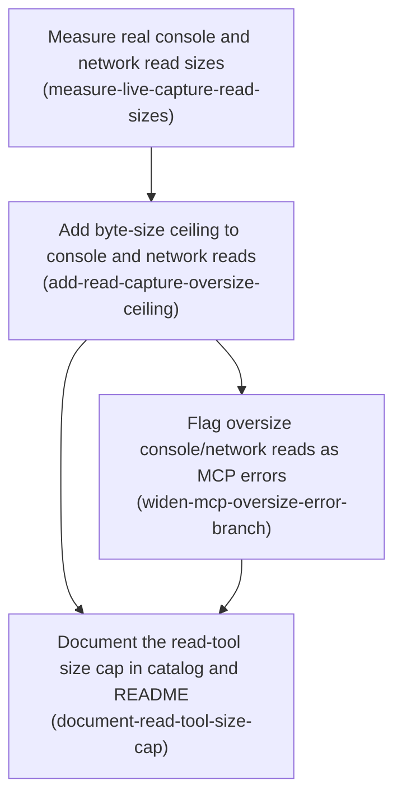

# Horizon 17 — Byte-size caps for readConsoleMessages / readNetworkRequests

## 🎯 What are we trying to achieve?

Right now, `readConsoleMessages` and `readNetworkRequests` (the two MCP tools that let an AI coding
assistant read a Chrome tab's console log and network traffic) only limit how many entries come back —
never how *big* the response is in bytes. This horizon adds a byte-size ceiling to both, so a caller
that reads an unusually large console/network window gets a clear, structured "too large" error instead
of an unbounded response body that could overwhelm the calling tool.

## 🧠 Why does this change need to happen?

Horizon 16 already solved exactly this problem for two other tools — `executeScript` and
`evaluatePage` — by measuring the returned value's size and returning a structured error when it
exceeds a byte ceiling, instead of throwing or silently returning a huge payload. `readConsoleMessages`
and `readNetworkRequests` never got the same treatment: they still have zero byte-size protection, only
a count-based `limit` parameter. This horizon closes that gap using the exact same reusable pattern,
rather than inventing a new one.

**At a glance**
- **Phases:** 4
- **Complexity:** Low — this is a narrow extension of an existing, already-proven pattern into two more call sites, not new design.
- **Main risk:** Setting the byte ceiling without a real measurement first — horizon 13 had to replan `captureTab`'s ceiling after guessing wrong, so this horizon measures real console/network payload sizes in live Chrome before writing any constant.
- **Testing focus:** Under-cap reads stay unchanged (no regression), over-cap reads return the structured too-large shape, and the MCP layer surfaces that as `isError: true`.

## Order of work

1. **Measure real console and network read sizes** — must happen first; nothing downstream can pick a real byte ceiling without evidence.
2. **Add byte-size ceiling to console and network reads** — needs phase 1's measured numbers to choose real constants.
3. **Flag oversize console/network reads as MCP errors** — needs phase 2's new oversize result shape to exist before the MCP layer can detect it.
4. **Document the read-tool size cap in catalog and README** — documents the constants (phase 2) and the error behavior (phase 3), so it comes last.

### Phase 1 — Measure real console and network read sizes

Technical ID: `measure-live-capture-read-sizes` · chrome-bridge-extension · infrastructure · small

**Goal:** Using a live Chrome session with the extension loaded and the nest-host relay running,
capture a near-max (500-entry) console read and network read from a page that produces heavy
console/network volume, measure the serialized size of each, and record the numbers so the next phase
can fix real byte-ceiling constants instead of guessed ones.

**Why:** Setting a byte ceiling without a real measurement risks the same mistake horizon 13 made with
`captureTab` (had to replan after measuring real bytes) — too low causes false positives on legitimate
reads, too high never fires at all.

**Changes:**
- Start the relay + workflow engine (`npm start` from repo root) and load the extension unpacked in Chrome
- Navigate the sandbox tab to a page that generates substantial console output and network traffic
- Call `readConsoleMessages` and `readNetworkRequests` with `limit=500` (the existing max) against that page
- Measure the serialized size of the returned `entries` array for each response, alongside the entry count and per-entry cap context (`MAX_CONSOLE_TEXT_BYTES=8192`, `MAX_BODY_PREVIEW_BYTES=4096`)
- Append one binding-decision line to `docs/roadmaps/agent-agnostic-browser-bridge/decisions.md` recording the measured console and network character counts

**Files / areas:** `tools/chrome-bridge/src/extension/page-actions.ts`

**How to verify:**
- Evidence recorded: the measurement is captured and traceable, not asserted from memory
- Per-entry-cap context is cited alongside the aggregate measurement
- No scope creep: this phase measures only, it does not touch the size-guard code itself
- Measurement methodology is sound (real page, real 500-entry read, not a toy case)
- The `decisions.md` line follows the file's existing format

**Done when:** A recorded measurement (character-length of a 500-entry console read and a 500-entry
network read against a real page) lands as a one-line decision in `decisions.md`, ready for the next
phase to cite.

**Depends on:** nothing — can start immediately

---

### Phase 2 — Add byte-size ceiling to console and network reads

Technical ID: `add-read-capture-oversize-ceiling` · chrome-bridge-extension · infrastructure · medium

**Goal:** Add new, measurement-grounded byte-size constants for `readConsoleMessages`/`readNetworkRequests`,
and make the shared `readCapture` closure in `page-actions.ts` measure the serialized size of the
entries it's about to return — replacing the whole result with the existing `buildOversizeResult` (via
`checkSizeLimit`/`buildOversizeResult` from `size-limits.ts`) when it exceeds the ceiling, exactly
mirroring how `executeScript`'s oversize case already works.

**Why:** Today `readCapture` has no byte-size check at all — only the count-based `limit`/`since`
clamp. An unbounded read can still return an arbitrarily large payload. The horizon-16 helpers are
already generic and must be reused as-is, not reimplemented.

**Changes:**
- Add `MAX_CONSOLE_READ_RESULT_CHARS` and `MAX_NETWORK_READ_RESULT_CHARS` constants near the existing size constants, each documenting the measured basis from phase 1
- In the `readCapture(channel)` closure, after the store read returns, measure its serialized size, run it through `checkSizeLimit`, and on over-cap return the oversize result instead of the normal result — leaving the existing count-based clamp untouched
- Add unit tests: under-cap reads for both channels stay unchanged; over-cap reads for both channels return the oversize shape

**Files / areas:** `tools/chrome-bridge/src/extension/page-actions.ts`, `tools/chrome-bridge/src/extension/page-actions.unit.test.ts`

**How to verify:**
- The shared helpers (`checkSizeLimit`/`buildOversizeResult`) are reused, not reimplemented
- Both channels (console and network) are wired through the oversize branch
- The existing count-based clamp still runs, and runs before the new size check
- The new constants are documented with their measured basis
- Both channels' under-cap and over-cap paths are covered by new unit tests

**Done when:** `readCapture` returns the structured oversize result (in place of the normal result) for
both tools when the serialized result exceeds its new byte ceiling, covered by new unit tests, with
existing count-based tests unaffected.

**Depends on:** Measure real console and network read sizes

---

### Phase 3 — Flag oversize console/network reads as MCP errors

Technical ID: `widen-mcp-oversize-error-branch` · chrome-bridge-mcp · interface · small

**Goal:** Widen the MCP server's tool-name guard around the oversize-result check to also cover
`readConsoleMessages` and `readNetworkRequests`, so an oversize read now surfaces to the calling AI
tool as `isError: true`, and update the stale code comment that currently disclaims read tools.

**Why:** The oversize check itself has no tool-name awareness — the scoping lives entirely in a
`toolName === ...` condition, whose comment currently and explicitly says the check "never runs for
... read tools." Without this phase, phase 2's new oversize result would reach the calling tool as a
silent, non-error success payload instead of a flagged error.

**Changes:**
- Extend the tool-name condition to also match `readConsoleMessages` and `readNetworkRequests`
- Update the adjacent comment to reflect that read tools are now included
- Add unit tests proving an oversize result from either read tool is now surfaced as `isError: true`
- Confirm the existing "outside the branch" test (using `getPageText` as the example) still passes unchanged

**Files / areas:** `tools/chrome-bridge/src/mcp/server.ts`, `tools/chrome-bridge/src/mcp/server.unit.test.ts`

**How to verify:**
- The tool-name guard is widened to include both read tools
- The adjacent comment is updated to match the new behavior
- New unit tests cover both read tools' oversize case
- The pre-existing "outside the branch" test still passes unchanged

**Done when:** The MCP server's `isError`/oversize branch covers `readConsoleMessages` and
`readNetworkRequests` (comment updated to match), verified by new unit tests.

**Depends on:** Add byte-size ceiling to console and network reads

---

### Phase 4 — Document the read-tool size cap in catalog and README

Technical ID: `document-read-tool-size-cap` · chrome-bridge-mcp · interface · small

**Goal:** Document the new byte-size ceiling and its non-throwing too-large behavior in both the MCP
tool descriptions (`tool-catalog.ts`) and the project README, matching the phrasing convention already
used for `executeScript`/`evaluatePage`'s own oversize documentation in each file.

**Why:** `tool-catalog.ts` is the description an MCP caller actually reads before invoking a tool, and
the README is this project's user-facing reference. Today both describe only cursor semantics and
buffer caps — leaving the new byte ceiling undocumented would contradict the project's own established
convention.

**Changes:**
- Append a sentence to each of `readConsoleMessages`' and `readNetworkRequests`' descriptions in `tool-catalog.ts` noting the new byte ceiling and error-not-value behavior
- No input-schema change (mirrors `executeScript`/`evaluatePage`, which also added no caller-tunable parameter)
- Add/update a `tool-catalog.unit.test.ts` assertion that the two descriptions mention the oversize behavior
- Extend README's existing read-tools section with the two new byte-ceiling constants and the wholesale-replacement/`isError` shape

**Files / areas:** `tools/chrome-bridge/src/mcp/tool-catalog.ts`, `tools/chrome-bridge/src/mcp/tool-catalog.unit.test.ts`, `tools/chrome-bridge/README.md`

**How to verify:**
- `tool-catalog.ts` describes the byte ceiling and error-not-value behavior for both tools
- A catalog unit test asserts the descriptions mention this
- README documents the new byte-ceiling constants
- README describes the wholesale-replacement behavior and the resulting MCP error shape

**Done when:** Both `tool-catalog.ts` (verified by a unit test) and README document the new byte-size
ceiling and the too-large/`isError` behavior.

**Depends on:** Add byte-size ceiling to console and network reads; Flag oversize console/network reads as MCP errors

---

## Discovery Findings

| Area | Finding | File | Implication |
|---|---|---|---|
| readCapture handler | Both read tools share one `readCapture(channel)` closure with zero byte-size logic today, only count-based `limit` | `page-actions.ts` | The byte check must be added inside/wrapping `readCapture`, after the store read and before the result is returned |
| CaptureRead shape | `truncated` already means count-based truncation; overloading it for byte truncation would break its established meaning | `capture-buffer.ts` | Use the oversize-result pattern (a new/sibling field), don't repurpose `truncated` |
| size-limits.ts API | `checkSizeLimit`/`buildOversizeResult` are tool-agnostic; `executeScript`/`evaluatePage` fully replace the payload on oversize, they don't return a partial one | `size-limits.ts` | Confirms the full-replace design decision this horizon resolved explicitly with the user |
| mcp/server.ts scoping | The oversize `isError` branch is gated by an explicit `toolName === ...` string check whose comment disclaims read tools | `mcp/server.ts` | This horizon must literally widen that condition and fix the now-stale comment |
| tool-catalog.ts | Read-tool descriptions mention only cursor semantics, no byte-cap hint; `executeScript`/`evaluatePage` append an oversize sentence to their own descriptions | `tool-catalog.ts` | Add the equivalent sentence to both read tools' descriptions |
| README convention | README already documents `executeScript`/`evaluatePage`'s oversize behavior in the same section as the read tools' buffer caps | `README.md` | Extend the existing section rather than creating a new one |
| Test coverage | Zero existing tests touch byte size for either read tool (because the cap doesn't exist yet) | `page-actions.unit.test.ts` | Purely additive test work, no existing invariant to delete |
| Existing constants | `MAX_EXECUTE_SCRIPT_RESULT_CHARS`/`MAX_SCREENSHOT_BASE64_CHARS` are each scoped to their own tool; per-entry caps (`MAX_CONSOLE_TEXT_BYTES`/`MAX_BODY_PREVIEW_BYTES`) bound individual entries, not whole reads | `page-actions.ts` | New constants are needed — no existing one is directly reusable as a whole-response ceiling |
| Ring buffer measurement point | The ring buffer's count clamp is unconditional and has no serialization step; there is no natural byte-measurement seam inside it | `capture-buffer.ts` | Measure downstream of the count clamp, in the read-tool handler — don't touch the ring buffer itself |

## Out of Scope

- Trimming the entries array to fit under the ceiling instead of full-replace — the resolved design decision requires mirroring the existing full-replace pattern exactly; entry-trimming is a new, unrequested read-protocol feature.
- A single shared byte constant across console and network — deferred pending the phase-1 measurement; premature to collapse before the numbers are in.
- Removing the dead active-tab code surface — explicitly rejected as this horizon's alternative scope at the outset.
- Any pagination/auto-retry-with-smaller-limit mechanism for an oversize read — the established flat, non-retrying ceiling precedent is what this horizon mirrors.
- Any change to the count-based `since`/`limit`/`nextSince`/`dropped`/`truncated` cursor semantics.
- Per-entry content truncation changes (`MAX_CONSOLE_TEXT_BYTES`, `MAX_BODY_PREVIEW_BYTES`) — already bound individual entries, untouched here.
- Streaming/observation-frame delivery of console/network entries — the wire protocol's unused `observation` frame stays unused.
- Persistent-CDP-session redesign, JPEG/quality downscale rungs for `captureTab`, a second render-primitive consumer — separate backlog items, other horizons.
- Changes to boky's own extension/bridge/nest-host code — this project never touches boky itself.
- Project-memory housekeeping (discoveries.md/state.md/blockers.md/next-horizon-brief.md updates) — this is the PLAN pipeline's own mechanical per-horizon bookkeeping, performed by the orchestrator after the gate passes, not a phase deliverable.

## Success Criteria

1. Done and correct means: (1) `readConsoleMessages` and `readNetworkRequests` each measure the
   serialized size of the result they're about to return and, when it exceeds a defined byte ceiling,
   return a non-throwing structured oversize outcome built from the existing helpers, exactly mirroring
   how `executeScript`/`evaluatePage` already behave; (2) a normal within-ceiling read is unaffected;
   (3) the MCP server's oversize/`isError` branch is extended to also cover both read tools; (4)
   new/adjusted unit tests cover both the within-limit and over-limit paths for both tools; (5)
   `tsc --noEmit`, `eslint --max-warnings 0`, and `vitest` pass; (6) README documents the new byte-size
   ceiling and the too-large outcome shape.
2. Measure real console and network read sizes: a recorded measurement lands in `decisions.md`.
3. Add byte-size ceiling to console and network reads: `readCapture` returns the oversize shape past the ceiling, covered by new unit tests.
4. Flag oversize console/network reads as MCP errors: the MCP `isError` branch covers both read tools, verified by new unit tests.
5. Document the read-tool size cap in catalog and README: both files document the new ceiling and behavior.

## Alignment Preview

Two concerns were raised at the preview: (1) the measurement phase didn't specify where its recorded
numbers get written down, and (2) the two documentation phases (tool-catalog + README) were small,
same-purpose text edits that could merge. The user approved applying both fixes: phase 1 now records
its measurement as a `decisions.md` line, and the two documentation phases were merged into one — 5
phases became 4. No further redirect was needed; this fully resolved both concerns.

## Quality Gate

Full path (design decision required an explicit user choice; multiple files touched). Gate ran 2
critic iterations. Iteration 0: 9/10 dimensions passed; `success-coverage` failed (major) because the
objective's success definition promised project-memory-file updates no phase actually performed —
healed by trimming that clause (it was orchestrator bookkeeping, not phase work, per this skill's own
"bookkeeping is never a phase" rule) and deduping a near-duplicate `deferred` entry the same pass
flagged as minor. Iteration 1: 10/10 dimensions passed, 0 blockers, 0 majors, 0 debt. Final verdict:
**PASS**.

## Full Analysis

**Domain shape:** technical — the objective is entirely about a subsystem's size-guard/error-signaling
mechanism (an MCP tool response pipeline) rather than any business domain concept.

**Ubiquitous language:**

| Term | Meaning |
|---|---|
| `SizeCeilingOutcome` | The flat comparison result (`withinLimit`, `actualBytes`, `limitBytes`) from `checkSizeLimit` |
| `checkSizeLimit` | Pure comparison function: is a measured size within a ceiling |
| `buildOversizeResult` | Maps a `SizeCeilingOutcome` into the caller-facing `OversizeResult` shape |
| `OversizeResult` / `tooLarge` | The structured too-large sentinel returned in place of a normal result |
| `readConsoleMessages` / `readNetworkRequests` | The two MCP tools this horizon adds byte caps to |
| `CaptureReadResult` | The normal (non-oversize) shape these two tools return today |
| `isError` (MCP result) | The MCP protocol flag that surfaces a tool call as failed to the calling AI |
| `since` / `limit` / `nextSince` (ring-buffer read cursor) | The existing count-based pagination protocol these two tools already have |

**Assumptions:**
- The byte ceiling is a NEW constant per tool (not a reuse of the executeScript/screenshot constants), sized for console/network payload shapes — the exact number is a measurement-driven implementation decision, not fixed in planning.
- Size is measured via serialized character length (the same convention `executeScript`/`evaluatePage` already use), not a true UTF-8 byte count.
- The oversize check applies to the whole result after the existing count-based `limit` clamp already ran — both mechanisms coexist.
- `since`/`nextSince` cursor bookkeeping is unchanged; a caller hitting the cap can retry with a smaller `limit`.
- No change to the ring buffer's capacity, eviction, or per-entry truncation constants.
- This horizon does not touch the dead active-tab code removal or any other item on the standing cross-horizon backlog.

**Risks:**
- The existing count-based `limit` may already keep most real-world results well under any reasonable ceiling, making the new guard rarely exercised — mitigated by phase 1's live measurement.
- Choosing the ceiling without measuring first risks the same mistake horizon 13 made with `captureTab` — mitigated by making measurement phase 1, before any constant is written.
- The `mcp/server.ts` oversize-branch comment explicitly says it's scoped to two tools only — must be updated in the same change or it becomes stale/misleading.
- If results are large primarily due to many entries rather than a few huge ones, the flat oversize outcome discards an entire otherwise-useful batch rather than degrading gracefully — a known, accepted tradeoff (matches the executeScript/evaluatePage precedent), not a new risk to solve differently.
- No security/correctness invariant is being dropped by this task's scope — it strictly adds a bound where none existed.
